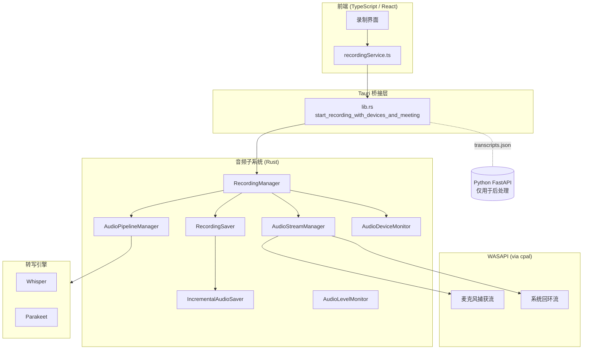
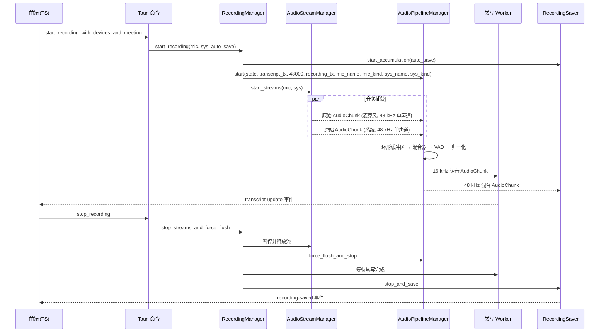
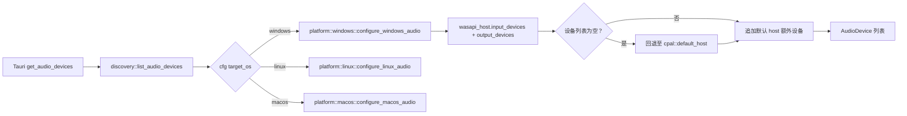
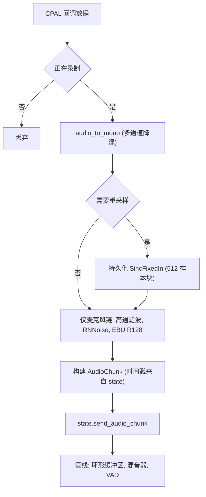
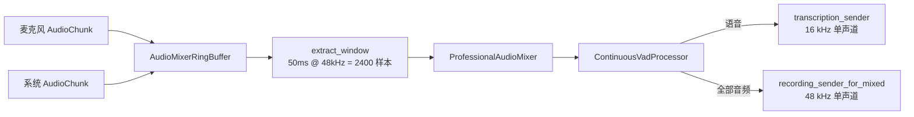
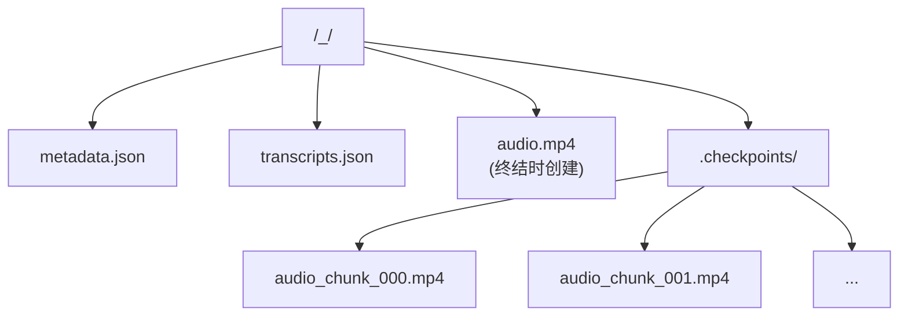

# Meetily 音频捕获技术文档 — Windows

## 目录

- [1. 概述](#1-概述)
  - [1.1 Windows 平台有何不同？](#11-windows-平台有何不同)
  - [1.2 高层架构](#12-高层架构)
- [2. 模块布局](#2-模块布局)
- [3. 录制生命周期](#3-录制生命周期)
- [4. 设备发现与配置](#4-设备发现与配置)
  - [4.1 为什么选择 WASAPI](#41-为什么选择-wasapi)
  - [4.2 WASAPI 枚举](#42-wasapi-枚举)
  - [4.3 将设备解析为 `cpal::Device`](#43-将设备解析为-cpaldevice)
  - [4.4 权限探测](#44-权限探测)
- [5. Windows 上的捕获后端](#5-windows-上的捕获后端)
- [6. 音频流构建](#6-音频流构建)
  - [6.1 `AudioStream` 和 `AudioStreamManager`](#61-audiostream-和-audiostreammanager)
  - [6.2 `create_cpal_stream`](#62-create_cpal_stream)
  - [6.3 停止音频流](#63-停止音频流)
- [7. 逐流处理：`AudioCapture`](#7-逐流处理audiocapture)
  - [7.1 `process_audio_data(data: &[f32])` 流程](#71-process_audio_datadata-f32-流程)
  - [7.2 重采样](#72-重采样)
  - [7.3 错误处理](#73-错误处理)
- [8. 管线、混音器和 VAD](#8-管线混音器和-vad)
  - [8.1 `AudioMixerRingBuffer`](#81-audiomixerringbuffer)
  - [8.2 `ProfessionalAudioMixer`](#82-professionalaudiomixer)
  - [8.3 VAD](#83-vad)
  - [8.4 FFmpeg 风格自适应混音器（参考/未来方向）](#84-ffmpeg-风格自适应混音器参考未来方向)
- [9. 设备分类与自适应行为](#9-设备分类与自适应行为)
  - [9.1 Windows 特有的检测模式](#91-windows-特有的检测模式)
  - [9.2 自适应缓冲区超时](#92-自适应缓冲区超时)
- [10. 持久化与恢复](#10-持久化与恢复)
  - [10.1 文件夹结构](#101-文件夹结构)
  - [10.2 增量保存器](#102-增量保存器)
  - [10.3 崩溃恢复](#103-崩溃恢复)
  - [10.4 转写持久化](#104-转写持久化)
- [11. 设备热插拔监控](#11-设备热插拔监控)
- [12. 电平监控](#12-电平监控)
- [13. 转写引擎集成](#13-转写引擎集成)
- [14. 错误处理](#14-错误处理)
  - [14.1 错误 → 动作映射表](#141-错误--动作映射表)
- [15. 性能优化](#15-性能优化)
- [16. 兼容性矩阵（Windows）](#16-兼容性矩阵windows)
- [17. 扩展 Windows 路径](#17-扩展-windows-路径)
  - [17.1 添加新的虚拟音频设备（如自定义回环线缆）](#171-添加新的虚拟音频设备如自定义回环线缆)
  - [17.2 替换 VAD](#172-替换-vad)
  - [17.3 启用降噪](#173-启用降噪)
  - [17.4 迁移至 `audio_v2`](#174-迁移至-audio_v2)
- [18. 关键代码索引](#18-关键代码索引)

## 1. 概述

Meetily 是一款基于 Tauri 的桌面会议纪要应用。在 Windows 平台上，它通过跨平台的 `cpal` crate 调用 Windows 音频会话 API（WASAPI）来捕获麦克风音频（以及系统音频回环，如果可用），然后经由 VAD 驱动的混音管线处理音频流，并将混合后的单声道音频发送至本地 Whisper / Parakeet 引擎进行转写。音频文件采用增量持久化方式保存，因此崩溃时仅会丢失数秒的数据；Python FastAPI 后端仅用于转写后的后处理工作（说话人分离、摘要生成、思维导图等），不参与实时音频处理。

本文档描述 Windows 平台特有的实现：WASAPI 的选择方式、设备发现与配置的工作原理、音频流的构建方式、管线如何混合与归一化音频、错误处理机制，以及性能关键的热路径所在。它是 `audio-capture-zh.md` 的 Windows 对应文档，后者涵盖跨平台架构以及 macOS / Linux 的实现变体。

### 1.1 Windows 平台有何不同？

| 关注点           | Windows 行为                                                                                                | macOS 对应行为                                    |
| ---------------- | ----------------------------------------------------------------------------------------------------------- | ------------------------------------------------- |
| 音频后端         | `cpal` host = `Wasapi`，无 `CoreAudio` / `ScreenCaptureKit`                                                 | `cidre` Core Audio tap，ScreenCaptureKit 作为备选 |
| 系统音频         | 同一个 `cpal` 流，标记为 `DeviceType::Output` 并配置为捕获流；依赖 WASAPI 回环（当前代码树中无额外处理）    | Core Audio tap 或 ScreenCaptureKit                |
| 设备选择         | 直接使用系统默认设备；`get_safe_recording_devices_macos` 在编译时被排除                                     | macOS 会将蓝牙设备覆盖为内置设备                  |
| 蓝牙检测         | 名称启发式 + WASAPI 命名模式（如 "Bluetooth Hands-Free Audio"）                                             | Core Audio 传输类型                               |
| 权限管理         | 麦克风权限由 Windows 隐私设置处理；`trigger_audio_permission` 仅构建一个空操作的 CPAL 输入流并调用 `play()` | macOS 音频捕获权限对话框                          |
| Whisper GPU 加速 | 默认使用 CPU；编译时可选 `cuda` 或 `vulkan` 特性                                                            | 默认使用 Metal + CoreML                           |

### 1.2 高层架构



## 2. 模块布局

| 文件                                                | 职责                                                                                                                    |
| --------------------------------------------------- | ----------------------------------------------------------------------------------------------------------------------- |
| `audio/mod.rs`                                      | 模块索引，统一再导出                                                                                                    |
| `audio/devices/discovery.rs`                        | `list_audio_devices` 入口，调度至平台适配层                                                                             |
| `audio/devices/platform/windows.rs`                 | WASAPI 设备枚举、默认设备查找、配置选择                                                                                 |
| `audio/devices/platform/mod.rs`                     | `cfg` 条件编译控制的平台函数再导出                                                                                      |
| `audio/devices/configuration.rs`                    | `AudioDevice` / `DeviceType` 模型，`get_device_and_config`                                                              |
| `audio/devices/microphone.rs`                       | `default_input_device`、`find_builtin_input_device`                                                                     |
| `audio/devices/speakers.rs`                         | `default_output_device`、`find_builtin_output_device`                                                                   |
| `audio/devices/fallback.rs`                         | `get_safe_recording_devices`（Windows 使用系统默认值）                                                                  |
| `audio/stream.rs`                                   | `AudioStream` + `AudioStreamManager`，构建 CPAL 流，多后端感知                                                          |
| `audio/pipeline.rs`                                 | `AudioCapture`、`AudioMixerRingBuffer`、`ProfessionalAudioMixer`、VAD 驱动的 `AudioPipeline::run`                       |
| `audio/ffmpeg_mixer.rs`                             | 参考实现 `FFmpegAudioMixer`，带逐源自适应缓冲区                                                                         |
| `audio/recording_manager.rs`                        | 生命周期协调器（`start_recording`、`stop_streams_and_force_flush`）                                                     |
| `audio/recording_commands.rs`                       | Tauri 命令适配器                                                                                                        |
| `audio/recording_state.rs`                          | `RecordingState`、`AudioChunk`、`AudioError`、错误回调管道                                                              |
| `audio/recording_saver.rs`                          | 累积混合后的音频块，写入 `metadata.json` + `transcripts.json`                                                           |
| `audio/incremental_saver.rs`                        | 基于检查点的 WAV 写入器，FFmpeg concat 终结器                                                                           |
| `audio/device_detection.rs`                         | 多层蓝牙 vs 有线设备分类                                                                                                |
| `audio/device_monitor.rs`                           | 活跃设备的热插拔检测                                                                                                    |
| `audio/audio_processing.rs`                         | `audio_to_mono`、`LoudnessNormalizer`（EBU R128）、`HighPassFilter`、`NoiseSuppressionProcessor`（RNNoise）、`resample` |
| `audio/vad.rs`                                      | Silero VAD 封装，`ContinuousVadProcessor`                                                                               |
| `audio/level_monitor.rs`                            | 向 UI 实时推送 RMS/峰值数据流                                                                                           |
| `audio/permissions.rs`                              | `trigger_audio_permission`（CPAL 探测），Windows 音频捕获为空操作                                                       |
| `audio/capture/mod.rs`                              | 再导出 `system`、`microphone`、`backend_config`                                                                         |
| `audio/capture/system.rs`                           | `SystemAudioCapture`（定义回环管道；使用与麦克风相同的 CPAL host）                                                      |
| `audio/capture/microphone.rs`                       | 麦克风专用流逻辑占位符（当前通过 `stream.rs` 路由）                                                                     |
| `audio/capture/backend_config.rs`                   | 后端枚举（`ScreenCaptureKit` 作为跨平台占位；`CoreAudio` 通过 cfg 限制为 macOS）                                        |
| `audio/transcription/{engine,worker,provider,*}.rs` | Whisper / Parakeet 引擎抽象层                                                                                           |
| `audio/recording_preferences.rs`                    | 持久化 `auto_save`、首选麦克风/系统设备名称                                                                             |

## 3. 录制生命周期

端到端的生命周期在所有平台上相同；仅底层实现有所差异。



Windows 平台的关键实现说明：

- `stop_streams_and_force_flush`（位于 `recording_manager.rs`）**首先停止设备监控器**，以解决在监控器拆除之前关闭时观察到的 90 秒 WASAPI 轮询挂起问题。
- 管线被指示在 `is_recording()` 翻转为 `false` 之后继续排空接收器通道中的剩余数据；这可以防止丢失最后的 `flush` 数据块（`chunk_id >= u64::MAX - 10` 作为哨兵值）。
- 显式调用 `state.cleanup()` 以释放对麦克风和扬声器的 `Arc<AudioDevice>` 引用；否则 Windows 会让麦克风指示灯保持亮起数秒。

## 4. 设备发现与配置

### 4.1 为什么选择 WASAPI

`cpal::default_host()` 在 Windows 上返回 WASAPI host。WASAPI 是 Microsoft 唯一支持的低延迟音频 API，是共享模式捕获和回环的正确选择。本项目使用的 `cpal` 0.15.3 crate 直接封装了 WASAPI，并暴露了我们所依赖的标准 `Device`、`SupportedStreamConfig` 和 `Stream` 类型。

`audio/devices/discovery.rs::list_audio_devices` 是 `get_audio_devices` Tauri 命令使用的入口点。在 Windows 上，它委托给 `platform::configure_windows_audio`，然后合并默认 host 报告的、尚未被枚举的设备（某些虚拟设备仅在默认 host 上出现）。结果为 `Vec<AudioDevice>`，其中麦克风使用 `DeviceType::Input`，扬声器/回环候选设备使用 `DeviceType::Output`。



### 4.2 WASAPI 枚举

`audio/devices/platform/windows.rs::configure_windows_audio` 执行三层枚举：

1. **WASAPI host** — `cpal::host_from_id(cpal::HostId::Wasapi)`。如果成功返回，则枚举所有输入和输出设备。输出设备以 `DeviceType::Output` 类型推入（在 Windows 上同时作为回环候选标记）。
2. **默认 host 回退** — 如果 WASAPI host 本身失败或未返回任何设备，代码回退至 `cpal::default_host()`。这可以挽救 WASAPI 初始化失败的环境（罕见，但在受限的企业版构建中出现过）。
3. **默认设备回退** — 如果两层都为空，代码追加 `host.default_input_device()` 和 `host.default_output_device()`，以便 UI 至少有一个条目可以显示。

### 4.3 将设备解析为 `cpal::Device`

`platform::windows::get_windows_device(audio_device)` 由 `configuration::get_device_and_config` 调用（通过 cfg 限制为 `windows`）。名称匹配具有容错性：首先去除前端可能追加的尾部 ` (input)` / ` (output)` 后缀，然后遍历 WASAPI 设备列表，接受与请求的基础名称相等或包含该名称的设备。第一个匹配项胜出。

对于每个匹配项，代码按以下优先级选择 `SupportedStreamConfig`：

1. F32，2 通道（立体声）— 首选，因为管线可以将其折叠为单声道而不损失精度。
2. F32，任意通道数 — 当立体声不可用时的安全回退。
3. 第一个支持的配置 — 当完全不支持 F32 时使用（某些虚拟设备仅暴露 I16）。

如果 `default_input_config()` 失败，代码调用 `supported_input_configs()` 并遍历列表。第一个成功匹配通过 `with_max_sample_rate()` 包装后返回。输出设备适用相同的逻辑。

如果完全找不到匹配设备，代码尝试将 WASAPI 默认输入（或输出）设备作为最后的回退方案。如果即便如此仍然失败，则返回 `anyhow::Error`，并在错误消息中包含原始设备名称，以便 UI 显示精确的错误信息。

### 4.4 权限探测

`trigger_audio_permission()` 从默认设备构建一个空操作的输入流，调用 `stream.play()` 以强制 Windows 评估麦克风隐私设置，然后释放该流。成功时返回 `Ok(true)`，如果任一步骤失败则返回 `Ok(false)`（通常意味着用户在操作系统级别拒绝了麦克风访问权限，或者设备正被另一个独占模式的应用程序占用）。该函数作为 `trigger_microphone_permission` 暴露给前端，是引导流程的一部分。

## 5. Windows 上的捕获后端

`audio/capture/backend_config.rs` 声明了两个后端：

```rust
pub enum AudioCaptureBackend {
    ScreenCaptureKit,    // 跨平台占位名称，Windows 上也使用此名称
    #[cfg(target_os = "macos")]
    CoreAudio,           // 仅限 macOS
}
```

在 Windows 上仅 `ScreenCaptureKit` 可用，`AudioCaptureBackend::default()` 返回该值。`get_current_backend()` 读取全局 `BACKEND_CONFIG`（一个由 `RwLock` 保护的 `Lazy<Arc<BackendConfig>>`）；UI 可以在运行时切换活跃后端，但此更改在 Windows 上无效，因为 `stream.rs::create_with_backend` 通过 `#[cfg(target_os = "macos")]` 短路了 `CoreAudio` 分支。

在 Windows 上日志中报告的 `backend_name` 始终为 `"CPAL"`。代码有意这样设计，使得未来添加 Windows 原生后端（例如直接 WASAPI 回环捕获）成为局部修改：仅需在 `stream.rs::create_with_backend` 和平台适配层添加新分支。

## 6. 音频流构建

`audio/stream.rs` 是实际构建 WASAPI 流的位置。

### 6.1 `AudioStream` 和 `AudioStreamManager`

`AudioStream` 封装了 CPAL `Stream`（Windows 上唯一的变体）或 Core Audio task（通过 cfg 限制为 macOS）。`AudioStreamManager` 最多持有一个麦克风流和一个系统流，确保至少创建其中一个，并实现了 `Drop` trait，以便部分启动失败时仍能释放已打开的流。

两种类型都通过 `unsafe impl Send` 手动实现了 `Send`。这是必要的，因为 `cpal::Stream` 默认不是 `Send` 的；我们知道不会跨线程边界移动流，因为所有流操作都发生在拥有它的同一个 Tokio 运行时上。

### 6.2 `create_cpal_stream`

1. 通过 `get_device_and_config` 解析 `cpal::Device` 和 `SupportedStreamConfig`。
2. 构建一个绑定到该设备、采样率、通道数和 `DeviceType` 的 `AudioCapture` 处理器。
3. 调用 `build_stream`（见下文），然后调用 `stream.play()`。

`build_stream` 根据 `SampleFormat` 进行分发：

| 格式  | 转换方式                           | 设计理由                                           |
| ----- | ---------------------------------- | -------------------------------------------------- |
| `F32` | 直接传递                           | 管线和重采样器以 `f32` 工作                        |
| `I16` | `sample as f32 / i16::MAX as f32`  | 旧版 Windows 音频驱动上内置麦克风的常见格式        |
| `I32` | `sample as f32 / i32::MAX as f32`  | 某些专业 USB 设备                                  |
| `I8`  | `sample as f32 / i8::MAX as f32`   | 罕见；某些虚拟音频线缆                             |
| 其他  | `Err("Unsupported sample format")` | 防御性设计 — 在当前 WASAPI 下的 Windows 上不应出现 |

每个回调克隆一个 `AudioCapture`（开销极低，因为它是一个 `Arc` 集合），并在音频线程内调用 `process_audio_data(data)`。第二个 `Arc::clone` 传递给 `handle_stream_error`，因此错误路径无需触碰音频缓冲区。

### 6.3 停止音频流

`AudioStream::stop(self)` 是将流从服务中移除的唯一安全方式：

1. 首先调用 `stream.pause()`，使 WASAPI 回调线程在释放流之前停止触发 — 这至关重要，因为如果回调正在执行中时我们释放了流，被捕获的 `Arc<AudioCapture>` 会无限延长设备句柄的生命周期。
2. 释放流，从而释放 WASAPI 客户端。
3. 释放 `AudioDevice` 的 `Arc`，允许设备监控任务在下一次轮询周期重新枚举设备。

`stop_streams()` 收集两个流的错误并将它们聚合为单个 `anyhow::Error` 返回。

## 7. 逐流处理：`AudioCapture`

`pipeline.rs::AudioCapture` 是位于 WASAPI 回调与管线其余部分之间的逐流处理器。它每个流构建一次，持有设备元数据、配置的采样率和通道数，以及少量延迟初始化的增强处理器。

### 7.1 `process_audio_data(data: &[f32])` 流程



操作顺序至关重要，源代码中的注释明确说明了设计理由：

1. **立体声 → 单声道** 通过 `audio_to_mono(data, channels)` 执行。对于超过 2 通道的麦克风阵列，该函数仅对前 2 个通道求平均，以避免与辅助通道产生破坏性干扰（某些阵列使用辅助通道进行波束成形/降噪反相信号处理）。
2. **采样率转换** 至 48 kHz。管线始终以 48 kHz 运行。某些设备（最常见的是报告 16 kHz 或 44.1 kHz 的蓝牙耳机）返回不同的采样率；如果不进行重采样，音频回放会加速，且 VAD 不会触发。详见 §7.2。
3. **仅麦克风的增强处理链**（严格按此顺序执行，不可重排）：
   - **高通滤波器**（80 Hz 截止频率）— 消除直流偏置和低频隆隆声。
   - **RNNoise**（可选，当前通过 `RNNOISE_APPLY_ENABLED = false` 禁用）— 在 10 ms / 480 样本帧下实现 10–15 dB 降噪；Whisper 本身已具备噪声鲁棒性，对于音乐/非语音内容，额外的 CPU 开销通常不值得。
   - **EBU R128 归一化器**（目标 -23 LUFS）— 广播标准的响度，配有 10 ms 真峰值限制器以防止归一化后的削波。
4. **音频块构建** 使用 `RecordingState` 中的全局录制时间戳，以便麦克风和系统的音频块可以在混音器中同步。
5. **分发** 通过 `state.send_audio_chunk` 进入管线；原始流 **绝不** 直接发送给录制器，只有管线处理后的结果才会发送。录制器持久化的是混合后的结果 — 这正是防止回声/同一音频被重复录制的机制。

### 7.2 重采样

`AudioCapture::new` 在构建时决定是否需要重采样。当需要时，根据采样率比率选择参数创建持久化的 `SincFixedIn<f32>` 重采样器：

| 比率                              | sinc_len | 插值方式 | 过采样 |
| --------------------------------- | -------- | -------- | ------ |
| ≥ 2.0（重上采样，如 16 → 48 kHz） | 512      | Cubic    | 512    |
| 1.5–2.0                           | 384      | Cubic    | 384    |
| 1.0–1.5（如 44.1 → 48 kHz）       | 256      | Linear   | 256    |
| ≤ 0.5（重下采样）                 | 512      | Cubic    | 512    |
| 0.5–1.0                           | 384      | Linear   | 384    |

重采样器被包装在 `Arc<Mutex<…>>` 中，并 **跨音频块持久化**。早期实现中每次回调都创建新的重采样器，导致约 173% 的能量放大，因为内部滤波器状态每次都会重置。当前实现复用一个重采样器并缓冲输入直到达到 512 个样本（`RESAMPLER_CHUNK_SIZE`），使 Sinc 卷积能够在完整的状态历史和一致的叠接下运行。

使用 `BlackmanHarris2` 作为窗函数 — 这是音频处理中频谱最干净的选择。截止频率 f_cutoff 固定为 0.95，因此源端 95% 的奈奎斯特频带被保留。

### 7.3 错误处理

`handle_stream_error(error: cpal::StreamError)` 将 CPAL 的通用错误字符串转换为 `AudioError` 变体之一：

| 错误中的子字符串                                                                                                     | 映射的变体           | 可恢复？ |
| -------------------------------------------------------------------------------------------------------------------- | -------------------- | -------- |
| `device is no longer available` / `device not found` / `disconnected` / `no such device` / `unavailable` / `removed` | `DeviceDisconnected` | 是       |
| `permission` / `access denied`                                                                                       | `PermissionDenied`   | 否       |
| `channel closed`                                                                                                     | `ChannelClosed`      | 否       |
| `stream` + `failed`                                                                                                  | `StreamFailed`       | 是       |
| 其他                                                                                                                 | `StreamFailed`       | 是       |

然后调用 `RecordingState::report_error`。可恢复错误被单独计数；一旦达到 10 个可恢复错误，录制将被停止。达到 15 个总错误后录制也会被停止，作为硬性上限。

## 8. 管线、混音器和 VAD

`pipeline.rs::AudioPipelineManager` 拥有一个 `AudioPipeline` 任务。`AudioPipeline::run` 是核心循环：



### 8.1 `AudioMixerRingBuffer`

每次循环迭代从每个源提取一个 50 ms 的窗口。早期版本使用 50 ms 窗口，但当前 `new()` 使用 600 ms（`window_ms = 600.0`），最大缓冲区为 4800 ms（`max_buffer_size = window_size_samples * 8`）。之所以做出此更改，是因为 macOS 上的 Core Audio 通过逐样本流式传输引入了显著的抖动，需要更大的缓冲区来保持两个源的对齐。在 Windows 上，WASAPI 提供稳定的回调大小，因此同一代码路径实际上是空操作 — 缓冲区永远不会接近最大值。

如果在某个源为空时请求窗口，缺失的源将被零填充。选择零填充而非最后样本保持，是因为后者在流真正静音数百毫秒时会产生可听见的重复伪影。

`add_samples` 在缓冲区超过最大值时记录日志并丢弃最旧的样本。麦克风溢出记录为 `WARN`，系统溢出记录为 `ERROR`（系统溢出是导致用户注意到的失真的原因）。

### 8.2 `ProfessionalAudioMixer`

`mix_window` 逐样本运行，设计上刻意简洁：

- 系统源的缩放因子为 1.0；麦克风源保留缩放为 0.8（该变量当前未使用，但保留以供未来逐源增益控制）。
- 求和后执行软缩放至 `[-1.0, 1.0]` 范围：如果 `|sum| > 1.0`，结果为 `sum / |sum|`，否则保持原始求和值。软缩放避免了硬 `clamp` 产生的刺耳削波。
- 此路径不应用基于 RMS 的闪避。历史上的 FFmpeg 风格混音器（见 §8.4）会执行闪避，但当前默认录制路径使用更简洁的混音器，以保留系统音频的完整质量用于录制。

### 8.3 VAD

`ContinuousVadProcessor` 是通过 `silero_rs` 加载的 Silero VAD 模型的轻量封装。VAD 的处理流程：

1. 在内部将混合后的 48 kHz 窗口重采样至 16 kHz。
2. 生成一系列 `VadSegment { samples, start_timestamp_ms, end_timestamp_ms }` 对象。
3. 在 Windows 上应用 400 ms 的宽限时间（`if cfg!(target_os = "macos") { 400 } else { 400 }` — 两个分支当前恰好都使用 400 ms，但 cfg 门控存在是为了未来可以独立调优两个平台）。宽限时间用于桥接单次发言内的自然停顿，避免将段落碎片化。

管线将每个 VAD 段发送到转写通道，**仅当其长度至少为 50 ms（16 kHz 下 800 个样本）**。更短的段落作为噪声丢弃。最小长度要求也是 Parakeet 所需要的，因为它对极短窗口的鲁棒性不如 Whisper。

### 8.4 FFmpeg 风格自适应混音器（参考/未来方向）

`audio/ffmpeg_mixer.rs` 是一个单独的实现，代码库将其保留为参考以及未来的 `ProfessionalAudioMixer` 替代品。与默认混音器的主要区别：

- **逐源 `SourceBuffer`** 带有基于 `InputDeviceKind` 的自适应超时（有线 20–50 ms，蓝牙 80–200 ms，未知 80–180 ms）。
- **间隙检测** — 如果某个块在前一个块之后超过其预期时间的 2 倍以上才到达，则记录日志，并在蓝牙设备上插入静音以保持时序一致。
- **基于 RMS 的闪避** — 当麦克风 RMS 超过 `SPEECH_THRESHOLD`（0.01）时，系统源衰减至 60%；否则系统源保持全音量。麦克风始终为全音量。最终求和硬裁剪至 `[-1.0, 1.0]`。

混音器暴露 `BufferStats` 结构用于诊断（接收到的块数、检测到的间隙、插入的静音毫秒数）。它是生产路径正在趋近的参考实现；生产路径仍然使用 `ProfessionalAudioMixer`，因为该路径已通过端到端验证。

## 9. 设备分类与自适应行为

`audio/device_detection.rs` 将每个音频设备分类为 `Wired`（有线）、`Bluetooth`（蓝牙）或 `Unknown`（未知），该分类在两处驱动自适应行为：

1. **`RecordingManager::start_recording`** 记录麦克风和系统音频检测到的类型，并将这些值传递给 `AudioPipelineManager::start`。管线使用该类型来确定缓冲区大小和超时。
2. **未来的 FFmpeg 混音器路径** 使用该类型设置 `SourceBuffer::buffer_timeout`。

检测分三层运行；第一个返回 `Some` 的层级胜出：

1. **平台原生**（Windows：`device_detection.rs` 中的 `detect_windows_native`）。
2. **跨平台名称启发式**（`detect_by_name`）。
3. **缓冲区大小启发式**（`detect_by_buffer_size`）。

如果三层都返回 `None`，设备被分类为 `Unknown`，采用保守处理（类蓝牙超时）。

### 9.1 Windows 特有的检测模式

`detect_windows_native` 识别 Microsoft 用于蓝牙和内置音频的 WASAPI 命名约定：

| 模式（不区分大小写）         | 分类                 |
| ---------------------------- | -------------------- |
| 以 `bluetooth audio` 开头    | 蓝牙                 |
| 包含 `bluetooth hands-free`  | 蓝牙                 |
| 包含 `bluetooth stereo`      | 蓝牙                 |
| 包含 `usb audio`             | 有线                 |
| 包含 `realtek` 或 `conexant` | 有线（内置编解码器） |

对于无法识别/未匹配的名称，跨平台名称启发式接管。它们分为三个置信度等级（99%、95%、85%）；第三层记录为 `WARN`，因为它可能在类似 "Wireless USB Headset"（实际为有线）的设备上产生误报。

虚拟音频设备（`blackhole`、`vb-audio`、`virtual`、`loopback`、`monitor`）被显式映射为 `Wired`，以避免混音器对它们过度缓冲。

### 9.2 自适应缓冲区超时

`InputDeviceKind::buffer_timeout()` 返回用于自适应超时的 `(min, max)` 范围：

| 类型 | 最小值 | 最大值 |
| ---- | ------ | ------ |
| 有线 | 20 ms  | 50 ms  |
| 蓝牙 | 80 ms  | 200 ms |
| 未知 | 80 ms  | 180 ms |

`calculate_buffer_timeout` 接收设备类型以及报告的缓冲区大小和采样率，返回一个时长：

1. 如果缓冲区大小或采样率为 0，返回该类型的最小超时。
2. 否则，计算基础延迟为 `buffer_size / sample_rate`，乘以 2（Cap 风格抖动余量），并裁剪至 `(min, max)` 范围。

## 10. 持久化与恢复

### 10.1 文件夹结构

当 `auto_save = true` 时，`RecordingSaver::initialize_meeting_folder` 创建以下会议文件夹结构。`create_meeting_folder` 通过将 `/ \ : * ? " < > |` 和控制字符替换为 `_` 来清理名称。



当 `auto_save = false` 时，**不会** 创建 `.checkpoints/` 目录，也不会生成 `audio.mp4`；会议文件夹仍然存在，用于存放元数据和转写 JSON。

### 10.2 增量保存器

`IncrementalAudioSaver` 在内存中缓冲音频块，直到收集了 30 秒的 48 kHz 单声道样本（`checkpoint_interval_samples = sample_rate * 30`），然后使用 `encode_single_audio`（调用捆绑的 `ffmpeg-sidecar`）将缓冲区编码为单个 AAC-in-MP4 检查点。在终结时，所有检查点使用 FFmpeg 的 concat demuxer 以 `copy` 编解码器合并为 `audio.mp4` — 无需重新编码，因此终结操作本质上就是文件复制。

Windows 特有的部分在 `merge_checkpoints` 中：生成的 `Command` 被赋予 `CREATE_NO_WINDOW`（0x08000000）标志，以避免在终结期间 CMD 窗口闪烁。该标志通过 `std::os::windows::process::CommandExt` 的 `command.creation_flags(CREATE_NO_WINDOW)` 设置。

### 10.3 崩溃恢复

`recover_audio_from_checkpoints` 是前端可以在启动时调用的 Tauri 命令。它扫描 `<meeting_folder>/.checkpoints/*.mp4`，对它们排序，并生成 FFmpeg 可以消费的 `concat_list.txt`。返回的 `AudioRecoveryStatus` 报告 `success` / `partial` / `failed` / `none`，以便 UI 决定显示内容。

### 10.4 转写持久化

`RecordingSaver::add_transcript_segment` 以 `sequence_id` 为键执行 upsert，因此 Whisper 重新转写可以就地更新之前写入的段落。每次 upsert 后紧跟原子化的 `transcripts.json` 写入：

1. 序列化至会议文件夹中的 `.transcripts.json.tmp`。
2. 验证临时文件是否存在。
3. 将临时文件重命名为 `transcripts.json`（在 Windows 上为原子操作，因为 `std::fs::rename` 使用带 `MOVEFILE_REPLACE_EXISTING` 的 `MoveFileExW`）。

`metadata.json` 使用相同的原子重命名模式。

## 11. 设备热插拔监控

`audio/device_monitor.rs` 运行一个 Tokio 任务，每 2 秒轮询一次 `list_audio_devices`（如果所有设备都在位则为 5 秒）。每次变化时，它通过无界 mpsc 通道发出 `DeviceEvent`：

```rust
pub enum DeviceEvent {
    DeviceDisconnected { device_name, device_type },
    DeviceReconnected  { device_name, device_type },
    DeviceListChanged,
}
```

`MonitoredDevice::disconnect_threshold()` 返回在发出 `DeviceDisconnected` 事件之前所需的连续缺失检查次数：

- 蓝牙：3 个周期（6–15 秒）— 蓝牙在重新连接期间可能短暂消失。
- 有线：2 个周期（4–10 秒）— 有线断开通常是永久性的。

监控器由 `RecordingManager::start_recording` 启动，并由 `stop_streams_and_force_flush` **首先** 停止（这个顺序正是修复 Windows 上 90 秒关机挂起的关键）。

`RecordingManager::poll_device_events` 以非阻塞方式排空接收器，`attempt_device_reconnect(name, type)` 重新运行设备发现，找到同名的新 `cpal::Device`，并重新启动相应的流。

## 12. 电平监控

存在两种实现：

- `audio/level_monitor.rs`（`AudioLevelMonitor`）— 为每个设备打开一个专用的 CPAL 流，计算 RMS 和峰值，将它们累积到 `Vec<AudioLevelData>` 中，并通过 Tauri 每 100 ms 发出一次 `audio-levels` 事件。累积的向量在每次发出时清空，因此天然具备背压安全性。输出设备监控被显式拒绝（大多数音频系统在没有回环的情况下无法监控输出，而回环会与录制器自身的回环重复）。
- `audio/simple_level_monitor.rs` — 发出模拟正弦波电平；在真正的监控器接入之前用作 UI 占位。通过 `start_audio_level_monitoring` / `stop_audio_level_monitoring` Tauri 命令调用。

## 13. 转写引擎集成

音频捕获与转写解耦。管线通过无界 mpsc 通道将 VAD 段发送至 `transcription::start_transcription_task`，该任务管理 Whisper / Parakeet worker。三个 worker 并行运行（参见 `transcription::worker.rs`）；每个 worker 从共享队列中取出段落，执行推理，并发出 `transcript-update` 事件，保存器通过 Tauri 监听器捕获这些事件。

Windows 构建默认使用带 `raw-api` 的 `whisper-rs`；用户可以在编译时选择 `cuda`（NVIDIA）或 `vulkan`（AMD / Intel）GPU 加速。不存在逐设备依赖；转写完全不关心 WASAPI。

## 14. 错误处理

`audio/recording_state.rs::AudioError` 枚举了所有错误变体。每个变体有两个元数据方法：

- `is_recoverable()` — 对 `DeviceDisconnected`、`StreamFailed`、`ProcessingFailed`、`TranscriptionFailed`、`BufferOverflow` 返回 `true`。这些被单独计数，录制持续到达到 10 个为止。对 `ChannelClosed`、`InitializationFailed`、`ConfigurationError`、`PermissionDenied`、`SampleRateUnsupported` 返回 `false` — 这些会立即停止录制。
- `user_message()` — 简短的、可直接复制的字符串，用于 UI 中的 toast / 模态框。

`report_error` 是唯一的汇聚点：它递增全局计数器，如果适用则递增至可恢复计数器，调用用户注册的 `error_callback`（Tauri 命令层将其连接为发出 `recording-error` 事件），并执行停止阈值判断。

### 14.1 错误 → 动作映射表

| 来源              | 检测方式                                                                                     | 动作                                                                                                                |
| ----------------- | -------------------------------------------------------------------------------------------- | ------------------------------------------------------------------------------------------------------------------- |
| 麦克风权限被拒    | `trigger_audio_permission` 返回 `Ok(false)`                                                  | 前端显示引导模态框；录制拒绝启动                                                                                    |
| 无输入设备        | `default_input_device` 返回 `Err`                                                            | Tauri 命令返回 `Err("No microphone device available")`                                                              |
| 流构建失败        | `AudioStream::create` 返回 `Err`                                                             | Tauri 命令向前端返回 `Err`；录制在任何流运行之前中止                                                                |
| 录制中途流错误    | `cpal::StreamError` 回调                                                                     | 映射为 `AudioError` 并报告；可恢复错误被计数                                                                        |
| 设备断开连接      | `AudioDeviceMonitor` 中的轮询                                                                | 发出 `DeviceEvent::DeviceDisconnected`；UI 可调用 `attempt_device_reconnect`                                        |
| 采样率不匹配      | 管线强制 48 kHz；重采样器延迟创建                                                            | `AudioCapture::new` 记录策略和比率；如果重采样器创建失败，记录 `WARN` 并回退至无重采样（此时预期设备已经是 48 kHz） |
| 管线溢出          | `AudioMixerRingBuffer::add_samples` 溢出检查                                                 | 麦克风溢出 → `WARN`；系统溢出 → `ERROR` 并丢弃最旧的样本                                                            |
| 转写引擎未就绪    | `validate_transcription_model_ready`                                                         | 以明确错误拒绝录制，并发出 `transcription-error` 事件且 `actionable: false`（toast，非模态框）                      |
| 录制中途崩溃      | 增量保存器每 30 秒写入检查点                                                                 | 下次启动时，`recover_audio_from_checkpoints` 可以从检查点重建音频文件                                               |
| WASAPI 设备被占用 | `default_input_config` / `default_output_config` 返回包含 "in use" 或 "access denied" 的错误 | `get_windows_device` 切换到列表中的下一个设备；如果没有剩余设备，返回包含设备名称的 `Err`                           |

## 15. 性能优化

Windows 音频路径包含若干容易被意外破坏的性能优化：

1. **条件日志宏**（`lib.rs::perf_debug!`、`perf_trace!`）— 这些宏在 release 构建中编译为空操作。它们在 VAD 管线的热循环和音频块计数路径中使用。
2. **指标批处理**（`AudioMetricsBatcher`）— 管线批量收集音频指标并定期刷新，避免逐块的日志行写入磁盘。
3. **持久化重采样器** — 见 §7.2。跨音频块复用 Sinc 滤波器可以保持能量并产生正确的输出长度；之前的逐块重采样器将 RMS 放大了 173%。
4. **缓冲池**（`AudioBufferPool`，由 `RecordingState` 使用）— 预分配的 16 个单声道 / 48 kHz 缓冲区在音频块之间复用，避免热路径中的 `Vec` 分配。
5. **Send-unsafe → Send-safe 封装** 在 `stream.rs` 中 — 对 `Stream` 和封装类型手动 `unsafe impl Send`，配合 `AudioStream::stop` 中的 `stream.pause()` + `drop()`，避免音频线程的生命周期超过流本身以及由此导致的内存泄漏。
6. **管线中的原子停止标志** — `tokio::time::timeout(50 ms, receiver.recv())` 模式使管线能够以紧凑循环排空队列中的音频块，同时仍然对关闭信号保持响应。
7. **原子排序** — 所有 `is_recording` / `is_paused` 检查使用 `SeqCst`；这故意比必要值更严格，以保持推理简洁，并避免 x86_64 Windows 上的可见性问题，在该平台上最强的排序基本上没有额外开销。

## 16. 兼容性矩阵（Windows）

| 功能                 | 状态                                   | 备注                                                                     |
| -------------------- | -------------------------------------- | ------------------------------------------------------------------------ |
| 麦克风捕获（WASAPI） | 已支持                                 | 默认且唯一的麦克风后端                                                   |
| 系统音频回环         | 已支持（CPAL 输出设备标记为 `Output`） | 依赖所选设备的 WASAPI 回环能力；某些虚拟设备仅暴露渲染端点，必须重新路由 |
| 蓝牙设备检测         | 已支持（名称 + WASAPI 模式）           | 见 §9.1                                                                  |
| 自适应缓冲区超时     | 已支持                                 | 由 `InputDeviceKind` 驱动                                                |
| 系统音频活动事件     | 不支持                                 | 仅 macOS（`system_detector.rs` 通过 cfg 门控）                           |
| 热插拔检测           | 已支持                                 | 见 §11                                                                   |
| 增量保存             | 已支持                                 | 30 秒检查点；终结时 FFmpeg concat                                        |
| 崩溃恢复             | 已支持                                 | `recover_audio_from_checkpoints`                                         |
| Whisper CPU          | 已支持（默认）                         | `whisper-rs` raw-api                                                     |
| Whisper CUDA         | 编译时可选                             | `--features cuda`                                                        |
| Whisper Vulkan       | 编译时可选                             | `--features vulkan`                                                      |
| EBU R128 归一化      | 已支持（仅麦克风）                     | `audio_processing::LoudnessNormalizer`                                   |
| RNNoise 降噪         | 已支持但默认禁用                       | `RNNOISE_APPLY_ENABLED = false`                                          |
| 高通滤波器（80 Hz）  | 已支持（仅麦克风）                     | `audio_processing::HighPassFilter`                                       |

## 17. 扩展 Windows 路径

### 17.1 添加新的虚拟音频设备（如自定义回环线缆）

1. 在 `audio/devices/platform/windows.rs` 中添加一个返回具有特定 `DeviceType` 的设备的发现辅助函数。现有的 WASAPI 枚举已经可以拾取操作系统暴露的任何设备；通常只有在需要让设备在 UI 中突出显示时才需要添加启发式。
2. 如果设备需要特殊的 `AudioStream`（如独占模式流），在 `stream.rs` 中添加构建正确 `cpal::StreamConfig` 的新方法，并从 `create_with_backend` 调用。
3. 如果设备具有不寻常的延迟特性，扩展 `device_detection.rs` 中的 `InputDeviceKind` 和 `buffer_timeout()`。
4. 如果设备需要从与现有设备选择器不同的 UI 中选择，在 `lib.rs` 中注册新的 Tauri 命令。

### 17.2 替换 VAD

将 `vad::extract_speech_16k`（或 `pipeline.rs` 中的 `ContinuousVadProcessor` 构造器）替换为新的实现。管线每个混音窗口调用一次 VAD，因此接口约定为：接收 48 kHz 混合样本的 `&[f32]`，返回 `Vec<VadSegment>`。转写通道期望 16 kHz 样本，因此新 VAD 必须在内部进行重采样或暴露自己的重采样器。

### 17.3 启用降噪

在 `audio/ffmpeg_mixer.rs` 中设置 `RNNOISE_APPLY_ENABLED = true`，并在代表性的 Windows 机器上验证 CPU 开销。麦克风处理链已经将 `NoiseSuppressionProcessor` 接入 `AudioCapture`；打开该标志是一个单行更改。开销大约为每 10 ms 音频消耗一个 10 ms 帧的 CPU；在现代 x86 CPU 上这是几个百分点，但在较旧/低功耗 Windows 设备上可能会明显。

### 17.4 迁移至 `audio_v2`

`audio_v2/` 模块是实验性的后续管线。它尚未接入 `RecordingManager`；桥接入口点是运行在 `AudioMode::Hybrid` 模式下的 `audio_v2::compatibility::LegacyBridge`。以下四个子系统仍需要达到与当前管线的功能对等：

- `audio_v2::resampler` — 占位符；当前 `audio_processing::resample` 中的 `SincFixedIn` 实现是参考。
- `audio_v2::normalizer` — 占位符；`audio_processing::LoudnessNormalizer` 中的 EBU R128 路径是参考。
- `audio_v2::limiter` — 占位符；`LoudnessNormalizer` 内部的 `TruePeakLimiter` 是参考。
- `audio_v2::sync` — 占位符；`pipeline::AudioMixerRingBuffer` 中的环形缓冲区是参考。

当 v2 管线功能完备后，`RecordingManager::start_recording` 将根据 v2 就绪标志分支，并通过新管线路由而非 `AudioPipelineManager`。

## 18. 关键代码索引

| 关注点                        | 文件                                                       | 符号                                                                                                                                               |
| ----------------------------- | ---------------------------------------------------------- | -------------------------------------------------------------------------------------------------------------------------------------------------- |
| Tauri 命令接口                | `frontend/src-tauri/src/lib.rs`                            | `start_recording_with_devices_and_meeting`、`stop_recording`、`get_audio_devices`、`trigger_microphone_permission`、`start_audio_level_monitoring` |
| 录制生命周期                  | `frontend/src-tauri/src/audio/recording_manager.rs`        | `RecordingManager::start_recording`、`RecordingManager::stop_streams_and_force_flush`                                                              |
| Tauri 命令适配器              | `frontend/src-tauri/src/audio/recording_commands.rs`       | `start_recording_with_devices_and_meeting`、`start_recording_with_meeting_name`                                                                    |
| 设备发现（跨平台）            | `frontend/src-tauri/src/audio/devices/discovery.rs`        | `list_audio_devices`、`trigger_audio_permission`                                                                                                   |
| WASAPI 枚举                   | `frontend/src-tauri/src/audio/devices/platform/windows.rs` | `configure_windows_audio`、`get_windows_device`                                                                                                    |
| 设备模型                      | `frontend/src-tauri/src/audio/devices/configuration.rs`    | `AudioDevice`、`DeviceType`、`get_device_and_config`                                                                                               |
| 默认麦克风                    | `frontend/src-tauri/src/audio/devices/microphone.rs`       | `default_input_device`、`find_builtin_input_device`                                                                                                |
| 默认扬声器                    | `frontend/src-tauri/src/audio/devices/speakers.rs`         | `default_output_device`、`find_builtin_output_device`                                                                                              |
| 音频流构建                    | `frontend/src-tauri/src/audio/stream.rs`                   | `AudioStream::create_with_backend`、`AudioStreamManager::start_streams`                                                                            |
| 逐流处理                      | `frontend/src-tauri/src/audio/pipeline.rs`                 | `AudioCapture::new`、`AudioCapture::process_audio_data`、`AudioPipeline::run`、`AudioMixerRingBuffer`、`ProfessionalAudioMixer`                    |
| 参考混音器                    | `frontend/src-tauri/src/audio/ffmpeg_mixer.rs`             | `FFmpegAudioMixer`、`SourceBuffer`、`AudioMixer`                                                                                                   |
| 设备检测                      | `frontend/src-tauri/src/audio/device_detection.rs`         | `InputDeviceKind::detect`、`InputDeviceKind::buffer_timeout`、`detect_windows_native`                                                              |
| 后端枚举                      | `frontend/src-tauri/src/audio/capture/backend_config.rs`   | `AudioCaptureBackend`、`BACKEND_CONFIG`                                                                                                            |
| 系统捕获                      | `frontend/src-tauri/src/audio/capture/system.rs`           | `SystemAudioCapture`、`start_system_audio_capture`                                                                                                 |
| 麦克风捕获                    | `frontend/src-tauri/src/audio/capture/microphone.rs`       | （占位符，麦克风通过 `stream.rs` 路由）                                                                                                            |
| 权限管理                      | `frontend/src-tauri/src/audio/permissions.rs`              | `trigger_system_audio_permission`、`trigger_audio_permission`                                                                                      |
| 热插拔监控                    | `frontend/src-tauri/src/audio/device_monitor.rs`           | `AudioDeviceMonitor::start_monitoring`                                                                                                             |
| 电平监控（真实）              | `frontend/src-tauri/src/audio/level_monitor.rs`            | `AudioLevelMonitor::start_monitoring`                                                                                                              |
| 电平监控（占位）              | `frontend/src-tauri/src/audio/simple_level_monitor.rs`     | `start_monitoring`、`stop_monitoring`                                                                                                              |
| 重采样、归一化、RNNoise、高通 | `frontend/src-tauri/src/audio/audio_processing.rs`         | `resample`、`LoudnessNormalizer`、`NoiseSuppressionProcessor`、`HighPassFilter`、`audio_to_mono`                                                   |
| VAD 封装                      | `frontend/src-tauri/src/audio/vad.rs`                      | `ContinuousVadProcessor`、`extract_speech_16k`                                                                                                     |
| 录制状态 / 错误               | `frontend/src-tauri/src/audio/recording_state.rs`          | `RecordingState`、`AudioError`、`AudioChunk`                                                                                                       |
| 保存器                        | `frontend/src-tauri/src/audio/recording_saver.rs`          | `RecordingSaver::start_accumulation`、`RecordingSaver::stop_and_save`                                                                              |
| 增量检查点                    | `frontend/src-tauri/src/audio/incremental_saver.rs`        | `IncrementalAudioSaver::add_chunk`、`recover_audio_from_checkpoints`                                                                               |
| 转写入口                      | `frontend/src-tauri/src/audio/transcription/engine.rs`     | `validate_transcription_model_ready`、`get_or_init_transcription_engine`                                                                           |
| 转写 Worker                   | `frontend/src-tauri/src/audio/transcription/worker.rs`     | `start_transcription_task`                                                                                                                         |
| Cargo 特性 (Win)              | `frontend/src-tauri/Cargo.toml`                            | `target.'cfg(target_os = "windows")'.dependencies`                                                                                                 |
