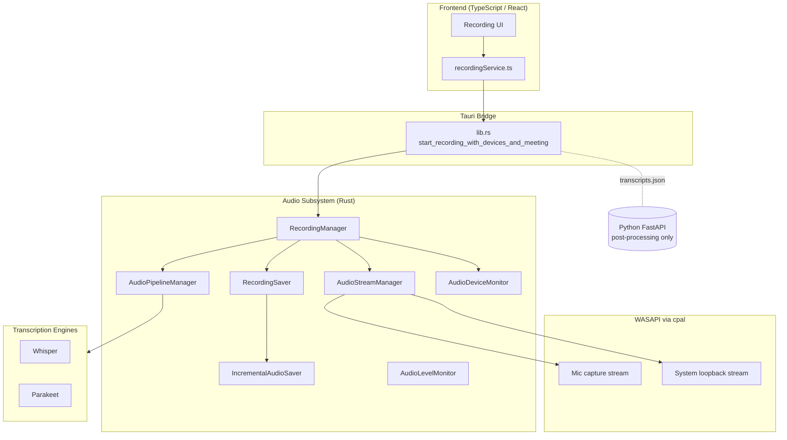
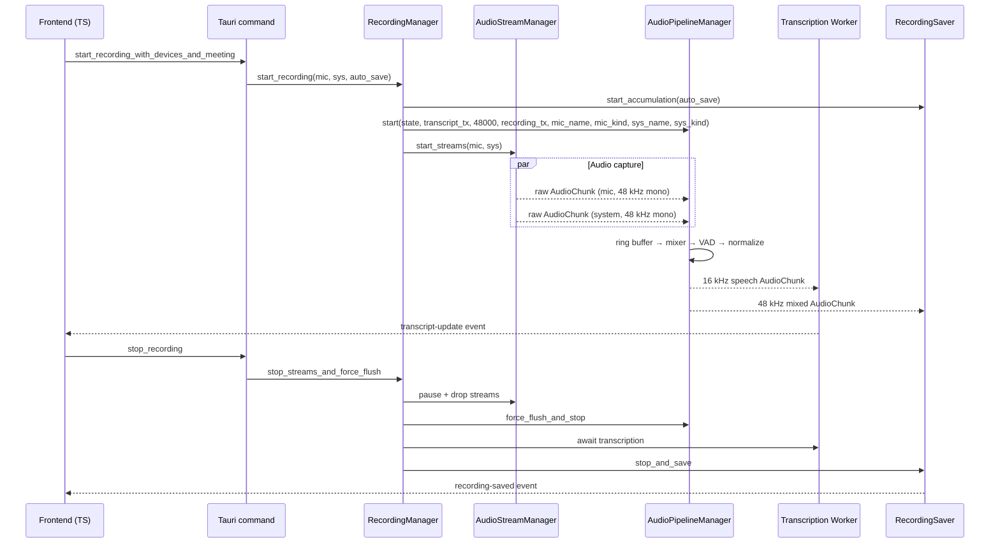
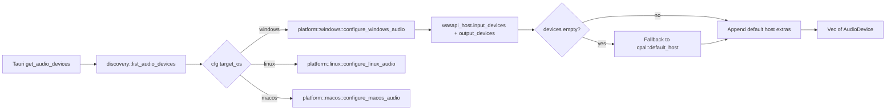
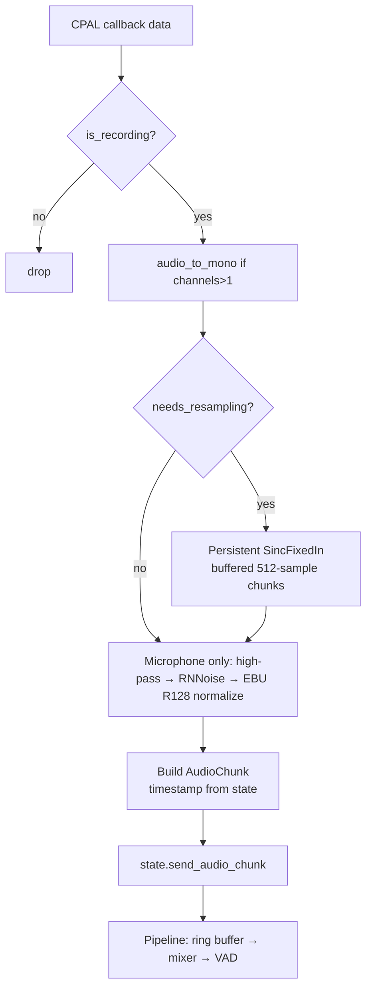
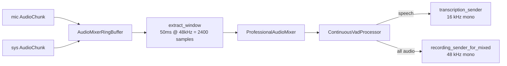
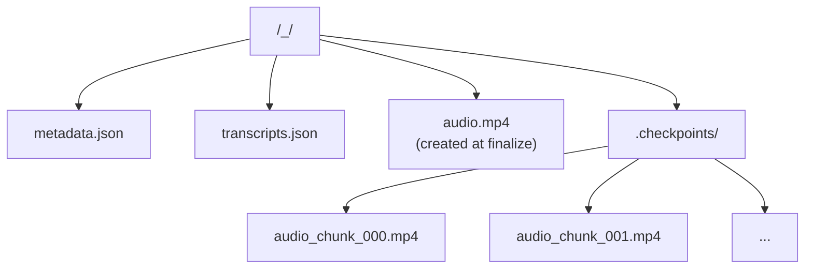

# Meetily Audio Capture Technical Document — Windows

## 1. Overview

Meetily is a Tauri-based desktop meeting minutes application. On Windows it captures microphone audio (and, when available, system-audio loopback) through the Windows Audio Session API (WASAPI) exposed by the cross-platform `cpal` crate, runs the streams through a VAD-driven mixing pipeline, and dispatches the mixed mono audio to local Whisper / Parakeet engines for transcription. Audio files are persisted incrementally so a crash only loses a few seconds, and the Python FastAPI backend is only used for post-transcription work (diarization, summaries, mind-maps) — it never sees live audio.

This document describes the Windows-specific implementation: how WASAPI is selected, how device discovery and configuration work, how streams are built, how the pipeline mixes and normalizes audio, how errors are handled, and where the performance-critical hot paths live. It is the Windows counterpart to `audio-capture-zh.md`, which covers the cross-cutting architecture and the macOS / Linux variants.

### 1.1 What is different on Windows?

| Concern             | Windows behavior                                                                                                                                  | macOS counterpart                                 |
| ------------------- | ------------------------------------------------------------------------------------------------------------------------------------------------- | ------------------------------------------------- |
| Backend             | `cpal` host = `Wasapi`, no `CoreAudio` / `ScreenCaptureKit`                                                                                       | `cidre` Core Audio tap, ScreenCaptureKit fallback |
| System audio        | Same `cpal` stream, marked `DeviceType::Output` and configured as a capture stream; relies on WASAPI loopback (no extra code in the current tree) | Core Audio tap or ScreenCaptureKit                |
| Device selection    | System defaults used directly; `get_safe_recording_devices_macos` is compiled out                                                                 | macOS overrides Bluetooth to built-in devices     |
| Bluetooth detection | Name heuristics + WASAPI naming patterns (e.g. "Bluetooth Hands-Free Audio")                                                                      | Core Audio transport type                         |
| Permission          | Microphone permission handled by Windows privacy settings; `trigger_audio_permission` simply builds a no-op CPAL input stream and calls `play()`  | macOS Audio Capture permission dialog             |
| GPU for Whisper     | CPU by default; optional `cuda` or `vulkan` features at compile time                                                                              | Metal + CoreML by default                         |

### 1.2 High-level architecture



## 2. Module Layout

| File                                                | Responsibility                                                                                                        |
| --------------------------------------------------- | --------------------------------------------------------------------------------------------------------------------- |
| `audio/mod.rs`                                      | Module index, unified re-exports                                                                                      |
| `audio/devices/discovery.rs`                        | Entry point for `list_audio_devices`, dispatches to platform shim                                                     |
| `audio/devices/platform/windows.rs`                 | WASAPI device enumeration, default device lookup, config selection                                                    |
| `audio/devices/platform/mod.rs`                     | `cfg`-gated re-exports of platform functions                                                                          |
| `audio/devices/configuration.rs`                    | `AudioDevice` / `DeviceType` model, `get_device_and_config`                                                           |
| `audio/devices/microphone.rs`                       | `default_input_device`, `find_builtin_input_device`                                                                   |
| `audio/devices/speakers.rs`                         | `default_output_device`, `find_builtin_output_device`                                                                 |
| `audio/devices/fallback.rs`                         | `get_safe_recording_devices` (Windows uses system defaults)                                                           |
| `audio/stream.rs`                                   | `AudioStream` + `AudioStreamManager`, builds CPAL streams, multi-backend aware                                        |
| `audio/pipeline.rs`                                 | `AudioCapture`, `AudioMixerRingBuffer`, `ProfessionalAudioMixer`, VAD-driven `AudioPipeline::run`                     |
| `audio/ffmpeg_mixer.rs`                             | Reference `FFmpegAudioMixer` with per-source adaptive buffers                                                         |
| `audio/recording_manager.rs`                        | Lifecycle coordinator (`start_recording`, `stop_streams_and_force_flush`)                                             |
| `audio/recording_commands.rs`                       | Tauri command adapters                                                                                                |
| `audio/recording_state.rs`                          | `RecordingState`, `AudioChunk`, `AudioError`, error callback plumbing                                                 |
| `audio/recording_saver.rs`                          | Accumulates mixed chunks, writes `metadata.json` + `transcripts.json`                                                 |
| `audio/incremental_saver.rs`                        | Checkpoint-based WAV writer, FFmpeg concat finalizer                                                                  |
| `audio/device_detection.rs`                         | Multi-layer Bluetooth vs Wired classification                                                                         |
| `audio/device_monitor.rs`                           | Hot-plug detection for active devices                                                                                 |
| `audio/audio_processing.rs`                         | `audio_to_mono`, `LoudnessNormalizer` (EBU R128), `HighPassFilter`, `NoiseSuppressionProcessor` (RNNoise), `resample` |
| `audio/vad.rs`                                      | Silero VAD wrapper, `ContinuousVadProcessor`                                                                          |
| `audio/level_monitor.rs`                            | Real RMS/peak streaming to the UI                                                                                     |
| `audio/permissions.rs`                              | `trigger_audio_permission` (CPAL probe), Windows Audio Capture is a no-op                                             |
| `audio/capture/mod.rs`                              | Re-exports `system`, `microphone`, `backend_config`                                                                   |
| `audio/capture/system.rs`                           | `SystemAudioCapture` (defines the loopback plumbing; same CPAL host as mic)                                           |
| `audio/capture/microphone.rs`                       | Placeholder for mic-specific stream logic (currently routed through `stream.rs`)                                      |
| `audio/capture/backend_config.rs`                   | Backend enum (`ScreenCaptureKit` for the cross-platform stub; `CoreAudio` is cfg-gated to macOS)                      |
| `audio/transcription/{engine,worker,provider,*}.rs` | Whisper / Parakeet engine abstraction                                                                                 |
| `audio/recording_preferences.rs`                    | Persists `auto_save`, preferred mic/system device names                                                               |

## 3. Recording Lifecycle

The end-to-end lifecycle is identical on every platform; only the implementation of the lower layers differs.



Critical implementation notes for Windows:

- `stop_streams_and_force_flush` (in `recording_manager.rs`) **stops the device monitor first** to break a 90-second WASAPI polling hang observed when shutdown happens before monitor teardown.
- The pipeline is instructed to continue draining the receiver channel even after `is_recording()` flips to `false`; this prevents losing the last `flush` chunk (`chunk_id >= u64::MAX - 10` is the sentinel).
- `state.cleanup()` is called explicitly so `Arc<AudioDevice>` references to the microphone and speaker are released; otherwise Windows keeps the mic LED on for several seconds.

## 4. Device Discovery and Configuration

### 4.1 Why WASAPI

`cpal::default_host()` on Windows returns the WASAPI host. WASAPI is the only Microsoft-supported low-latency audio API and is the right choice for both shared-mode capture and loopback. The `cpal` 0.15.3 crate used here wraps WASAPI directly and exposes the standard `Device`, `SupportedStreamConfig`, and `Stream` types we rely on.

`audio/devices/discovery.rs::list_audio_devices` is the entry point used by the `get_audio_devices` Tauri command. On Windows it delegates to `platform::configure_windows_audio` and then merges in any devices reported by the default host that were not already enumerated (some virtual devices only show up on the default host). The result is `Vec<AudioDevice>` with `DeviceType::Input` for microphones and `DeviceType::Output` for speakers / loopback candidates.



### 4.2 WASAPI enumeration

`audio/devices/platform/windows.rs::configure_windows_audio` performs three layers of enumeration:

1. **WASAPI host** — `cpal::host_from_id(cpal::HostId::Wasapi)`. If it returns, every input and output device is enumerated. Output devices are pushed with `DeviceType::Output` (which doubles as the loopback candidate marker on Windows).
2. **Default host fallback** — if the WASAPI host itself failed or returned no devices, the code falls back to `cpal::default_host()`. This rescues environments where WASAPI initialization fails (rare, but seen on locked-down enterprise builds).
3. **Default device fallback** — if both layers are empty, the code appends `host.default_input_device()` and `host.default_output_device()` so the UI has at least one entry to show.

### 4.3 Resolving a device to a `cpal::Device`

`platform::windows::get_windows_device(audio_device)` is called by `configuration::get_device_and_config` (cfg-gated to `windows`). The name matching is forgiving: the trailing ` (input)` / ` (output)` suffix that the frontend may append is stripped first, then the code iterates the WASAPI device list and accepts a name that is either equal to or contains the requested base name. The first match wins.

For each match the code selects a `SupportedStreamConfig` in this priority order:

1. F32, 2 channels (stereo) — preferred because the pipeline can collapse it to mono without precision loss.
2. F32, any channel count — the safe fallback when stereo is unavailable.
3. The first supported config — used when F32 is unsupported entirely (some virtual devices only expose I16).

If `default_input_config()` fails, the code calls `supported_input_configs()` and walks the list. The first successful match is wrapped via `with_max_sample_rate()` and returned. The same logic applies to output devices.

If no matching device is found at all, the code attempts the WASAPI default input (or output) device as a last-resort fallback. If even that fails, it returns an `anyhow::Error` with the original device name in the message so the UI can show a precise error.

### 4.4 Permission probing

`trigger_audio_permission()` builds a no-op input stream from the default device, calls `stream.play()` to force Windows to evaluate the microphone privacy setting, then drops the stream. It returns `Ok(true)` on success, `Ok(false)` if any step fails (which usually means the user has denied microphone access at the OS level, or the device is in use by another exclusive-mode application). The function is exposed to the frontend as `trigger_microphone_permission` and is part of the onboarding flow.

## 5. Capture Backends on Windows

`audio/capture/backend_config.rs` declares two backends:

```rust
pub enum AudioCaptureBackend {
    ScreenCaptureKit,    // cross-platform stub name, also used on Windows
    #[cfg(target_os = "macos")]
    CoreAudio,           // macOS only
}
```

On Windows only `ScreenCaptureKit` is available, and `AudioCaptureBackend::default()` returns it. `get_current_backend()` reads the global `BACKEND_CONFIG` (a `Lazy<Arc<BackendConfig>>` guarded by an `RwLock`); the UI can switch the active backend at runtime but the change has no effect on Windows because `stream.rs::create_with_backend` short-circuits the `CoreAudio` branch via `#[cfg(target_os = "macos")]`.

The `backend_name` reported in the logs is always `"CPAL"` on Windows. The code is intentionally written to make adding a future Windows-native backend (e.g. a direct WASAPI loopback capture) a localized change: only `stream.rs::create_with_backend` and the platform shim need new branches.

## 6. Stream Construction

`audio/stream.rs` is where the actual WASAPI streams are built.

### 6.1 `AudioStream` and `AudioStreamManager`

`AudioStream` wraps either a CPAL `Stream` (the only Windows variant) or a Core Audio task (cfg-gated to macOS). `AudioStreamManager` holds at most one mic stream and one system stream, ensures at least one of them is created, and implements `Drop` so partial-start failures still release any opened stream.

Both types manually implement `Send` via `unsafe impl Send`. This is necessary because `cpal::Stream` is not `Send` by default; we know we never move a stream across thread boundaries because all stream operations happen on the same Tokio runtime that owns it.

### 6.2 `create_cpal_stream`

1. Resolves the `cpal::Device` and `SupportedStreamConfig` through `get_device_and_config`.
2. Constructs an `AudioCapture` processor bound to that device, sample rate, channel count, and `DeviceType`.
3. Calls `build_stream` (see below) and then `stream.play()`.

`build_stream` dispatches on the `SampleFormat`:

| Format | Conversion                         | Rationale                                                   |
| ------ | ---------------------------------- | ----------------------------------------------------------- |
| `F32`  | Pass through                       | The pipeline and resampler work in `f32`                    |
| `I16`  | `sample as f32 / i16::MAX as f32`  | Common for built-in mics on older Windows audio drivers     |
| `I32`  | `sample as f32 / i32::MAX as f32`  | Some professional USB devices                               |
| `I8`   | `sample as f32 / i8::MAX as f32`   | Rare; some virtual cables                                   |
| other  | `Err("Unsupported sample format")` | Defensive — should not occur on Windows with current WASAPI |

Each callback clones an `AudioCapture` (cheap, because it is a bag of `Arc`s) and calls `process_audio_data(data)` inside the audio thread. A second `Arc::clone` feeds `handle_stream_error`, so the error path never has to touch the audio buffer.

### 6.3 Stopping a stream

`AudioStream::stop(self)` is the only safe way to take a stream out of service:

1. Calls `stream.pause()` first so the WASAPI callback thread stops firing before we drop the stream — this is critical, because if the callback is mid-flight when we drop, the captured `Arc<AudioCapture>` would extend the lifetime of the device handle for an unbounded time.
2. Drops the stream, which releases the WASAPI client.
3. Drops the `AudioDevice` `Arc`, allowing the device-monitor task to re-enumerate the device on the next polling cycle.

`stop_streams()` collects errors from both streams and returns them as a single aggregated `anyhow::Error`.

## 7. Per-Stream Processing: `AudioCapture`

`pipeline.rs::AudioCapture` is the per-stream processor that sits between the WASAPI callback and the rest of the pipeline. It is constructed once per stream, holds the device metadata, the configured sample rate and channel count, and a handful of lazily-initialized enhancement processors.

### 7.1 `process_audio_data(data: &[f32])` flow



The order of operations is significant and the comments in the source make the rationale explicit:

1. **Stereo → mono** is performed via `audio_to_mono(data, channels)`. For microphone arrays with more than 2 channels the function only averages the first 2 channels to avoid destructive interference with the auxiliary channels (which some arrays use for beam-forming / noise-cancellation anti-phase signals).
2. **Sample-rate conversion** to 48 kHz. The pipeline always runs at 48 kHz. Some devices (most commonly Bluetooth headsets reporting 16 kHz or 44.1 kHz) return different rates; without resampling, audio plays back sped up and the VAD refuses to fire. See §7.2.
3. **Microphone-only enhancement chain** (in this exact order, never reordered):
   - **High-pass filter** (80 Hz cutoff) — removes DC bias and low-frequency rumble.
   - **RNNoise** (optional, currently disabled via `RNNOISE_APPLY_ENABLED = false`) — 10–15 dB noise reduction at 10 ms / 480-sample frames; Whisper is already noise-robust, so the extra CPU is rarely worth it for music / non-speech content.
   - **EBU R128 normalizer** (target -23 LUFS) — broadcast-standard loudness, with a 10 ms true-peak limiter to prevent post-normalization clipping.
4. **Chunk construction** uses the global recording timestamp from `RecordingState` so that mic and system chunks can be synchronized later in the mixer.
5. **Dispatch** into the pipeline via `state.send_audio_chunk`; the raw stream is **never** sent to the recorder, only to the pipeline. The mixed result is what the recorder persists — this is what prevents echo / double-recording of the same audio.

### 7.2 Resampling

`AudioCapture::new` decides at construction time whether resampling is needed. When it is, a persistent `SincFixedIn<f32>` resampler is created with parameters chosen by the sample-rate ratio:

| Ratio                                    | sinc_len | Interpolation | Oversampling |
| ---------------------------------------- | -------- | ------------- | ------------ |
| ≥ 2.0 (heavy upsample, e.g. 16 → 48 kHz) | 512      | Cubic         | 512          |
| 1.5–2.0                                  | 384      | Cubic         | 384          |
| 1.0–1.5 (e.g. 44.1 → 48 kHz)             | 256      | Linear        | 256          |
| ≤ 0.5 (heavy downsample)                 | 512      | Cubic         | 512          |
| 0.5–1.0                                  | 384      | Linear        | 384          |

The resampler is wrapped in `Arc<Mutex<…>>` and **persisted across chunks**. Earlier iterations created a fresh resampler per callback, which produced an energy amplification of ~173 % because the internal filter state reset every time. The current implementation reuses one resampler and buffers input until it has 512 samples (the `RESAMPLER_CHUNK_SIZE`), so the Sinc convolution can run with full state history and a consistent overlap.

`BlackmanHarris2` is used as the window function — the most spectrally clean choice for audio. The f_cutoff is fixed at 0.95, so 95 % of the Nyquist band is preserved on the source side.

### 7.3 Error handling

`handle_stream_error(error: cpal::StreamError)` translates CPAL's generic error string into one of the `AudioError` variants:

| Substring in error                                                                                                   | Mapped variant       | Recoverable? |
| -------------------------------------------------------------------------------------------------------------------- | -------------------- | ------------ |
| `device is no longer available` / `device not found` / `disconnected` / `no such device` / `unavailable` / `removed` | `DeviceDisconnected` | yes          |
| `permission` / `access denied`                                                                                       | `PermissionDenied`   | no           |
| `channel closed`                                                                                                     | `ChannelClosed`      | no           |
| `stream` + `failed`                                                                                                  | `StreamFailed`       | yes          |
| anything else                                                                                                        | `StreamFailed`       | yes          |

`RecordingState::report_error` is then called. Recoverable errors are counted separately; once 10 recoverable errors occur, the recording is stopped. After 15 total errors the recording is also stopped as a hard cap.

## 8. Pipeline, Mixer, and VAD

`pipeline.rs::AudioPipelineManager` owns a single `AudioPipeline` task. `AudioPipeline::run` is the central loop:



### 8.1 `AudioMixerRingBuffer`

A 50 ms window is extracted from each source per loop iteration. The window was 50 ms in earlier versions but the current `new()` uses 600 ms (`window_ms = 600.0`) with a 4 800 ms maximum buffer (`max_buffer_size = window_size_samples * 8`). This was changed because Core Audio on macOS introduces significant jitter via per-sample streaming, and the larger buffer is required to keep the two sources aligned. On Windows, where WASAPI delivers stable callback sizes, the same code path is a no-op in practice — the buffers never approach the maximum.

If a window is requested while one of the sources is empty, the missing source is zero-padded. Zero-padding was chosen over last-sample-hold because the latter produces audible repetition artifacts when a stream is genuinely silent for hundreds of milliseconds.

`add_samples` logs and drops the oldest samples whenever the buffer exceeds the maximum. Microphone overflow is logged at `WARN`, system overflow at `ERROR` (system overflow is what causes distortion that the user notices).

### 8.2 `ProfessionalAudioMixer`

`mix_window` runs sample by sample and is intentionally simple:

- The system source is scaled by 1.0; the mic source is reserved-scaled to 0.8 (the variable is currently unused but kept for future per-source gain).
- The sum is soft-scaled to `[-1.0, 1.0]`: if `|sum| > 1.0`, the result is `sum / |sum|`, otherwise the sum is preserved as-is. Soft scaling avoids the harsh clipping that hard `clamp` produces.
- No RMS-based ducking is applied in this path. The historical FFmpeg-style mixer (see §8.4) does duck, but the current default recording path uses the simpler mixer so the system audio stays full-quality for the recording.

### 8.3 VAD

`ContinuousVadProcessor` is a thin wrapper around the Silero VAD model loaded via `silero_rs`. The VAD:

1. Resamples the mixed 48 kHz window to 16 kHz internally.
2. Produces a stream of `VadSegment { samples, start_timestamp_ms, end_timestamp_ms }` objects.
3. Applies a redemption time of 400 ms on Windows (`if cfg!(target_os = "macos") { 400 } else { 400 }` — both branches happen to use 400 ms today, but the cfg gate exists so the two platforms can be tuned independently in the future). The redemption time bridges natural pauses inside a single utterance without fragmenting the segment.

The pipeline sends each VAD segment to the transcription channel **only if it is at least 50 ms (800 samples at 16 kHz)**. Shorter segments are dropped as noise. The minimum length is also what enables Parakeet, which is less robust than Whisper on tiny windows.

### 8.4 FFmpeg-style adaptive mixer (reference / future)

`audio/ffmpeg_mixer.rs` is a separate implementation that the codebase keeps as a reference and as the future replacement for the ring-buffer mixer. Key differences from the default:

- **Per-source `SourceBuffer`** with adaptive timeout based on `InputDeviceKind` (Wired 20–50 ms, Bluetooth 80–200 ms, Unknown 80–180 ms).
- **Gap detection** — a chunk that arrives more than 2× its expected time after the previous one is logged, and silence is inserted on Bluetooth devices to keep timing consistent.
- **RMS-based ducking** — when the mic RMS exceeds `SPEECH_THRESHOLD` (0.01), the system source is attenuated to 60 %; otherwise the system source is full-volume. The mic is always full-volume. The final sum is hard-clipped to `[-1.0, 1.0]`.

The mixer exposes a `BufferStats` struct for diagnostics (chunks received, gaps detected, silence inserted in ms). It is the reference implementation that the production path is converging toward; the production path still uses `ProfessionalAudioMixer` because that is the path that has been validated end-to-end.

## 9. Device Classification and Adaptive Behavior

`audio/device_detection.rs` classifies every audio device as `Wired`, `Bluetooth`, or `Unknown`, and the classification drives adaptive behavior in two places:

1. **`RecordingManager::start_recording`** logs the detected kind for both mic and system audio and passes the values into `AudioPipelineManager::start`. The pipeline uses the kind to size its buffers and timeouts.
2. **Future FFmpeg mixer path** uses the kind to set `SourceBuffer::buffer_timeout`.

The detection runs in three layers; the first one that returns `Some` wins:

1. **Platform-native** (Windows: `detect_windows_native` in `device_detection.rs`).
2. **Cross-platform name heuristics** (`detect_by_name`).
3. **Buffer-size heuristic** (`detect_by_buffer_size`).

If all three layers return `None`, the device is `Unknown`, which is treated conservatively (Bluetooth-like timeouts).

### 9.1 Windows-specific detection patterns

`detect_windows_native` recognizes the WASAPI naming conventions that Microsoft uses for Bluetooth and built-in audio:

| Pattern (case-insensitive)       | Class                  |
| -------------------------------- | ---------------------- |
| Starts with `bluetooth audio`    | Bluetooth              |
| Contains `bluetooth hands-free`  | Bluetooth              |
| Contains `bluetooth stereo`      | Bluetooth              |
| Contains `usb audio`             | Wired                  |
| Contains `realtek` or `conexant` | Wired (built-in codec) |

For unknown / unrecognized names, the cross-platform name heuristics take over. They are split into three confidence tiers (99 %, 95 %, 85 %); the third tier is logged at `WARN` because it can false-positive on devices like "Wireless USB Headset" that are actually wired.

Virtual audio devices (`blackhole`, `vb-audio`, `virtual`, `loopback`, `monitor`) are explicitly mapped to `Wired` so the mixer does not over-buffer them.

### 9.2 Adaptive buffer timeouts

`InputDeviceKind::buffer_timeout()` returns the `(min, max)` range used for adaptive timeouts:

| Kind      | Min   | Max    |
| --------- | ----- | ------ |
| Wired     | 20 ms | 50 ms  |
| Bluetooth | 80 ms | 200 ms |
| Unknown   | 80 ms | 180 ms |

`calculate_buffer_timeout` takes the device kind plus the reported buffer size and sample rate and returns a duration:

1. If buffer size or sample rate is 0, return the min timeout for the kind.
2. Otherwise, compute the base latency as `buffer_size / sample_rate`, multiply by 2 (Cap-style jitter headroom), and clamp to the `(min, max)` range.

## 10. Persistence and Recovery

### 10.1 Folder structure

When `auto_save = true`, `RecordingSaver::initialize_meeting_folder` creates the meeting folder structure below. `create_meeting_folder` sanitizes the name by replacing `/ \ : * ? " < > |` and control characters with `_`.



When `auto_save = false`, the `.checkpoints/` directory is **not** created and `audio.mp4` is not produced; the meeting folder still exists for the metadata and transcript JSON.

### 10.2 Incremental saver

`IncrementalAudioSaver` buffers chunks in memory until 30 seconds worth of 48 kHz mono samples have been collected (`checkpoint_interval_samples = sample_rate * 30`), then encodes the buffer to a single AAC-in-MP4 checkpoint using `encode_single_audio` (which calls the bundled `ffmpeg-sidecar`). On finalize, all checkpoints are merged into `audio.mp4` using FFmpeg's concat demuxer with `copy` codec — no re-encoding, so finalize is essentially a file copy.

The Windows-specific bit is in `merge_checkpoints`: the spawned `Command` is given `CREATE_NO_WINDOW` (0x08000000) so the CMD window does not flash during finalize. The flag is set via `command.creation_flags(CREATE_NO_WINDOW)` from `std::os::windows::process::CommandExt`.

### 10.3 Crash recovery

`recover_audio_from_checkpoints` is a Tauri command that the frontend can invoke on startup. It scans `<meeting_folder>/.checkpoints/*.mp4`, sorts them, and produces a `concat_list.txt` that FFmpeg can consume. The returned `AudioRecoveryStatus` reports `success` / `partial` / `failed` / `none` so the UI can decide what to show.

### 10.4 Transcript persistence

`RecordingSaver::add_transcript_segment` performs an upsert keyed on `sequence_id` so a Whisper retranscription can update a previously written segment in place. Every upsert is followed by an atomic `transcripts.json` write:

1. Serialize to `.transcripts.json.tmp` in the meeting folder.
2. Verify the temp file exists.
3. Rename the temp file to `transcripts.json` (atomic on Windows since `std::fs::rename` uses `MoveFileExW` with `MOVEFILE_REPLACE_EXISTING`).

The same atomic-rename pattern is used for `metadata.json`.

## 11. Device Hot-Plug Monitoring

`audio/device_monitor.rs` runs a Tokio task that polls `list_audio_devices` every 2 seconds (5 seconds if all devices are present). On every change it emits a `DeviceEvent` over an unbounded mpsc channel:

```rust
pub enum DeviceEvent {
    DeviceDisconnected { device_name, device_type },
    DeviceReconnected  { device_name, device_type },
    DeviceListChanged,
}
```

`MonitoredDevice::disconnect_threshold()` returns the number of consecutive missing checks required before emitting a `DeviceDisconnected` event:

- Bluetooth: 3 cycles (6–15 s) — Bluetooth can briefly vanish during reconnection.
- Wired: 2 cycles (4–10 s) — wired disconnects are usually permanent.

The monitor is started by `RecordingManager::start_recording` and stopped first by `stop_streams_and_force_flush` (this ordering is what fixes the 90-second shutdown hang on Windows).

`RecordingManager::poll_device_events` drains the receiver non-blockingly, and `attempt_device_reconnect(name, type)` re-runs the device discovery, finds a new `cpal::Device` with the same name, and re-starts the appropriate stream.

## 12. Level Monitoring

Two implementations exist:

- `audio/level_monitor.rs` (`AudioLevelMonitor`) — opens a dedicated CPAL stream per device, computes RMS and peak, accumulates them in a `Vec<AudioLevelData>`, and emits an `audio-levels` event every 100 ms via Tauri. The accumulated vector is cleared on every emit so it is naturally back-pressure-safe. Output-device monitoring is explicitly rejected (most audio systems cannot monitor output without a loopback, and loopback would double up with the recorder's own loopback).
- `audio/simple_level_monitor.rs` — emits fake sine-wave levels; used as a UI placeholder while the real monitor is being wired up. Reached through `start_audio_level_monitoring` / `stop_audio_level_monitoring` Tauri commands.

## 13. Transcription Engine Integration

Audio capture is decoupled from transcription. The pipeline sends VAD segments over an unbounded mpsc channel to `transcription::start_transcription_task`, which owns the Whisper / Parakeet workers. Three workers run in parallel (see `transcription::worker.rs`); each picks segments from a shared queue, runs inference, and emits `transcript-update` events that the saver captures via a Tauri listener.

The Windows build uses `whisper-rs` with `raw-api` by default; the user can opt into `cuda` (NVIDIA) or `vulkan` (AMD / Intel) GPU acceleration at compile time. There is no per-device dependency; transcription does not care about WASAPI at all.

## 14. Error Handling

`audio/recording_state.rs::AudioError` enumerates all error variants. Each variant has two metadata methods:

- `is_recoverable()` — `true` for `DeviceDisconnected`, `StreamFailed`, `ProcessingFailed`, `TranscriptionFailed`, `BufferOverflow`. These are counted separately and the recording continues until 10 occur. `false` for `ChannelClosed`, `InitializationFailed`, `ConfigurationError`, `PermissionDenied`, `SampleRateUnsupported` — these stop the recording immediately.
- `user_message()` — short, copy-pasteable string for the toast / modal in the UI.

`report_error` is the single chokepoint: it increments the global counter, dispatches to the recoverable counter if applicable, calls the user-registered `error_callback` (which the Tauri command layer wires to emit `recording-error` events), and enforces the stop thresholds.

### 14.1 Error → action map

| Source                       | Detection                                                                                                | Action                                                                                                                                                                           |
| ---------------------------- | -------------------------------------------------------------------------------------------------------- | -------------------------------------------------------------------------------------------------------------------------------------------------------------------------------- |
| Microphone permission denied | `trigger_audio_permission` returns `Ok(false)`                                                           | Frontend shows the onboarding modal; recording refuses to start                                                                                                                  |
| No input device              | `default_input_device` returns `Err`                                                                     | Tauri command returns `Err("No microphone device available")`                                                                                                                    |
| Stream construction failure  | `AudioStream::create` returns `Err`                                                                      | Tauri command returns `Err` to the frontend; recording aborts before any stream runs                                                                                             |
| Stream error mid-recording   | `cpal::StreamError` callback                                                                             | Mapped to `AudioError` and reported; recoverable errors are counted                                                                                                              |
| Device disconnected          | Polling in `AudioDeviceMonitor`                                                                          | `DeviceEvent::DeviceDisconnected` is emitted; UI may call `attempt_device_reconnect`                                                                                             |
| Sample rate mismatch         | Pipeline enforces 48 kHz; resampler created lazily                                                       | `AudioCapture::new` logs the strategy and ratio; if resampler creation fails it logs a `WARN` and falls back to no-resampling (the device is then expected to already be 48 kHz) |
| Pipeline overflow            | `AudioMixerRingBuffer::add_samples` overflow checks                                                      | Mic overflow → `WARN`; system overflow → `ERROR` and the oldest samples are dropped                                                                                              |
| Transcribe-engine not ready  | `validate_transcription_model_ready`                                                                     | Recording is refused with a clear error and a `transcription-error` event with `actionable: false` (toast, not modal)                                                            |
| Crash mid-recording          | Incremental saver writes checkpoints every 30 s                                                          | Next launch, `recover_audio_from_checkpoints` can rebuild the audio file from the checkpoints                                                                                    |
| WASAPI device busy           | `default_input_config` / `default_output_config` returns an error containing "in use" or "access denied" | `get_windows_device` falls through to the next device in the list; if none remain, returns `Err` with the device name                                                            |

## 15. Performance Optimizations

The Windows audio path includes several performance optimizations that are easy to break by accident:

1. **Conditional logging macros** (`lib.rs::perf_debug!`, `perf_trace!`) — these macros compile to nothing in release builds. They are used inside the VAD pipeline's hot loop and the chunk counting paths.
2. **Metrics batching** (`AudioMetricsBatcher`) — the pipeline collects audio metrics in a batch and flushes them periodically, so per-chunk log lines are not emitted to disk.
3. **Persistent resampler** — see §7.2. Reusing the Sinc filter across chunks preserves energy and produces correct output lengths; the previous per-chunk resampler amplified RMS by 173 %.
4. **Buffer pool** (`AudioBufferPool`, used by `RecordingState`) — a pre-allocated pool of 16 mono / 48 kHz buffers is reused across chunks to avoid `Vec` allocation in the hot path.
5. **Send-unsafe → Send-safe** wrapping in `stream.rs` — manual `unsafe impl Send` on `Stream` and the wrappers, paired with `stream.pause()` + `drop()` in `AudioStream::stop`, avoids the audio thread outliving the stream and the consequent memory leak.
6. **Atomic stop flag in the pipeline** — the `tokio::time::timeout(50 ms, receiver.recv())` pattern lets the pipeline drain queued chunks in a tight loop while still being responsive to shutdown.
7. **Atomic ordering** — all `is_recording` / `is_paused` checks use `SeqCst`; this is intentionally stricter than necessary to keep the reasoning simple and to avoid visibility issues on x86_64 Windows where the strongest ordering is essentially free.

## 16. Compatibility Matrix (Windows)

| Feature                      | Status                                         | Notes                                                                                                                                  |
| ---------------------------- | ---------------------------------------------- | -------------------------------------------------------------------------------------------------------------------------------------- |
| Microphone capture (WASAPI)  | Supported                                      | Default and only mic backend                                                                                                           |
| System audio loopback        | Supported (CPAL output device marked `Output`) | Depends on WASAPI loopback capability of the selected device; some virtual devices only expose a render endpoint and must be re-routed |
| Bluetooth device detection   | Supported (name + WASAPI pattern)              | See §9.1                                                                                                                               |
| Adaptive buffer timeouts     | Supported                                      | Driven by `InputDeviceKind`                                                                                                            |
| System-audio activity events | Not supported                                  | macOS-only (`system_detector.rs` is cfg-gated)                                                                                         |
| Hot-plug detection           | Supported                                      | See §11                                                                                                                                |
| Incremental saving           | Supported                                      | 30 s checkpoints; FFmpeg concat at finalize                                                                                            |
| Crash recovery               | Supported                                      | `recover_audio_from_checkpoints`                                                                                                       |
| Whisper CPU                  | Supported (default)                            | `whisper-rs` raw-api                                                                                                                   |
| Whisper CUDA                 | Optional at compile time                       | `--features cuda`                                                                                                                      |
| Whisper Vulkan               | Optional at compile time                       | `--features vulkan`                                                                                                                    |
| EBU R128 normalization       | Supported (microphone only)                    | `audio_processing::LoudnessNormalizer`                                                                                                 |
| RNNoise noise suppression    | Supported but disabled by default              | `RNNOISE_APPLY_ENABLED = false`                                                                                                        |
| High-pass filter (80 Hz)     | Supported (microphone only)                    | `audio_processing::HighPassFilter`                                                                                                     |

## 17. Extending the Windows Path

### 17.1 Adding a new virtual audio device (e.g. a custom loopback cable)

1. Add a discovery helper in `audio/devices/platform/windows.rs` that returns the device with a specific `DeviceType`. The existing WASAPI enumeration already picks up any device the OS exposes; you typically only need to add a heuristic if the device should be highlighted in the UI.
2. If the device needs a special `AudioStream` (e.g. an exclusive-mode stream), add a new method in `stream.rs` that builds the right `cpal::StreamConfig` and call it from `create_with_backend`.
3. If the device has unusual latency characteristics, extend `InputDeviceKind` and `buffer_timeout()` in `device_detection.rs`.
4. Register a new Tauri command in `lib.rs` if the device should be selectable from a UI different from the existing device picker.

### 17.2 Replacing the VAD

Replace `vad::extract_speech_16k` (or the `ContinuousVadProcessor` constructor in `pipeline.rs`) with a new implementation. The pipeline calls the VAD once per mixer window, so the contract is: take `&[f32]` of mixed 48 kHz samples, return `Vec<VadSegment>`. The transcription channel expects 16 kHz samples, so the new VAD must either resample internally or expose its own resampler.

### 17.3 Enabling noise suppression

Set `RNNOISE_APPLY_ENABLED = true` in `audio/ffmpeg_mixer.rs` and verify the CPU cost on a representative Windows machine. The microphone chain already wires the `NoiseSuppressionProcessor` into `AudioCapture`; turning the flag on is a one-line change. The cost is roughly one 10 ms frame of CPU per 10 ms of audio; on a modern x86 CPU this is a few percent, but on older / low-power Windows devices it can be noticeable.

### 17.4 Migrating to `audio_v2`

The `audio_v2/` module is the experimental successor pipeline. It is not yet wired into `RecordingManager`; the bridge entry point is `audio_v2::compatibility::LegacyBridge` running in `AudioMode::Hybrid`. The four subsystems that still need to be brought up to feature parity with the current pipeline are:

- `audio_v2::resampler` — placeholder; current `SincFixedIn` work in `audio_processing::resample` is the reference.
- `audio_v2::normalizer` — placeholder; the EBU R128 path in `audio_processing::LoudnessNormalizer` is the reference.
- `audio_v2::limiter` — placeholder; the `TruePeakLimiter` inside `LoudnessNormalizer` is the reference.
- `audio_v2::sync` — placeholder; the ring buffer in `pipeline::AudioMixerRingBuffer` is the reference.

When the v2 pipeline is feature-complete, `RecordingManager::start_recording` will branch on the v2 readiness flag and route through the new pipeline instead of `AudioPipelineManager`.

## 18. Key Code References

| Concern                                 | File                                                       | Symbol                                                                                                                                             |
| --------------------------------------- | ---------------------------------------------------------- | -------------------------------------------------------------------------------------------------------------------------------------------------- |
| Tauri command surface                   | `frontend/src-tauri/src/lib.rs`                            | `start_recording_with_devices_and_meeting`, `stop_recording`, `get_audio_devices`, `trigger_microphone_permission`, `start_audio_level_monitoring` |
| Recording lifecycle                     | `frontend/src-tauri/src/audio/recording_manager.rs`        | `RecordingManager::start_recording`, `RecordingManager::stop_streams_and_force_flush`                                                              |
| Tauri command adapter                   | `frontend/src-tauri/src/audio/recording_commands.rs`       | `start_recording_with_devices_and_meeting`, `start_recording_with_meeting_name`                                                                    |
| Device discovery (cross-platform)       | `frontend/src-tauri/src/audio/devices/discovery.rs`        | `list_audio_devices`, `trigger_audio_permission`                                                                                                   |
| WASAPI enumeration                      | `frontend/src-tauri/src/audio/devices/platform/windows.rs` | `configure_windows_audio`, `get_windows_device`                                                                                                    |
| Device model                            | `frontend/src-tauri/src/audio/devices/configuration.rs`    | `AudioDevice`, `DeviceType`, `get_device_and_config`                                                                                               |
| Default mic                             | `frontend/src-tauri/src/audio/devices/microphone.rs`       | `default_input_device`, `find_builtin_input_device`                                                                                                |
| Default speaker                         | `frontend/src-tauri/src/audio/devices/speakers.rs`         | `default_output_device`, `find_builtin_output_device`                                                                                              |
| Stream construction                     | `frontend/src-tauri/src/audio/stream.rs`                   | `AudioStream::create_with_backend`, `AudioStreamManager::start_streams`                                                                            |
| Per-stream processing                   | `frontend/src-tauri/src/audio/pipeline.rs`                 | `AudioCapture::new`, `AudioCapture::process_audio_data`, `AudioPipeline::run`, `AudioMixerRingBuffer`, `ProfessionalAudioMixer`                    |
| Reference mixer                         | `frontend/src-tauri/src/audio/ffmpeg_mixer.rs`             | `FFmpegAudioMixer`, `SourceBuffer`, `AudioMixer`                                                                                                   |
| Device detection                        | `frontend/src-tauri/src/audio/device_detection.rs`         | `InputDeviceKind::detect`, `InputDeviceKind::buffer_timeout`, `detect_windows_native`                                                              |
| Backend enum                            | `frontend/src-tauri/src/audio/capture/backend_config.rs`   | `AudioCaptureBackend`, `BACKEND_CONFIG`                                                                                                            |
| System capture                          | `frontend/src-tauri/src/audio/capture/system.rs`           | `SystemAudioCapture`, `start_system_audio_capture`                                                                                                 |
| Microphone capture                      | `frontend/src-tauri/src/audio/capture/microphone.rs`       | (placeholder, mic routed through `stream.rs`)                                                                                                      |
| Permissions                             | `frontend/src-tauri/src/audio/permissions.rs`              | `trigger_system_audio_permission`, `trigger_audio_permission`                                                                                      |
| Hot-plug monitor                        | `frontend/src-tauri/src/audio/device_monitor.rs`           | `AudioDeviceMonitor::start_monitoring`                                                                                                             |
| Level monitor (real)                    | `frontend/src-tauri/src/audio/level_monitor.rs`            | `AudioLevelMonitor::start_monitoring`                                                                                                              |
| Level monitor (stub)                    | `frontend/src-tauri/src/audio/simple_level_monitor.rs`     | `start_monitoring`, `stop_monitoring`                                                                                                              |
| Resampling, normalization, RNNoise, HPF | `frontend/src-tauri/src/audio/audio_processing.rs`         | `resample`, `LoudnessNormalizer`, `NoiseSuppressionProcessor`, `HighPassFilter`, `audio_to_mono`                                                   |
| VAD wrapper                             | `frontend/src-tauri/src/audio/vad.rs`                      | `ContinuousVadProcessor`, `extract_speech_16k`                                                                                                     |
| Recording state / errors                | `frontend/src-tauri/src/audio/recording_state.rs`          | `RecordingState`, `AudioError`, `AudioChunk`                                                                                                       |
| Saver                                   | `frontend/src-tauri/src/audio/recording_saver.rs`          | `RecordingSaver::start_accumulation`, `RecordingSaver::stop_and_save`                                                                              |
| Incremental checkpoints                 | `frontend/src-tauri/src/audio/incremental_saver.rs`        | `IncrementalAudioSaver::add_chunk`, `recover_audio_from_checkpoints`                                                                               |
| Transcribe entry                        | `frontend/src-tauri/src/audio/transcription/engine.rs`     | `validate_transcription_model_ready`, `get_or_init_transcription_engine`                                                                           |
| Transcribe worker                       | `frontend/src-tauri/src/audio/transcription/worker.rs`     | `start_transcription_task`                                                                                                                         |
| Cargo features (Win)                    | `frontend/src-tauri/Cargo.toml`                            | `target.'cfg(target_os = "windows")'.dependencies`                                                                                                 |
