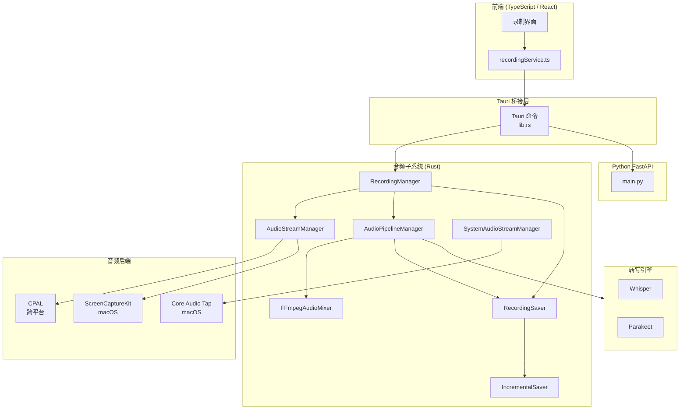
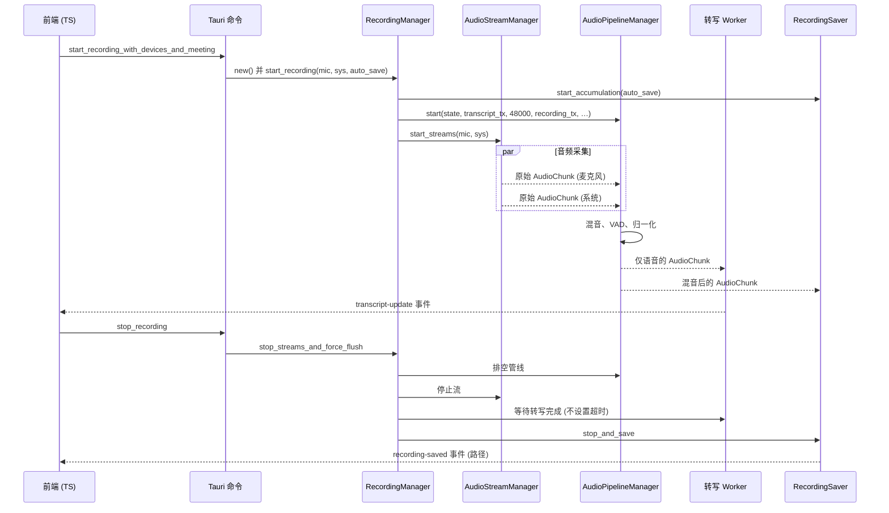
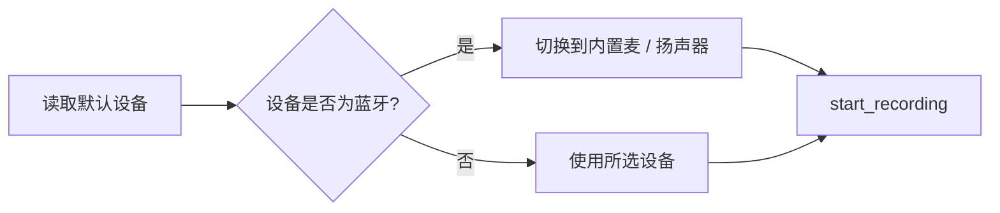
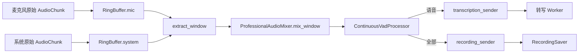

# Meetily 音频捕获技术文档

## 概述

Meetily 是一款基于 Tauri 的桌面会议纪要应用,能够实时采集麦克风与系统音频,并使用 Whisper / Parakeet 引擎进行本地转写,同时可选择性地持久化音频文件以及转写片段。音频捕获子系统以 Rust 实现 (Tauri 后端),通过 Tauri 命令向 TypeScript / React 前端开放能力。

本文档详细阐述 Meetily 的音频捕获实现:设备发现、采集后端、处理管线、基于 VAD 的分段、混音、编码、错误处理机制,并说明 macOS / Windows / Linux 三端的差异,以及与 Python FastAPI 后端的关系。

## 整体架构



## 模块布局

Tauri 后端的音频代码位于 `frontend/src-tauri/src/audio/`。

| 文件 / 模块 | 职责 |
| --- | --- |
| `mod.rs` | 模块索引与统一 re-export |
| `recording_manager.rs` | 录制会话的生命周期协调器 |
| `recording_commands.rs` | Tauri 命令入口 (`start_recording`、`stop_recording` 等) |
| `recording_state.rs` | 共享状态对象,`AudioChunk`、`DeviceType`、错误类型 |
| `pipeline.rs` | 环形缓冲混音器、采集处理器、VAD 驱动的管线 |
| `stream.rs` | CPAL / Core Audio / ScreenCaptureKit 流封装 |
| `ffmpeg_mixer.rs` | FFmpeg 风格的自适应分源缓冲混音器 (含闪避) |
| `recording_saver.rs` | 接收混音后的音频块并写入磁盘 |
| `incremental_saver.rs` | 周期性检查点,避免崩溃时丢失全部数据 |
| `device_detection.rs` | 有线 / 蓝牙设备分类与自适应超时 |
| `devices/` | 跨平台设备枚举、配置、回退 |
| `capture/` | 后端选择 (`backend_config.rs`)、Core Audio tap、系统音频采集 |
| `permissions.rs` | macOS 麦克风 / 系统音频权限申请 |
| `system_detector.rs` | 监听 Core Audio 属性变化,识别正在使用系统音频的应用 |
| `level_monitor.rs`、`simple_level_monitor.rs` | UI 电平表的 RMS / 峰值计量 |
| `transcription/` | 引擎抽象、工作线程池、转写事件发送 |
| `audio_v2/` | 较新的实验性管线 (重采样、归一化、限幅、同步) |
| `vad.rs` | Silero VAD 包装,用于语音 / 静音分段 |

## 录制生命周期



关键代码:`recording_manager.rs:RecordingManager::start_recording` 与 `recording_commands.rs:start_recording_with_devices_and_meeting`。

## 设备发现与选择

跨平台枚举从 `audio/devices/discovery.rs::list_audio_devices` 启动,内部委托给平台 shim:

- `windows` → `platform::configure_windows_audio`
- `linux` → `platform::configure_linux_audio`
- `macos` → `platform::configure_macos_audio`

该函数返回 `Vec<AudioDevice>`,前端在设备选择器中渲染。Tauri 命令 `get_audio_devices` 将其暴露给 UI。

`discovery.rs` 中的 `trigger_audio_permission` 会构建一个空操作的 CPAL 输入流,并调用 `stream.play()` 强制系统弹出麦克风权限对话框。该函数以前端命令 `trigger_microphone_permission` 暴露,用于引导流程。

### macOS 智能设备选择

在 macOS 上,`recording_manager::start_recording_with_defaults_and_auto_save` 会调用 `devices::get_safe_recording_devices_macos`,同时检查默认输入和默认输出设备。如果其中之一是蓝牙设备,函数会改用内置的 MacBook 麦克风 / 扬声器。注释中给出的理由是:macOS 上的蓝牙设备采样率可能不稳定 (Core Audio 与蓝牙协议栈可能动态重采样),从而破坏麦克风与系统音频的混音一致性。用户仍然可以通过蓝牙耳机听到声音,但录音采集会走稳定的有线路径。



## 音频采集后端

`audio/capture/backend_config.rs` 定义了后端枚举:

```rust
pub enum AudioCaptureBackend {
    CoreAudio,        // 仅 macOS
    ScreenCaptureKit, // 仅 macOS
    Cpal,             // 跨平台回退
}
```

默认后端按平台区分 (macOS 选 Core Audio,其它平台选 CPAL)。用户可以在设置界面运行时切换;当前值存储在全局 `BACKEND_CONFIG` 中 (由互斥锁保护),由 `get_current_backend()` 读取。

### `stream.rs` 中的后端选择

`AudioStream::create_with_backend` 在创建流时根据设备类型选择后端:

- 在 macOS 上,若 `device_type == System` 且后端为 `CoreAudio`,则走 Core Audio tap 路径。
- 否则构建 CPAL 流。在 macOS 上,CPAL 宿主是 ScreenCaptureKit (或通用 CPAL 后端),以 CPAL 设备的形式暴露。

`stream.rs::create_core_audio_stream` 会派生一个 Tokio 任务,持续轮询基于 `cidre` 的 Core Audio tap,并以 1024 帧为一块转发到 `AudioCapture` 处理器。

### Core Audio Tap (macOS)

`audio/capture/core_audio.rs` 基于 `cidre` (Apple Core Audio / AVFoundation 的 Rust 绑定) 实现。它通过 `with_mono_global_tap_excluding_processes` 创建进程级 tap,这是 macOS 14.4+ 上唯一允许用户态应用捕获系统音频且无需特殊授权的公开 API。tap 输出单声道、48 kHz、float32 样本。

### ScreenCaptureKit (macOS)

当 Core Audio 不可用或被禁用时,系统音频路径会通过 CPAL 回退到 ScreenCaptureKit。SCK 是较老的 API,需要屏幕录制权限,且通常比 Core Audio tap 引入更大的延迟。

### CPAL (Windows / Linux / 通用)

`audio/devices/discovery.rs` 通过 `cpal::default_host()` 枚举输入与输出设备。CPAL 是 Windows 与 Linux 上唯一受支持的后端。宿主 API 因平台而异 (Windows 用 WASAPI,Linux 用 ALSA / PulseAudio)。

## 设备类型检测与自适应缓冲

`audio/device_detection.rs` 将每个设备分类为 `Wired`、`Bluetooth` 或 `Unknown`,检测分多层:

1. 名称启发式 (`AirPods`、`Bluetooth`、`LE-`、`WH-`、`WF-` 等)。
2. macOS 上可获取时,使用 Core Audio 传输类型检查。
3. 无法分类时,默认回退到 `Unknown`。

每个 `InputDeviceKind` 暴露一个自适应缓冲超时范围:

| 类别 | 最小超时 | 最大超时 |
| --- | --- | --- |
| Wired | 20 ms | 50 ms |
| Bluetooth | 80 ms | 200 ms |
| Unknown | 80 ms | 180 ms |

混音器根据该范围为每个源分配缓冲大小,这对蓝牙设备 (AirPods、蓝牙耳机) 至关重要 —— 它们的延迟更高、抖动更大,远高于有线 USB / 内置麦克风。

## 音频处理管线

`audio/pipeline.rs` 定义了 VAD 驱动的管线,核心组件:

- `AudioMixerRingBuffer` — 分别累积麦克风与系统音频样本,直到约 600 ms 的窗口可用,再抽取对齐窗口进行混音。
- `ProfessionalAudioMixer` — 通过比例软缩放叠加麦克风与系统音频,避免削波。
- `ContinuousVadProcessor` — 封装 Silero VAD,判断混音后的音频是否包含语音。
- `AudioCapture` — 执行采样格式转换 (单声道混缩)、RMS / 峰值计量、噪声抑制 (默认关闭的 RNNoise)、高通滤波、响度归一化,并将 `AudioChunk` 推送到对应的发送端。



`AudioPipelineManager::start` 是入口,内部保存设备类型、构建 `FFmpegAudioMixer`,并派生 `AudioPipeline::run` 协程。`run` 主循环以 50 ms 超时等待 `receiver.recv()`;收到数据后压入环形缓冲,窗口达到要求时送入混音器。

## FFmpeg 风格的自适应混音器

`audio/ffmpeg_mixer.rs` 实现了一种替代混音器,为每个源 (麦克风、系统) 维护独立的缓冲与自适应超时。它是当前录制路径的默认实现,也是蓝牙场景鲁棒性的参考实现,关键行为:

- 每个源拥有独立的 `SourceBuffer` 队列与超时。
- 间隙检测:若新数据块比预期晚 2 倍以上到达,记录一次间隙并在蓝牙设备上插入静音以保持时序一致。
- 自适应混音窗口:50 ms (48 kHz 下 2400 个样本)。
- `AudioMixer` 进行基于 RMS 的闪避:当麦克风 RMS 超过 `SPEECH_THRESHOLD` (0.01) 时,系统音频压低至 60 %;否则系统音频全音量输出。麦克风始终全音量。最终求和信号被硬截断在 `[-1.0, 1.0]`,避免削波。

混音器暴露 `BufferStats` 用于诊断 (已接收块数、检测到的间隙、插入的静音量)。

## 语音活动检测

`audio/vad.rs` 暴露 `extract_speech_16k`,是对 Silero VAD 模型 (通过 `silero_rs` crate 加载) 的封装。`ContinuousVadProcessor` 配置为实时向转写发送端推送语音片段,从而在用户说话过程中就能输出部分转写结果。

RNNoise (`nnnoiseless` crate) 已集成,但默认禁用 (`ffmpeg_mixer.rs` 中 `RNNOISE_APPLY_ENABLED = false`),原因是 Whisper 本身对中等噪声已经足够鲁棒,而 RNNoise 在音乐 / 非语音内容上可能引入可听瑕疵。

## 响度归一化与重采样

`audio/audio_processing.rs` 提供:

- `audio_to_mono` — 当设备返回立体声时,平均多声道得到单声道。
- `LoudnessNormalizer` — 峰值 / RMS 归一化,用于保持混音后音频的一致响度。
- `NoiseSuppressionProcessor` — RNNoise 包装。
- `HighPassFilter` — 去除直流偏置与极低频隆隆声。

采样率转换通过 `pipeline.rs` 中的 `rubato` (SincFixedIn) 完成,统一到管线目标采样率 (48 kHz)。较新的 `audio_v2/resampler.rs` 是为未来支持采样率动态变化的占位实现。

## 增量保存与检查点

`audio/incremental_saver.rs` 负责在录制过程中将混音后的音频写入磁盘。它维护一个小环形缓冲,按可配置间隔将最近的样本刷新为部分 WAV 文件。这保证了即使在长时间会议中发生崩溃或 panic,损失也仅限于最近几秒,而不是整场会议。

完整的 saver (`audio/recording_saver.rs::RecordingSaver`) 负责累积所有数据块、维护转写历史、将元数据 (设备名称、会议名、开始时间、采样率等) 通过 `sqlx` 写入 SQLite,并在 `stop_and_save` 时生成最终的音频文件 (WAV) 与 JSON 转写结果。

## 设备监控

`audio/device_monitor.rs` 派生一个后台任务,通过 `cpal` 轮询设备的添加 / 移除事件。如果录制过程中活动麦克风或系统设备消失,monitor 会发出 `DeviceEvent`,由 recording manager 转发给 UI 作为告警 (录制会在剩余可用流上继续)。

`audio/system_detector.rs` (仅 macOS) 监听 Core Audio 的 `DEVICE_IS_RUNNING_SOMEWHERE` 属性,并向前端发出 `SystemAudioEvent::SystemAudioStarted { apps }` 或 `SystemAudioStopped`。前端据此在会议应用开始使用音频时,提示用户开始录制。

## 权限

| 权限 | macOS | Windows | Linux |
| --- | --- | --- | --- |
| 麦克风 | `trigger_audio_permission` 构建 CPAL 流并调用 `play()` 触发系统弹窗,`Info.plist` 必须包含 `NSMicrophoneUsageDescription` | 大多数场景默认授予 | 依赖 PulseAudio / PipeWire 会话总线 |
| 系统音频 | `trigger_system_audio_permission` 调用 `CoreAudioCapture::new()`;macOS 14.4+ 上系统会自动弹出 Audio Capture 弹窗,`Info.plist` 必须包含 `NSAudioCaptureUsageDescription` | WASAPI loopback,无需特殊权限 | PulseAudio / PipeWire monitor 源,无需特殊权限 |
| 屏幕录制 (SCK 回退) | 使用 ScreenCaptureKit 时必需 | 不适用 | 不适用 |

Tauri 命令 `trigger_microphone_permission`、`trigger_system_audio_permission`、`check_screen_recording_permission` 在引导流程中暴露给前端。

## 编码与持久化

用户停止录制时,saver 会写入 WAV 文件 (PCM 16-bit、48 kHz、单声道或立体声,取决于是否同时采集两个源)。如果用户开启了自动保存,文件会保留在用户的录制文件夹 (可在设置中配置);否则仅保留转写 JSON 与 SQLite 元数据。FFmpeg (`ffmpeg-sidecar`) 随应用打包,用于支持可选的转码 (例如导出 MP3) 以及在 `audio_v2` 路径下合并独立的麦克风 / 系统音轨。

## Python 后端集成

Tauri 后端仅在转写后处理阶段调用本地的 Python FastAPI 服务 (`backend/app/main.py`),用于实现说话人分离、纪要摘要、思维导图生成等。转写本身在 Rust 中通过 Whisper / Parakeet 本地完成,因此音频捕获管线不依赖 Python 后端的可用性。Python 服务通过 HTTP 接收最终的转写 JSON,并返回衍生产物。

## 错误处理

| 错误来源 | 处理方式 |
| --- | --- |
| 权限被拒 | `trigger_audio_permission` 返回 `Ok(false)`,前端显示引导弹窗;`trigger_system_audio_permission` 在 Core Audio tap 创建失败时同样返回 `Ok(false)` |
| 没有输入设备 | `default_input_device` 返回 `None`;`start_recording_with_defaults_and_auto_save` 报 `"No microphone device available for recording"` 错误并退出 |
| 缓冲溢出 | `AudioMixerRingBuffer::add_samples` 对麦克风溢出记录 `WARN`、对系统音频溢出记录 `ERROR` (会引起失真),随后丢弃最旧样本以限制内存占用 |
| 采样率不匹配 | 管线强制 48 kHz;`rubato` 执行 SincFixedIn 重采样。`audio_v2/resampler.rs` 留作未来动态采样率切换 |
| 录制中设备断开 | `device_monitor` 发出 `DeviceEvent`,UI 收到通知,录制在剩余可用流上继续 |
| 流构建失败 | `AudioStream::create` 返回 `Err`;`RecordingManager::start_recording` 向上传播,Tauri 命令层将错误转为 `String`,前端弹出提示 |
| 转写引擎未加载 | `audio/transcription/engine.rs::validate_transcription_model_ready` 检查所配置的 provider (localWhisper 或 parakeet),在模型缺失时返回明确错误,`start_recording_with_devices_and_meeting` 在打开流之前就退出 |
| 录制中崩溃 | `incremental_saver` 定期刷新 WAV 检查点;下次启动时用户可以恢复部分文件 |

## 关键代码引用

| 关注点 | 文件 | 符号 |
| --- | --- | --- |
| Tauri 命令面 | `frontend/src-tauri/src/lib.rs` | `start_recording_with_devices_and_meeting`、`stop_recording`、`get_audio_devices`、`trigger_microphone_permission` |
| 录制生命周期 | `frontend/src-tauri/src/audio/recording_manager.rs` | `RecordingManager::start_recording` |
| 流创建 | `frontend/src-tauri/src/audio/stream.rs` | `AudioStream::create_with_backend` |
| 管线 | `frontend/src-tauri/src/audio/pipeline.rs` | `AudioPipelineManager::start`、`AudioPipeline::run`、`AudioMixerRingBuffer`、`ProfessionalAudioMixer` |
| 自适应混音器 | `frontend/src-tauri/src/audio/ffmpeg_mixer.rs` | `FFmpegAudioMixer`、`SourceBuffer`、`AudioMixer` |
| 设备检测 | `frontend/src-tauri/src/audio/device_detection.rs` | `InputDeviceKind::detect`、`InputDeviceKind::buffer_timeout` |
| 后端选择 | `frontend/src-tauri/src/audio/capture/backend_config.rs` | `AudioCaptureBackend`、`BACKEND_CONFIG` |
| Core Audio tap | `frontend/src-tauri/src/audio/capture/core_audio.rs` | `CoreAudioCapture::new`、`CoreAudioCapture::stream` |
| 系统音频采集 | `frontend/src-tauri/src/audio/capture/system.rs` | `SystemAudioCapture::start_system_audio_capture` |
| 权限 | `frontend/src-tauri/src/audio/permissions.rs` | `trigger_system_audio_permission`、`trigger_audio_permission` |
| 系统音频活动 | `frontend/src-tauri/src/audio/system_detector.rs` | `MacOSSystemAudioDetector::start` |
| Saver | `frontend/src-tauri/src/audio/recording_saver.rs` | `RecordingSaver::start_accumulation`、`RecordingSaver::stop_and_save` |
| 增量检查点 | `frontend/src-tauri/src/audio/incremental_saver.rs` | `IncrementalSaver` |
| 设备热插拔 | `frontend/src-tauri/src/audio/device_monitor.rs` | `AudioDeviceMonitor` |
| 电平计量 | `frontend/src-tauri/src/audio/level_monitor.rs`、`simple_level_monitor.rs` | `AudioLevelMonitor::start_monitoring` |
| 转写入口 | `frontend/src-tauri/src/audio/transcription/engine.rs` | `validate_transcription_model_ready`、`get_or_init_transcription_engine` |
| 转写 Worker | `frontend/src-tauri/src/audio/transcription/worker.rs` | `start_transcription_task` |
| 前端服务 | `frontend/src/services/recordingService.ts` | 设备列表、开始 / 停止、电平订阅 |

## 兼容性矩阵

| 功能 | macOS | Windows | Linux |
| --- | --- | --- | --- |
| 麦克风采集 | CPAL (CoreAudio 宿主) | CPAL (WASAPI) | CPAL (ALSA / PulseAudio) |
| 系统音频 | Core Audio tap (首选) 或 ScreenCaptureKit (回退) | CPAL WASAPI loopback (尚未对接) | 未实现 (返回 `bail!`) |
| 蓝牙设备识别 | 支持 (名称 + 传输类型) | 仅按名称 | 仅按名称 |
| 自适应缓冲 | 支持 | 支持 | 支持 |
| 系统音频活动事件 | 支持 (Core Audio 属性监听) | 不支持 | 不支持 |
| Whisper (Metal / CoreML) | 支持 | CUDA / Vulkan / CPU | CUDA / HIP / Vulkan / CPU |

## 扩展管线

### 新增音频源

例如,要在 Windows 上加入虚拟音频线缆:

1. 在 `audio/devices/` 下实现一个发现函数,返回带有特定 `DeviceType` 的新设备 (如需区分)。
2. 在 `stream.rs` (或新模块) 中添加生成兼容 `AudioChunk` 的流创建路径。
3. 若新源的延迟特性与现有类别不同,扩展 `device_detection::InputDeviceKind` 与 `buffer_timeout`。
4. 在 `lib.rs` 中注册新的 Tauri 命令,便于前端启用。

### 替换 VAD 或噪声抑制器

- 替换 `vad::extract_speech_16k` 为新的实现,`AudioPipeline::run` 中的调用点保持不变。
- 启用噪声抑制:将 `RNNOISE_APPLY_ENABLED` 设为 `true`,并将 `nnnoiseless` 处理器接入 `AudioCapture` (目前默认禁用)。

### 迁移到 `audio_v2` 管线 (进行中)

- `audio_v2/compatibility.rs::LegacyBridge` 已经支持在 `AudioMode::Hybrid` 下并行运行旧版与新版系统。
- 在新版接管旧版管线之前,`audio_v2/resampler.rs`、`normalizer.rs`、`limiter.rs`、`sync.rs` 仍需补全。
