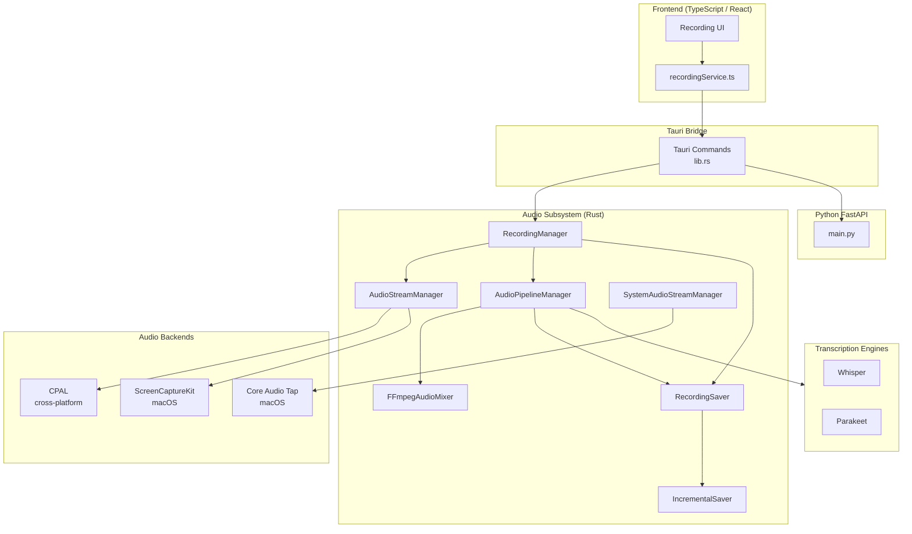
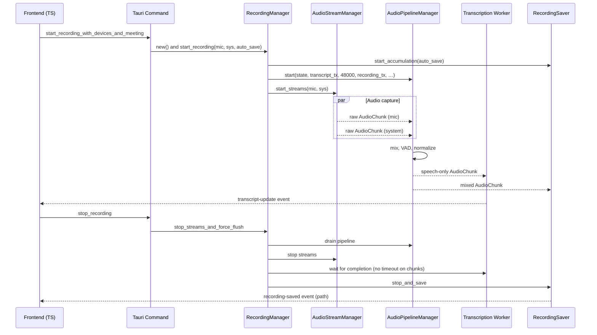
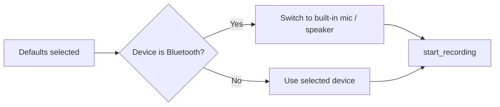
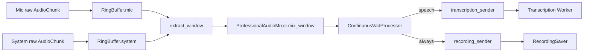

# Meetily Audio Capture Technical Documentation

## Overview

Meetily is a Tauri-based desktop meeting minutes application that captures microphone and system audio in real time, transcribes it locally with Whisper / Parakeet engines, and persists both the audio (optionally) and transcript segments. The audio capture subsystem is implemented in Rust (Tauri backend) and exposes Tauri commands to the TypeScript / React frontend.

This document details the audio capture implementation: device discovery, capture backends, the processing pipeline, VAD-driven segmentation, mixing, encoding, and error handling. It also calls out the macOS / Windows / Linux differences and the relationship with the Python FastAPI backend.

## High-Level Architecture



## Module Layout

The Tauri backend audio code lives at `frontend/src-tauri/src/audio/`.

| File / Module | Responsibility |
| --- | --- |
| `mod.rs` | Module index and re-exports |
| `recording_manager.rs` | Lifecycle coordinator for a recording session |
| `recording_commands.rs` | Tauri command surface (`start_recording`, `stop_recording`, …) |
| `recording_state.rs` | Shared state object, `AudioChunk`, `DeviceType`, error types |
| `pipeline.rs` | Ring buffer mixer, capture processor, VAD-driven pipeline |
| `stream.rs` | CPAL / Core Audio / ScreenCaptureKit stream wrapper |
| `ffmpeg_mixer.rs` | FFmpeg-style adaptive per-source buffer mixer with ducking |
| `recording_saver.rs` | Receives mixed audio chunks and writes the session to disk |
| `incremental_saver.rs` | Periodic checkpoints to avoid data loss on crash |
| `device_detection.rs` | Wired vs Bluetooth classification and adaptive timeouts |
| `devices/` | Cross-platform device enumeration, configuration, fallback |
| `capture/` | Backend selection (`backend_config.rs`), Core Audio tap, system capture |
| `permissions.rs` | macOS microphone / system audio permission requests |
| `system_detector.rs` | Listens to Core Audio property changes to detect apps using system audio |
| `level_monitor.rs`, `simple_level_monitor.rs` | RMS / peak metering for UI level meters |
| `transcription/` | Engine abstraction, worker pool, transcript emission |
| `audio_v2/` | Newer / experimental pipeline (resampler, normalizer, limiter, sync) |
| `vad.rs` | Silero VAD wrapper for speech / silence segmentation |

## Recording Lifecycle



Key code: `recording_manager.rs:RecordingManager::start_recording` and `recording_commands.rs:start_recording_with_devices_and_meeting`.

## Device Discovery and Selection

Cross-platform enumeration starts in `audio/devices/discovery.rs::list_audio_devices`. It delegates to a platform shim:

- `windows` → `platform::configure_windows_audio`
- `linux` → `platform::configure_linux_audio`
- `macos` → `platform::configure_macos_audio`

The function returns a `Vec<AudioDevice>` that the frontend renders in the device picker. Tauri command `get_audio_devices` exposes it to the UI.

`trigger_audio_permission` (in `discovery.rs`) builds a no-op CPAL input stream and calls `stream.play()` to force the OS to surface the microphone permission dialog. The function is exposed to the frontend as `trigger_microphone_permission` and is used during onboarding.

### macOS Smart Device Selection

On macOS, `recording_manager::start_recording_with_defaults_and_auto_save` calls `devices::get_safe_recording_devices_macos`, which inspects both the default input and default output devices. If either is a Bluetooth device, the function returns the built-in MacBook mic / speaker instead. Rationale (from the source comment): Bluetooth devices on macOS can have variable sample rates as Core Audio and the Bluetooth stack may resample dynamically, which destabilises mic / system mixing. The user still hears audio via Bluetooth, but recording captures from a stable wired path.



## Audio Capture Backends

`audio/capture/backend_config.rs` defines the backend enum:

```rust
pub enum AudioCaptureBackend {
    CoreAudio,        // macOS only
    ScreenCaptureKit, // macOS only
    Cpal,             // cross-platform fallback
}
```

The default is platform-specific (Core Audio on macOS, CPAL elsewhere). The user can switch it at runtime through the settings UI; the current value is stored in the global `BACKEND_CONFIG` (mutex-protected) and is consulted by `get_current_backend()`.

### Backend Selection in `stream.rs`

`AudioStream::create_with_backend` picks the right backend at stream creation time:

- If `device_type == System` on macOS and the backend is `CoreAudio`, the Core Audio tap path is used.
- Otherwise, the function builds a CPAL stream. On macOS, the CPAL host is ScreenCaptureKit (or a generic CPAL backend), exposed as a CPAL device.

`stream.rs::create_core_audio_stream` spawns a Tokio task that polls the `cidre`-backed Core Audio tap and forwards samples to an `AudioCapture` processor at 1024-frame chunks.

### Core Audio Tap (macOS)

`audio/capture/core_audio.rs` is built on top of `cidre` (a Rust binding around Apple's Core Audio / AVFoundation frameworks). It creates a process tap via `with_mono_global_tap_excluding_processes`, which is the only public API on macOS 14.4+ that lets a user-space app capture system audio without privileged entitlements. The tap is mono and produces 48 kHz float32 samples.

### ScreenCaptureKit (macOS)

When Core Audio is unavailable or disabled, the system audio path falls back to ScreenCaptureKit via CPAL. SCK is the older API, requires Screen Recording permission, and tends to introduce more latency than Core Audio taps.

### CPAL (Windows / Linux / Generic)

`audio/devices/discovery.rs` enumerates input and output devices through `cpal::default_host()`. CPAL is the only supported backend on Windows and Linux. The host API differs by platform (WASAPI on Windows, ALSA / PulseAudio on Linux).

## Device Type Detection and Adaptive Buffering

`audio/device_detection.rs` classifies each device as `Wired`, `Bluetooth`, or `Unknown`. The detection is multi-layered:

1. Name heuristics (`AirPods`, `Bluetooth`, `LE-`, `WH-`, `WF-`, etc.).
2. macOS-specific Core Audio transport type inspection (when available).
3. Default fallback to `Unknown` if the device cannot be classified.

Each `InputDeviceKind` exposes an adaptive buffer timeout range:

| Kind | Min timeout | Max timeout |
| --- | --- | --- |
| Wired | 20 ms | 50 ms |
| Bluetooth | 80 ms | 200 ms |
| Unknown | 80 ms | 180 ms |

The mixer consults this range to size its per-source buffers, which is critical because Bluetooth devices (AirPods, headsets) have higher latency and more jitter than wired USB / built-in mics.

## The Audio Processing Pipeline

`audio/pipeline.rs` defines the VAD-driven pipeline. Components:

- `AudioMixerRingBuffer` — accumulates samples from mic and system streams until a window of ~600 ms is available, then extracts aligned windows for mixing.
- `ProfessionalAudioMixer` — combines mic + system audio with proportional soft scaling to prevent clipping.
- `ContinuousVadProcessor` — wraps Silero VAD to decide when the mixed audio contains speech.
- `AudioCapture` — runs sample format conversion (mono mix-down), RMS / peak metering, noise suppression (RNNoise, off by default), high-pass filter, loudness normalization, and pushes `AudioChunk` to the appropriate sender.



`AudioPipelineManager::start` is the entry point. It stores the device kinds, builds the `FFmpegAudioMixer`, and spawns the `AudioPipeline::run` future. `run` loops with a 50 ms timeout on `receiver.recv()`; when data arrives it pushes to the ring buffer, then to the mixer when a window is ready.

## FFmpeg-Style Adaptive Mixer

`audio/ffmpeg_mixer.rs` implements an alternative mixer that maintains separate buffers per source (mic and system) with adaptive timeouts. It is the current default for the recording path and the reference implementation for Bluetooth robustness. Key behaviour:

- Per-source `SourceBuffer` with its own queue and timeout.
- Gap detection: if a chunk arrives more than 2× later than expected, the mixer records a gap and (for Bluetooth) inserts silence to keep timing consistent.
- Adaptive mix window: 50 ms (2400 samples at 48 kHz).
- `AudioMixer` performs RMS-based ducking: when mic RMS > `SPEECH_THRESHOLD` (0.01), system audio is ducked to 60 %; otherwise system audio plays at full volume. Mic always plays at full volume. The summed signal is hard-clamped to `[-1.0, 1.0]` to prevent clipping.

The mixer exposes `BufferStats` for diagnostics (chunks received, gaps detected, silence inserted).

## Voice Activity Detection

`audio/vad.rs` exposes `extract_speech_16k`, a wrapper around the Silero VAD model (loaded through the `silero_rs` crate). The `ContinuousVadProcessor` is configured to emit speech segments to the transcription sender in real time, allowing partial transcript updates to be shown while the user is still speaking.

RNNoise (`nnnoiseless` crate) is integrated but disabled by default (`RNNOISE_APPLY_ENABLED = false` in `ffmpeg_mixer.rs`) because Whisper is already robust to moderate noise and RNNoise can introduce audible artifacts on music / non-speech content.

## Loudness Normalization and Resampling

`audio/audio_processing.rs` provides:

- `audio_to_mono` — averages channels when a device returns stereo.
- `LoudnessNormalizer` — peak / RMS normalization used to keep the mixed audio at a consistent level.
- `NoiseSuppressionProcessor` — RNNoise wrapper.
- `HighPassFilter` — removes DC offset and very low frequency rumble.

Sample-rate conversion uses `rubato` (SincFixedIn) inside `pipeline.rs` to bring all streams to the pipeline's target rate (48 kHz). The newer `audio_v2/resampler.rs` is a placeholder for a future dynamic resampler that handles sample-rate changes gracefully.

## Incremental Saving and Checkpoints

`audio/incremental_saver.rs` is responsible for writing the mixed audio to disk as the recording progresses. It maintains a small ring buffer of recent samples and flushes to a partial WAV file at a configurable interval. This ensures that a crash or panic during a long meeting loses at most a few seconds of audio rather than the entire session.

The full saver (`audio/recording_saver.rs::RecordingSaver`) accumulates all chunks, tracks the transcript history, persists metadata (device names, meeting name, start time, sample rate) to SQLite via `sqlx`, and on `stop_and_save` produces the final audio file (WAV) and a JSON transcript.

## Device Monitoring

`audio/device_monitor.rs` spawns a background task that polls `cpal` for device add / remove events. If the active microphone or system device disappears mid-recording, the monitor emits a `DeviceEvent` that the recording manager surfaces to the UI as a warning (the recording continues with whatever data is still available).

`audio/system_detector.rs` (macOS only) attaches a Core Audio property listener for `DEVICE_IS_RUNNING_SOMEWHERE` and emits `SystemAudioEvent::SystemAudioStarted { apps }` or `SystemAudioStopped` to the frontend. The frontend uses this to nudge the user to start a recording when a meeting app begins using audio.

## Permissions

| Permission | macOS | Windows | Linux |
| --- | --- | --- | --- |
| Microphone | `trigger_audio_permission` builds a CPAL stream and calls `play()` to surface the dialog. `Info.plist` must include `NSMicrophoneUsageDescription`. | Granted by default in most setups. | PulseAudio / PipeWire session bus. |
| System audio | `trigger_system_audio_permission` calls `CoreAudioCapture::new()`. The OS shows the Audio Capture dialog automatically on macOS 14.4+. `Info.plist` must include `NSAudioCaptureUsageDescription`. | WASAPI loopback — no special permission. | PulseAudio / PipeWire monitor source — no special permission. |
| Screen recording (SCK fallback) | Required when using ScreenCaptureKit. | N/A | N/A |

The Tauri commands `trigger_microphone_permission`, `trigger_system_audio_permission`, and `check_screen_recording_permission` are exposed to the frontend for onboarding flows.

## Encoding and Persistence

When the user stops a recording, the saver writes a WAV file (PCM 16-bit, 48 kHz, mono or stereo depending on whether both sources were active). If the user opted into auto-save, the file is kept in the user's recordings folder (configurable in settings); otherwise only the transcript JSON and SQLite metadata are kept. FFmpeg (`ffmpeg-sidecar`) is bundled with the application to support optional re-encoding (e.g. MP3 export) and to merge separate mic / system tracks in the `audio_v2` path.

## Backend Integration (Python)

The Tauri backend calls the local Python FastAPI service in `backend/app/main.py` only for transcript post-processing (e.g. speaker diarization, summary generation, mind-map creation). The transcription itself happens locally in Rust via Whisper / Parakeet, so the audio capture pipeline is not dependent on the Python backend being available. The Python service receives the final transcript JSON via HTTP and returns derived artefacts.

## Error Handling

| Error source | Handling |
| --- | --- |
| Permission denied | `trigger_audio_permission` returns `Ok(false)`; the frontend shows a guidance dialog. `trigger_system_audio_permission` returns `Ok(false)` if the Core Audio tap cannot be created. |
| No input device | `default_input_device` returns `None`; `start_recording_with_defaults_and_auto_save` bails with `"No microphone device available for recording"`. |
| Buffer overflow | `AudioMixerRingBuffer::add_samples` logs `WARN` for mic overflow and `ERROR` for system overflow (which causes distortion), then drops the oldest samples to bound memory. |
| Sample rate mismatch | Pipeline forces 48 kHz; `rubato` performs SincFixedIn resampling. The newer `audio_v2/resampler.rs` is reserved for dynamic rate-change handling. |
| Device disconnected mid-recording | `device_monitor` emits a `DeviceEvent`; the UI is notified. Recording continues with available streams. |
| Stream build failure | `AudioStream::create` returns `Err`; `RecordingManager::start_recording` propagates it. The Tauri command layer converts the error to a `String` and the frontend surfaces a toast. |
| Transcription engine not loaded | `validate_transcription_model_ready` (in `audio/transcription/engine.rs`) checks the configured provider (localWhisper or parakeet) and returns a descriptive error if the model is missing. The `start_recording_with_devices_and_meeting` flow bails before opening streams in that case. |
| Crash mid-recording | `incremental_saver` flushes partial WAV checkpoints; on next launch the user can recover the partial file. |

## Key Code References

| Concern | File | Symbol |
| --- | --- | --- |
| Tauri command surface | `frontend/src-tauri/src/lib.rs` | `start_recording_with_devices_and_meeting`, `stop_recording`, `get_audio_devices`, `trigger_microphone_permission` |
| Recording lifecycle | `frontend/src-tauri/src/audio/recording_manager.rs` | `RecordingManager::start_recording` |
| Stream creation | `frontend/src-tauri/src/audio/stream.rs` | `AudioStream::create_with_backend` |
| Pipeline | `frontend/src-tauri/src/audio/pipeline.rs` | `AudioPipelineManager::start`, `AudioPipeline::run`, `AudioMixerRingBuffer`, `ProfessionalAudioMixer` |
| Adaptive mixer | `frontend/src-tauri/src/audio/ffmpeg_mixer.rs` | `FFmpegAudioMixer`, `SourceBuffer`, `AudioMixer` |
| Device detection | `frontend/src-tauri/src/audio/device_detection.rs` | `InputDeviceKind::detect`, `InputDeviceKind::buffer_timeout` |
| Backend selection | `frontend/src-tauri/src/audio/capture/backend_config.rs` | `AudioCaptureBackend`, `BACKEND_CONFIG` |
| Core Audio tap | `frontend/src-tauri/src/audio/capture/core_audio.rs` | `CoreAudioCapture::new`, `CoreAudioCapture::stream` |
| System capture | `frontend/src-tauri/src/audio/capture/system.rs` | `SystemAudioCapture::start_system_audio_capture` |
| Permissions | `frontend/src-tauri/src/audio/permissions.rs` | `trigger_system_audio_permission`, `trigger_audio_permission` |
| System audio activity | `frontend/src-tauri/src/audio/system_detector.rs` | `MacOSSystemAudioDetector::start` |
| Saver | `frontend/src-tauri/src/audio/recording_saver.rs` | `RecordingSaver::start_accumulation`, `RecordingSaver::stop_and_save` |
| Incremental checkpoints | `frontend/src-tauri/src/audio/incremental_saver.rs` | `IncrementalSaver` |
| Device hot-plug | `frontend/src-tauri/src/audio/device_monitor.rs` | `AudioDeviceMonitor` |
| Level metering | `frontend/src-tauri/src/audio/level_monitor.rs`, `simple_level_monitor.rs` | `AudioLevelMonitor::start_monitoring` |
| Transcription entry | `frontend/src-tauri/src/audio/transcription/engine.rs` | `validate_transcription_model_ready`, `get_or_init_transcription_engine` |
| Transcription worker | `frontend/src-tauri/src/audio/transcription/worker.rs` | `start_transcription_task` |
| Frontend service | `frontend/src/services/recordingService.ts` | device listing, start / stop, level subscription |

## Compatibility Matrix

| Feature | macOS | Windows | Linux |
| --- | --- | --- | --- |
| Microphone capture | CPAL (CoreAudio host) | CPAL (WASAPI) | CPAL (ALSA / PulseAudio) |
| System audio | Core Audio tap (preferred) or ScreenCaptureKit (fallback) | CPAL WASAPI loopback (not yet wired) | Not implemented (returns `bail!`) |
| Bluetooth detection | Yes (name + transport type) | Name only | Name only |
| Adaptive buffering | Yes | Yes | Yes |
| System audio activity events | Yes (Core Audio prop listener) | No | No |
| Whisper (Metal / CoreML) | Yes | CUDA / Vulkan / CPU | CUDA / HIP / Vulkan / CPU |

## Extending the Pipeline

To add a new audio source (for example, a virtual audio cable on Windows):

1. Implement a discovery function in `audio/devices/` that returns the new device with a distinct `DeviceType` if needed.
2. Add a stream creation path in `stream.rs` (or a new module) that produces `AudioChunk`s compatible with the existing pipeline.
3. If the source has latency characteristics different from the existing kinds, extend `device_detection::InputDeviceKind` and `buffer_timeout`.
4. Register the new Tauri command in `lib.rs` so the frontend can opt in.

To swap the VAD or the noise suppressor:

- Replace `vad::extract_speech_16k` with the new implementation; keep the call site in `AudioPipeline::run` unchanged.
- For noise suppression, set `RNNOISE_APPLY_ENABLED = true` and wire the `nnnoiseless` processor into `AudioCapture` (currently disabled).

To migrate to the `audio_v2` pipeline (currently a work-in-progress):

- `audio_v2/compatibility.rs::LegacyBridge` already supports running legacy and modern systems side by side in `AudioMode::Hybrid`.
- `audio_v2/resampler.rs`, `normalizer.rs`, `limiter.rs`, `sync.rs` need to be filled in before the modern path can replace the legacy pipeline.
