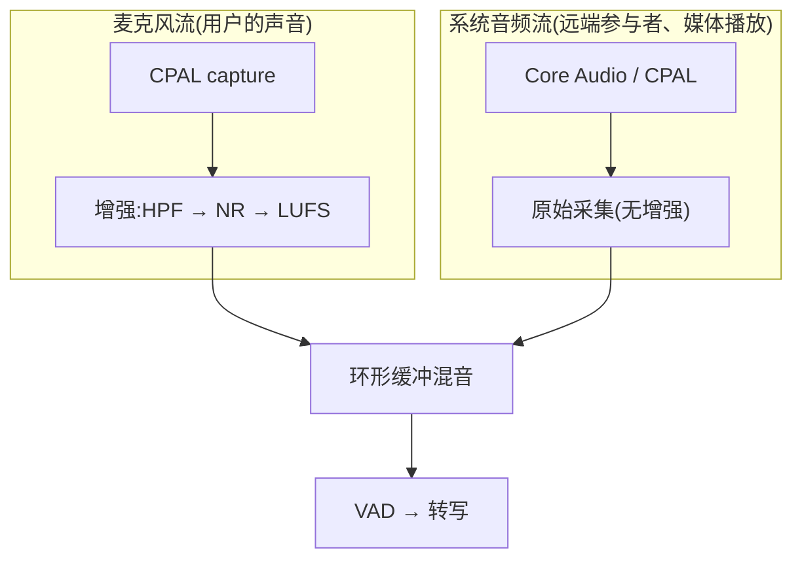
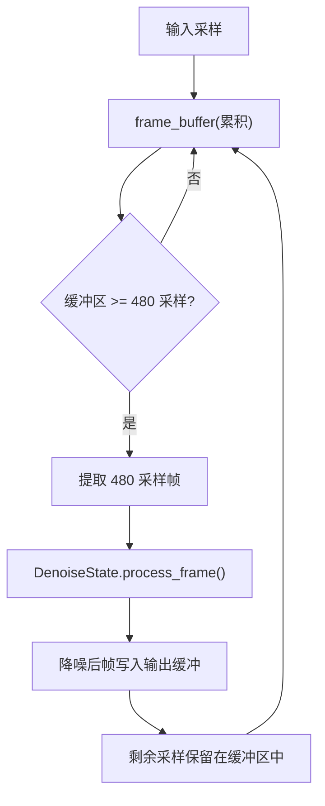

# 音频处理:回声消除与降噪

本文档详细介绍了 Meetily 如何在其音频处理管线中处理音频回声消除(AEC)与降噪(NR)。

> **最后更新基于源码路径:** `frontend/src-tauri/src/audio/`

---

## 目录

- [1. 架构概览](#1-架构概览)
  - [1.1 范围与边界](#11-范围与边界)
- [2. 回声消除(AEC)](#2-回声消除aec)
- [3. 降噪](#3-降噪)
- [4. 音频处理管线](#4-音频处理管线)
- [5. 关键组件与实现细节](#5-关键组件与实现细节)
- [6. 跨平台差异](#6-跨平台差异)
- [7. 配置选项与开关](#7-配置选项与开关)
- [8. 音频混音策略](#8-音频混音策略)
- [9. 语音活动检测(VAD)](#9-语音活动检测vad)
- [10. 总结与建议](#10-总结与建议)

---

## 1. 架构概览

Meetily 的音频系统使用 Rust 在 Tauri 后端实现
(`frontend/src-tauri/src/audio/`)。该管线划分为以下主要子系统:

| 子系统 | 源文件                                                          | 职责                              |
| ------ | --------------------------------------------------------------- | --------------------------------- |
| 采集   | `pipeline.rs` (`AudioCapture`),`capture/`                       | 设备采集、重采样、增强            |
| 混音   | `pipeline.rs` (`AudioMixerRingBuffer`,`ProfessionalAudioMixer`) | 麦克风 + 系统音频混音             |
| VAD    | `vad.rs` (`ContinuousVadProcessor`)                             | 通过 Silero VAD 进行语音分段      |
| 转写   | `transcription/`,`whisper_engine/`,`parakeet_engine/`           | 通过 Whisper 或 Parakeet 进行 STT |
| 后处理 | `post_processor.rs`                                             | 转写文本清理                      |

该管线在**采集时按设备处理音频**(增强阶段),并在**混音之后**进行 VAD 与转写。

### 1.1 范围与边界

本节明确本仓库中"音频信号处理"涉及和不涉及的代码范围,以避免读者在排查 AEC / 降噪问题时误入无关模块。

| 代码位置                                   | 是否参与音频信号处理  | 实际职责                                                                       |
| ------------------------------------------ | --------------------- | ------------------------------------------------------------------------------ |
| `frontend/src-tauri/src/audio/`            | ✅ **是**(本文件重点) | 采集、重采样、增强、混音、VAD                                                  |
| `frontend/src-tauri/src/transcription/`    | ❌ 否                 | 调用 Whisper / Parakeet 引擎推理,不处理原始 PCM                                |
| `backend/app/main.py`                      | ❌ 否                 | FastAPI 入口,只保存转写文本与 `audio_start_time` / `audio_end_time` 同步时间戳 |
| `backend/app/db.py`                        | ❌ 否                 | SQLite 元数据持久化(仅含时间戳字段)                                            |
| `backend/app/transcript_processor.py`      | ❌ 否                 | 转写文本摘要/处理,无音频信号路径                                               |
| `backend/whisper-custom/server/server.cpp` | ❌ 否                 | HTTP 服务,接收 WAV 后调用 `read_wav` 送入 whisper.cpp,**不**做 AEC / 降噪      |

**结论**:

- 所有 AEC / 降噪 / 归一化 / VAD 代码**仅存在于** `frontend/src-tauri/src/audio/`。
- Python 后端 (`backend/app/`) 与 Whisper C++ 服务 (`backend/whisper-custom/server/`) **均不参与**音频信号处理;若需排查麦克风噪声或回声问题,只需聚焦 Tauri 后端即可,无需在 `backend/` 目录中搜索 AEC / NR 相关实现。

---

## 2. 回声消除(AEC)

### 2.1 当前状态:未实现

**Meetily 未实现声学回声消除(AEC)。**

对整个代码库(`frontend/src-tauri/src/audio/`、`backend/` 以及相关模块)进行的彻底分析确认:

- 源码中不存在任何 AEC 算法(例如自适应滤波、NLMS、Speex AEC、WebRTC AEC)。
- `Cargo.toml` 中不依赖任何 AEC 库。
- "echo cancellation"、"AEC"、"acoustic echo" 等术语在整个代码库中均未出现。

### 2.2 为什么 Meetily 的架构不需要 AEC

Meetily 的设计通过**双流分离**从根本上避免了回声问题:



- **麦克风** 仅采集本地用户的声音(加上环境噪声)。
- **系统音频** 仅采集远端参与者/媒体播放。
- 两条流从**独立的硬件设备**采集,并在混音之前被独立处理。
- 由于系统音频是从操作系统音频输出采集(而非从麦克风采集),因此不存在引起回声的声学反馈回路。

### 2.3 可能出现回声的潜在场景

尽管架构在设计上避免了回声,在以下边界情况下仍可能感知到回声:

1. **扬声器播放被麦克风拾取**:如果用户通过扬声器(而非耳机)播放音频,且麦克风足够灵敏,麦克风流将包含微弱的系统音频串扰。这属于物理声学回声,而非数字回声。
2. **蓝牙设备回声**:蓝牙耳机有时会引入延迟,导致用户听到自己延迟后的声音。这是设备级问题,而非应用级回声。

### 2.4 缓解策略(无需 AEC)

- **推荐:使用耳机** —— 完全消除声学反馈。
- **RNNoise 降噪器**(见第 3 节)可以衰减麦克风中低强度的系统音频串扰。
- **高通滤波器**(80 Hz 截止频率)可去除可能由扬声器振动拾取的低频隆隆声。
- **EBU R128 归一化器**可确保一致的响度,同时避免过度放大背景噪声。

---

## 3. 降噪

### 3.1 基于 RNNoise 神经网络的降噪

Meetily 包含一个基于 **RNNoise** 算法的降噪处理器,通过 [`nnnoiseless`](https://crates.io/crates/nnnoiseless) crate(版本 `0.5`)实现。

**依赖声明**(`Cargo.toml`):

```toml
# Noise suppression - RNNoise-based neural network noise reduction
nnnoiseless = "0.5"
```

#### 3.1.1 实现:`NoiseSuppressionProcessor`

源码:`audio_processing.rs`,结构体 `NoiseSuppressionProcessor`

```rust
pub struct NoiseSuppressionProcessor {
    denoiser: DenoiseState<'static>,
    frame_buffer: Vec<f32>,
    frame_size: usize,  // 480 samples at 48kHz = 10ms
}
```

**关键特性:**

| 属性     | 值                         |
| -------- | -------------------------- |
| 算法     | RNNoise(循环神经网络)      |
| 库       | `nnnoiseless` v0.5         |
| 采样率   | 48000 Hz(必需)             |
| 帧大小   | 480 采样(10 ms)            |
| 降噪量   | 典型环境下 10–15 dB        |
| 延迟     | 每帧约 10 ms               |
| VAD 输出 | 每帧返回 VAD 概率(0.0–1.0) |

#### 3.1.2 处理逻辑



- 音频以固定的 **480 采样帧**(48 kHz 下 10 ms)进行处理。
- 未满一帧的采样会被**缓冲**到下一次调用。
- 在刷新时(录制结束),剩余采样通过**零填充**后处理。

#### 3.1.3 默认状态:禁用

**RNNoise 默认处于禁用状态。** 控制开关为:

```rust
// ffmpeg_mixer.rs
pub const RNNOISE_APPLY_ENABLED: bool = false;
```

代码中给出的理由:

> _"Whisper 自身能够很好地处理噪声 —— RNNoise 是可选的"_

这意味着:

- Whisper 的神经网络已具有很强的噪声鲁棒性。
- 在干净音频上启用 RNNoise 可能会引入伪影。
- 需要更强降噪的用户可通过将该标志设置为 `true` 并重新编译来启用。

#### 3.1.4 启用 RNNoise 后的行为

如果 `RNNOISE_APPLY_ENABLED = true`:

- RNNoise **仅针对麦克风流**初始化(不针对系统音频)。
- 它作为增强管线的**第二步**(高通滤波器之后,归一化之前)。
- 健康监控每 100 个块记录一次缓冲采样数和长度差,以检测延迟累积。

### 3.2 高通滤波器

一个一阶 IIR 高通滤波器用于去除 80 Hz 以下的低频隆隆声。

```rust
pub struct HighPassFilter {
    alpha: f32,
    prev_input: f32,
    prev_output: f32,
}
```

| 属性     | 值                                    |
| -------- | ------------------------------------- |
| 类型     | 一阶 IIR(无限脉冲响应)                |
| 截止频率 | 80 Hz                                 |
| 公式     | `y[n] = α × (y[n-1] + x[n] - x[n-1])` |
| 应用对象 | 仅麦克风                              |
| 始终启用 | 是(存在麦克风时)                      |

此滤波器可去除:

- 桌面振动和机械隆隆声
- 低频空调噪声
- 语音频段以下的扬声器感应反馈

### 3.3 谱减法(遗留/未使用)

代码库在 `audio_processing.rs` 中包含 `spectral_subtraction()` 函数和 `average_noise_spectrum()` 工具。这些函数**已定义但从未在主管线中调用**。它们似乎是出于参考目的而保留的遗留实现。

### 3.4 Whisper 内部噪声处理

Whisper(语音转文字引擎)本身具有噪声鲁棒性:

- 它在包括噪声环境在内的多样化音频上训练。
- 它使用注意力机制,天然聚焦于语音模式。
- 出于这个原因,Meetily 团队选择默认禁用 RNNoise。

---

## 4. 音频处理管线

### 4.1 完整管线流程

```mermaid
flowchart TB
    subgraph CAPTURE["采集阶段(按设备)"]
        direction TB
        RAW["原始音频 (CPAL/CoreAudio)"]
        S1["1. audio_to_mono() — 多声道转单声道"]
        S2["2. 重采样到 48kHz(如需)<br/>持久化 SincFixedIn (rubato),512 采样缓冲块,<br/>基于速率比的自适应质量"]
        S3["3. HighPassFilter — 去除 80 Hz 以下隆隆声(仅麦克风)"]
        S4["4. NoiseSuppressionProcessor — RNNoise 10-15 dB 降噪(仅麦克风,若 RNNOISE_APPLY_ENABLED)"]
        S5["5. LoudnessNormalizer — EBU R128 归一化至 -23 LUFS + 真峰值限幅 (-1 dBTP)(仅麦克风)"]
        CHUNK["AudioChunk → RecordingState 通道"]

        RAW --> S1 --> S2 --> S3 --> S4 --> S5 --> CHUNK
    end

    subgraph MIXING["混音阶段"]
        direction TB
        RB["AudioMixerRingBuffer (600ms 窗口,4.8s 最大缓冲)"]
        MX["ProfessionalAudioMixer<br/>麦克风全音量,系统音频 100%(缩放),<br/>软比例缩放(无硬削峰)"]
        MA["混音后音频 (48 kHz,单声道)"]

        RB --> MX --> MA
    end

    subgraph VAD["VAD 阶段"]
        direction TB
        RS["从 48kHz 重采样到 16kHz(抗混叠降采样)"]
        SV["Silero VAD (30ms 块 = 480 采样 @ 16kHz)<br/>positive_speech_threshold: 0.50<br/>negative_speech_threshold: 0.35<br/>redemption_time: 400 ms<br/>min_speech_time: 250 ms<br/>pre_speech_pad: 300 ms<br/>post_speech_pad: 400 ms"]
        SEG["SpeechSegment (>= 50ms / 800 采样 @ 16kHz)"]

        RS --> SV --> SEG
    end

    subgraph TRANS["转写阶段"]
        direction TB
        WP["Whisper / Parakeet / Deepgram<br/>(内部噪声鲁棒性,语言专属模型)"]
        PP["原始文本 → PostProcessor(去重、伪影去除)"]

        WP --> PP
    end

    CHUNK --> RB
    MA --> RS
    SEG --> WP
```



### 4.2 处理顺序的设计理由

麦克风增强的顺序至关重要:


1. **先高通滤波**:去除可能干扰降噪器、浪费归一化器动态范围的低频能量。
2. **再 RNNoise**:在归一化之前抑制背景噪声,避免归一化器放大噪声。
3. **最后归一化**:在音频干净后,将其响度调整至广播标准(-23 LUFS)。

---

## 5. 关键组件与实现细节

### 5.1 RNNoise(`NoiseSuppressionProcessor`)

| 文件     | `audio_processing.rs` (227–341 行)                    |
| -------- | ----------------------------------------------------- |
| 结构体   | `NoiseSuppressionProcessor`                           |
| Crate    | `nnnoiseless` v0.5                                    |
| 核心 API | `DenoiseState::new()`,`DenoiseState::process_frame()` |

```rust
// Frame-based processing
while self.frame_buffer.len() >= self.frame_size {
    let frame: Vec<f32> = self.frame_buffer.drain(0..self.frame_size).collect();
    let mut denoised_frame = vec![0.0f32; self.frame_size];
    let _vad_prob = self.denoiser.process_frame(&mut denoised_frame, &frame);
    output.extend_from_slice(&denoised_frame);
}
```

### 5.2 高通滤波器(`HighPassFilter`)

| 文件     | `audio_processing.rs` (343–403 行) |
| -------- | ---------------------------------- |
| 类型     | 一阶 IIR                           |
| 截止频率 | 80 Hz(构造时可配置)                |

```rust
// IIR formula
let filtered = self.alpha * (self.prev_output + sample - self.prev_input);
```

### 5.3 EBU R128 响度归一化器(`LoudnessNormalizer`)

| 文件       | `audio_processing.rs` (139–225 行) |
| ---------- | ---------------------------------- |
| 标准       | EBU R128                           |
| 目标       | -23 LUFS                           |
| 真峰值限制 | -1 dBTP                            |
| 分析块     | 512 采样                           |
| 库         | `ebur128` v0.1                     |
| 限幅器     | 10 ms 前瞻真峰值限幅器             |

### 5.4 重采样器(`rubato` SincFixedIn)

| 参数        | 基于速率比的值                       |
| ----------- | ------------------------------------ |
| 比率 ≥ 2.0x | sinc_len=512, Cubic, oversample=512  |
| 比率 ≥ 1.5x | sinc_len=384, Cubic, oversample=384  |
| 比率 > 1.0x | sinc_len=256, Linear, oversample=256 |
| 比率 ≤ 0.5x | sinc_len=512, Cubic, oversample=512  |
| 其他        | sinc_len=384, Linear, oversample=384 |

窗口函数:`BlackmanHarris2`,f_cutoff:0.95。

---

## 6. 跨平台差异

### 6.1 音频采集后端

| 平台        | 麦克风                     | 系统音频                                     |
| ----------- | -------------------------- | -------------------------------------------- |
| **macOS**   | CPAL                       | Core Audio(`cidre` crate)或 ScreenCaptureKit |
| **Windows** | CPAL (WASAPI)              | CPAL (WASAPI loopback)                       |
| **Linux**   | CPAL (PulseAudio/PipeWire) | CPAL (PulseAudio monitor)                    |

macOS 有专用的 `core_audio.rs` 实现,使用 Apple 的 Core Audio 聚合设备 + tap API 进行低延迟系统音频采集。

### 6.2 系统音频后端选择

在 macOS 上,用户可以在以下之间选择:

- **Core Audio**(默认,推荐):通过 `cidre` crate 直接硬件 tap
- **ScreenCaptureKit**:Apple 的屏幕捕获 API(包含音频)

在 Windows 和 Linux 上,只能使用基于 CPAL 的采集。

### 6.3 设备检测

`device_detection.rs` 模块提供三层检测策略:

1. **平台原生 API**(最高精度):macOS IOKit、Windows DeviceTopology、Linux ALSA
2. **基于名称的启发式**:将设备名称与已知蓝牙模式匹配(例如 "AirPods"、"WH-1000XM4")
3. **缓冲区大小分析**:根据报告的缓冲区大小推断设备类型

设备类型影响缓冲区超时:

| 设备类型 | 最小超时 | 最大超时 |
| -------- | -------- | -------- |
| 有线     | 20 ms    | 50 ms    |
| 蓝牙     | 80 ms    | 200 ms   |
| 未知     | 80 ms    | 180 ms   |

### 6.4 VAD 补偿时间

```rust
let redemption_time = if cfg!(target_os = "macos") { 400 } else { 400 };
```

目前,所有平台上的 VAD 补偿时间均设置为 **400 ms**。该条件分支保留以供未来按平台调优。

### 6.5 降噪与增强

RNNoise 降噪、高通滤波器和 EBU R128 归一化器在**所有平台上完全相同** —— 它们对 48 kHz 单声道音频进行操作,与操作系统无关。唯一的平台差异在于增强之前原始音频的采集方式。

### 6.6 转写的 GPU 加速

| 平台    | 默认 GPU 后端              |
| ------- | -------------------------- |
| macOS   | Metal + CoreML             |
| Windows | CPU(可选 OpenBLAS)         |
| Linux   | CPU(可选 CUDA/Vulkan/ROCm) |

GPU 加速影响 Whisper/Parakeet 的转写速度,而不影响音频增强管线。

---

## 7. 配置选项与开关

### 7.1 编译期标志

| 标志                    | 文件              | 默认值  | 描述                   |
| ----------------------- | ----------------- | ------- | ---------------------- |
| `RNNOISE_APPLY_ENABLED` | `ffmpeg_mixer.rs` | `false` | 启用/禁用 RNNoise 降噪 |

要启用 RNNoise,请修改该标志并重新编译:

```rust
pub const RNNOISE_APPLY_ENABLED: bool = true;
```

### 7.2 音频处理参数

| 参数           | 值               | 位置                  |
| -------------- | ---------------- | --------------------- |
| 目标采样率     | 48000 Hz         | `pipeline.rs`         |
| 高通截止频率   | 80 Hz            | `pipeline.rs`         |
| EBU R128 目标  | -23 LUFS         | `audio_processing.rs` |
| 真峰值限制     | -1 dBTP          | `audio_processing.rs` |
| 归一化器分析块 | 512 采样         | `audio_processing.rs` |
| RNNoise 帧大小 | 480 采样(10ms)   | `audio_processing.rs` |
| 环形缓冲窗口   | 600 ms           | `pipeline.rs`         |
| 环形缓冲最大   | 4800 ms(8× 窗口) | `pipeline.rs`         |

### 7.3 VAD 参数

| 参数         | 值                      | 位置                     |
| ------------ | ----------------------- | ------------------------ |
| VAD 采样率   | 16000 Hz                | `vad.rs`                 |
| VAD 块大小   | 480 采样(30ms)          | `vad.rs`                 |
| 语音正阈值   | 0.50                    | `vad.rs`                 |
| 语音负阈值   | 0.35                    | `vad.rs`                 |
| 补偿时间     | 400 ms                  | `vad.rs` / `pipeline.rs` |
| 最短语音时长 | 250 ms                  | `vad.rs`                 |
| 语音前填充   | 300 ms                  | `vad.rs`                 |
| 语音后填充   | 400 ms                  | `vad.rs`                 |
| 最小分段长度 | 800 采样(16kHz 下 50ms) | `pipeline.rs`            |

### 7.4 混音参数

| 参数                      | 值         | 位置              |
| ------------------------- | ---------- | ----------------- |
| 系统音频缩放              | 1.0(100%)  | `pipeline.rs`     |
| 麦克风缩放                | 0.8(预留)  | `pipeline.rs`     |
| 混音窗口                  | 600 ms     | `pipeline.rs`     |
| 自适应闪避(FFmpeg 混音器) | 启用       | `ffmpeg_mixer.rs` |
| 语音阈值(闪避)            | RMS > 0.01 | `ffmpeg_mixer.rs` |
| 系统闪避电平              | 0.60(60%)  | `ffmpeg_mixer.rs` |

---

## 8. 音频混音策略

### 8.1 环形缓冲混音(生产管线)

`pipeline.rs` 中的 `AudioMixerRingBuffer` 是当前活跃的混音实现:

1. **累积**:麦克风和系统采样被分别添加到独立的 `VecDeque` 缓冲区。
2. **窗口提取**:当任一缓冲区数据充足时,提取 600 ms 窗口。
3. **零填充**:不完整的缓冲区以静音(0.0)填充,而不是重复最后一个采样。
4. **软缩放**:如果混音后总和超过 ±1.0,则按比例缩放,而非硬削峰:
   ```rust
   let mixed_sample = if sum_abs > 1.0 {
       sum / sum_abs  // Proportional scaling
   } else {
       sum
   };
   ```

### 8.2 FFmpeg 风格的自适应混音器(备选)

`ffmpeg_mixer.rs` 中的 `FFmpegAudioMixer` 提供了一种备选混音策略,具备:

- **分源缓冲**,支持设备感知超时
- **间隙检测**,以应对蓝牙抖动
- **基于 RMS 的自适应闪避**:当检测到麦克风语音时(RMS > 0.01),系统音频被闪避至 60%;当麦克风静音时,恢复至 100%。

该混音器可用,但当前生产管线使用的是环形缓冲方案。

---

## 9. 语音活动检测(VAD)

### 9.1 Silero VAD

`ContinuousVadProcessor` 使用 [Silero VAD](https://github.com/snakers4/silero-vad)(通过 `silero_rs` crate)对混音后的音频进行语音分段。

关键设计决策:

- 工作在 **16 kHz**(Silero 要求)
- 以 **30 ms 块**(480 采样)处理
- 返回完整的语音段(而非单帧)
- 最短段时长:**250 ms**(防止 Whisper 产生幻觉)
- 短于 **50 ms**(800 采样)的段被丢弃

### 9.2 VAD 与降噪的交互

VAD 在所有降噪处理**之后**运行:

- 如果启用了 RNNoise,降噪后的音频进入 VAD,从而获得更清晰的语音/静音分类。
- 如果禁用 RNNoise(默认),原始归一化音频进入 VAD,可能包含背景噪声,但 Whisper 的鲁棒性可以补偿这一点。

---

## 10. 总结与建议

### 10.1 当前状态

| 功能                                        | 状态                          |
| ------------------------------------------- | ----------------------------- |
| 声学回声消除(AEC)                           | **未实现**                    |
| RNNoise 降噪(NS)                            | **已实现,默认禁用**           |
| 高通滤波器(HPF, 80 Hz)                      | **已实现,始终启用(仅麦克风)** |
| EBU R128 响度归一化(Loudness Normalization) | **已实现,始终启用(仅麦克风)** |
| 真峰值限幅(True Peak Limiting)              | **已实现,始终启用**           |
| 谱减法(Spectral Subtraction)                | **已定义但未使用(遗留)**      |
| 语音活动检测(VAD)                           | **已实现,始终启用**           |

### 10.2 设计理念

Meetily 优先采用 **干净采集 → 增强 → 转写** 的方法:

- 分离采集流,在架构层面避免回声
- 应用最小化的增强(HPF + 可选 NR + 归一化)
- 依赖 Whisper 内部的噪声鲁棒性以保证转写质量
- 避免引入伪影的过度处理

### 10.3 启用更强的降噪

如果遇到过多的背景噪声:

1. **启用 RNNoise**:在 `ffmpeg_mixer.rs` 中将 `RNNOISE_APPLY_ENABLED = true` 并重新构建。这将以最低延迟提供 10–15 dB 的降噪。
2. **使用耳机**:消除扬声器带来的声学反馈。
3. **选择定向麦克风**:在源头减少环境噪声。

### 10.4 未来考虑

`audio_v2/` 模块包含下一代音频系统的占位符实现,包括:

- 具有动态闪避和交叉淡化的专业音频混音
- EBU R128 归一化(重构)
- 真峰值限幅(重构)
- 模块化架构(`ModernAudioSystem`)

该模块当前处于**开发/占位状态**(许多方法包含 `TODO` 注释),尚未在生产管线中使用。
