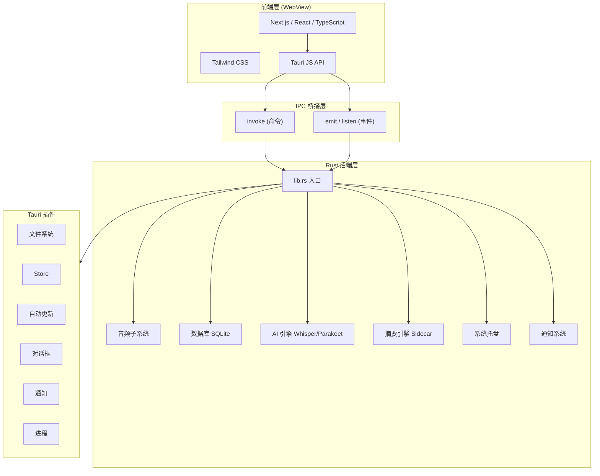
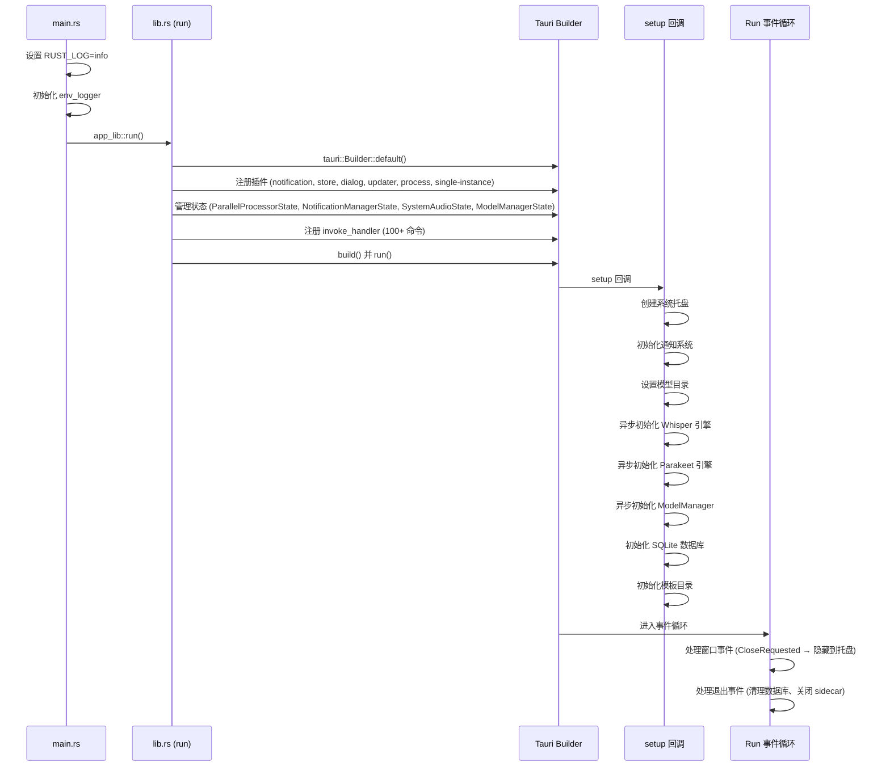
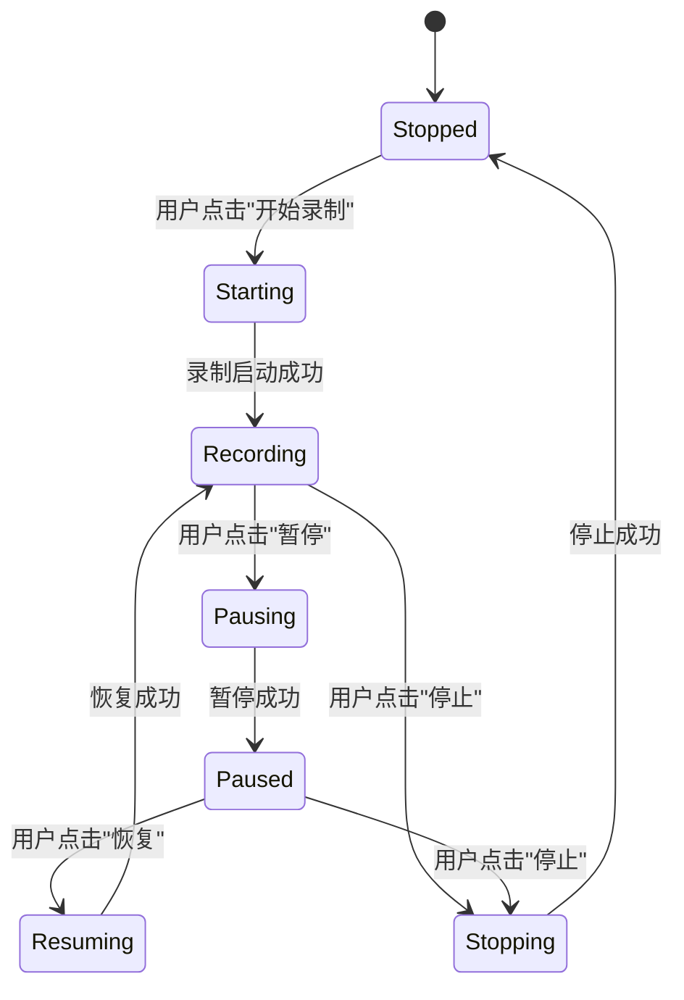
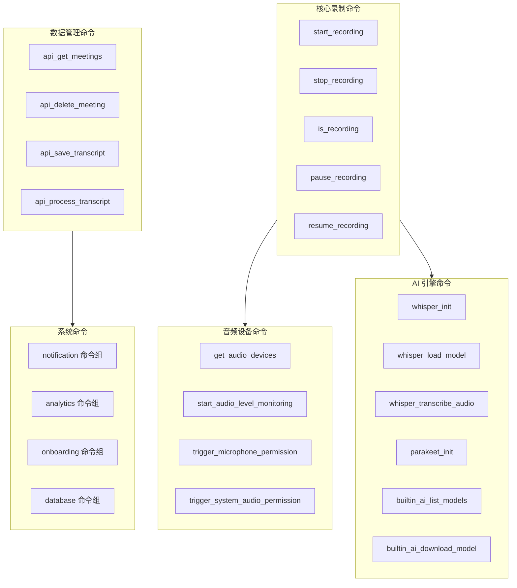

# Tauri 框架技术文档

## 1. 框架概述

Tauri 是一个基于 Rust 与系统 WebView 的桌面应用开发框架。它将 Web 前端 (HTML/CSS/JS) 与 Rust 后端组合为单一原生可执行文件,相比 Electron 等方案,具有包体积极小、内存占用低、安全性高等优势。

Meetily 采用 **Tauri v2** 构建,前端使用 Next.js (React + TypeScript),后端使用 Rust,形成一个隐私优先、完全本地运行的 AI 会议助手应用。

### 1.1 核心设计理念

| 特性 | 说明 |
| --- | --- |
| **前后端分离** | 前端运行在系统 WebView 中,Rust 后端作为原生进程,二者通过 IPC 桥接通信 |
| **安全沙箱** | 前端默认无法访问文件系统、网络等敏感 API,必须通过 Capability 显式授权 |
| **单二进制分发** | 编译后生成单一可执行文件,附带资源文件与外部二进制 (sidecar) |
| **跨平台** | 同一代码库可构建 macOS、Windows、Linux 桌面应用 |
| **插件体系** | 官方与社区提供丰富的插件 (通知、文件系统、自动更新等) |

### 1.2 Meetily 技术栈总览



## 2. 项目结构

Meetily 的 Tauri 项目结构如下:

```
frontend/
├── src/                       # Next.js 前端代码
│   ├── app/                   # 页面路由
│   ├── components/            # React 组件
│   ├── hooks/                 # 自定义 Hooks
│   ├── services/              # Tauri 命令封装服务
│   ├── contexts/              # React Context (事件监听)
│   └── lib/                   # 工具函数
├── src-tauri/                 # Tauri Rust 后端
│   ├── src/
│   │   ├── main.rs            # 进程入口
│   │   ├── lib.rs             # Tauri Builder 配置与命令注册
│   │   ├── state.rs           # 全局应用状态
│   │   ├── tray.rs            # 系统托盘
│   │   ├── audio/             # 音频子系统
│   │   ├── database/          # SQLite 数据库
│   │   ├── whisper_engine/    # Whisper 转写引擎
│   │   ├── parakeet_engine/   # Parakeet 转写引擎
│   │   ├── summary/           # 摘要引擎 (Sidecar)
│   │   ├── notifications/     # 通知系统
│   │   ├── analytics/         # 匿名分析
│   │   ├── onboarding/        # 用户引导
│   │   ├── api/               # HTTP API 封装
│   │   ├── ollama/            # Ollama 本地 LLM
│   │   ├── openai/            # OpenAI 兼容接口
│   │   ├── anthropic/         # Anthropic Claude
│   │   ├── groq/              # Groq
│   │   ├── openrouter/        # OpenRouter
│   │   └── config.rs          # 配置
│   ├── migrations/            # SQLite 迁移脚本
│   ├── templates/             # 摘要模板 JSON
│   ├── binaries/              # Sidecar 外部二进制
│   ├── Cargo.toml             # Rust 依赖声明
│   ├── tauri.conf.json        # Tauri 配置文件
│   ├── build.rs               # 构建脚本
│   ├── entitlements.plist     # macOS 权限声明
│   └── Info.plist             # macOS 应用属性
└── package.json               # 前端依赖
```

## 3. 应用生命周期

### 3.1 启动流程

Meetily 的启动流程从 `main.rs` 开始,经过 `lib.rs` 中的 Builder 配置,最终进入 Tauri 事件循环:



**关键代码: `main.rs`**

```rust
fn main() {
    std::env::set_var("RUST_LOG", "info");
    env_logger::init();
    app_lib::run();
}
```

`main.rs` 极其简洁:设置日志级别、初始化日志器、调用 `lib.rs` 中的 `run()` 函数。在 Windows Release 模式下,通过 `#![windows_subsystem = "windows"]` 隐藏控制台窗口。

**关键代码: `lib.rs` 的 `run()` 函数**

`run()` 是整个应用的核心,负责:

1. 构建 Tauri Builder
2. 注册所有插件
3. 注册所有状态
4. 注册所有命令 (invoke_handler)
5. 执行 setup 回调
6. 处理窗口事件与退出事件

### 3.2 退出与清理

当应用退出时 (`RunEvent::Exit`),Meetily 执行以下清理:

- **数据库清理**: 关闭 SQLite 连接,checkpoint WAL 文件
- **Sidecar 关闭**: 强制终止 llama-helper 子进程

窗口关闭请求 (`CloseRequested`) 不会真正退出应用,而是将主窗口隐藏到系统托盘,实现"最小化到托盘"的效果。

## 4. IPC 通信机制

Tauri 的核心是前端 (WebView) 与后端 (Rust) 之间的 IPC (进程间通信) 机制。Meetily 使用两种通信方式: **命令 (Command)** 与 **事件 (Event)**。

### 4.1 命令 (Command)

命令是前端主动调用 Rust 函数的机制,类似 RPC。

**Rust 端: 定义命令**

使用 `#[tauri::command]` 宏标记函数:

```rust
#[tauri::command]
async fn start_recording<R: Runtime>(
    app: AppHandle<R>,
    mic_device_name: Option<String>,
    system_device_name: Option<String>,
    meeting_name: Option<String>,
) -> Result<(), String> {
    // 实现录制启动逻辑
}
```

命令函数的规则:
- 必须是 `async` 或同步函数
- 参数自动从前端 JSON 反序列化 (需要 `Deserialize`)
- 返回值自动序列化为 JSON (需要 `Serialize`)
- `AppHandle<R>` 可作为参数注入,用于访问应用上下文
- 返回 `Result<T, String>` 时,`Err` 会被前端捕获为 Promise rejection

**Rust 端: 注册命令**

在 `lib.rs` 中通过 `generate_handler!` 宏注册:

```rust
.invoke_handler(tauri::generate_handler![
    start_recording,
    stop_recording,
    is_recording,
    get_audio_devices,
    // ... 100+ 命令
])
```

**前端: 调用命令**

通过 `@tauri-apps/api/core` 的 `invoke` 函数:

```typescript
import { invoke } from '@tauri-apps/api/core';

// 调用简单命令
const isRecording = await invoke<boolean>('is_recording');

// 调用带参数的命令 (snake_case 自动映射)
await invoke('start_recording_with_devices_and_meeting', {
  micDeviceName: 'MacBook Pro Microphone',
  systemDeviceName: null,
  meetingName: 'Sprint Planning'
});
```

**命名约定**: Rust 端使用 `snake_case`,前端调用时使用 `camelCase`,Tauri 自动进行转换。

### 4.2 事件 (Event)

事件是双向的发布/订阅机制,允许 Rust 后端向前端推送通知。

**Rust 端: 发送事件**

使用 `Emitter` trait 的 `emit` 方法:

```rust
use tauri::Emitter;

// 发送无数据事件
app.emit("recording-started", ()).unwrap();

// 发送带数据的事件
app.emit("transcript-update", TranscriptUpdate {
    text: "Hello world".to_string(),
    // ...
}).unwrap();

// 发送停止完成事件
app.emit("recording-stop-complete", true).unwrap();
```

**前端: 监听事件**

通过 `@tauri-apps/api/event` 的 `listen` 函数:

```typescript
import { listen, UnlistenFn } from '@tauri-apps/api/event';

// 监听事件,返回取消监听函数
const unlisten: UnlistenFn = await listen('recording-started', () => {
  console.log('Recording started!');
});

// 监听带数据的事件
const unlisten2 = await listen<RecordingStoppedPayload>(
  'recording-stopped',
  (event) => {
    console.log('Stopped:', event.payload.message);
    console.log('Folder:', event.payload.folder_path);
  }
);

// 组件卸载时取消监听
unlisten();
```

### 4.3 Meetily 事件清单

| 事件名 | 方向 | 数据 | 用途 |
| --- | --- | --- | --- |
| `recording-started` | Rust → 前端 | 无 | 通知录制已开始 |
| `recording-stopped` | Rust → 前端 | `{message, folder_path, meeting_name}` | 通知录制已停止 |
| `recording-paused` | Rust → 前端 | 无 | 通知录制已暂停 |
| `recording-resumed` | Rust → 前端 | 无 | 通知录制已恢复 |
| `recording-stop-complete` | Rust → 前端 | `true` | 托盘停止录制后通知前端执行后处理 |
| `transcript-update` | Rust → 前端 | `TranscriptUpdate` | 实时转写文本推送 |
| `chunk-drop-warning` | Rust → 前端 | `string` | 音频缓冲区溢出警告 |
| `speech-detected` | Rust → 前端 | 无 | VAD 检测到语音 |
| `first-launch-detected` | Rust → 前端 | 无 | 首次启动通知 (触发引导流程) |
| `audio-level-update` | Rust → 前端 | `{device, rms, peak}` | 音频电平实时更新 |

### 4.4 前端服务封装模式

Meetily 将 Tauri 命令封装为 TypeScript 服务类,隔离底层 IPC 细节:

```typescript
// frontend/src/services/recordingService.ts
export class RecordingService {
  async isRecording(): Promise<boolean> {
    return invoke<boolean>('is_recording');
  }

  async startRecordingWithDevices(
    micDeviceName: string | null,
    systemDeviceName: string | null,
    meetingName: string
  ): Promise<void> {
    return invoke('start_recording_with_devices_and_meeting', {
      mic_device_name: micDeviceName,
      system_device_name: systemDeviceName,
      meeting_name: meetingName
    });
  }

  async onRecordingStarted(callback: () => void): Promise<UnlistenFn> {
    return listen('recording-started', callback);
  }

  async onRecordingStopped(
    callback: (payload: RecordingStoppedPayload) => void
  ): Promise<UnlistenFn> {
    return listen<RecordingStoppedPayload>('recording-stopped', (event) => {
      callback(event.payload);
    });
  }
}

// 导出单例
export const recordingService = new RecordingService();
```

这种封装模式的优势:
- **类型安全**: TypeScript 类型检查参数与返回值
- **关注点分离**: 业务组件不直接依赖 Tauri API
- **易于测试**: 可在测试中 mock 服务类
- **一致性**: 所有调用走同一入口,便于日志与错误处理

## 5. 状态管理

### 5.1 Tauri 状态系统

Tauri 提供内建的状态管理,通过 `manage()` 注入,通过 `app.state::<T>()` 获取:

```rust
// 注入状态
builder
    .manage(whisper_engine::parallel_commands::ParallelProcessorState::new())
    .manage(Arc::new(RwLock::new(
        None::<NotificationManager<tauri::Wry>>
    )) as NotificationManagerState<tauri::Wry>)
    .manage(audio::init_system_audio_state())
    .manage(summary::summary_engine::ModelManagerState(
        Arc::new(tokio::sync::Mutex::new(None))
    ))
```

**在命令中访问状态**:

```rust
#[tauri::command]
async fn some_command<R: Runtime>(
    app: AppHandle<R>,
) -> Result<(), String> {
    let state = app.state::<SomeState>();
    // 使用状态
}
```

### 5.2 全局状态模式

Meetily 使用多种状态管理模式:

**1. AppState 结构体** (数据库)

```rust
// state.rs
pub struct AppState {
    pub db_manager: DatabaseManager,
}

// 在 setup 中注入
app.manage(AppState { db_manager });
```

**2. 静态全局变量** (录制状态)

```rust
// lib.rs
static RECORDING_FLAG: AtomicBool = AtomicBool::new(false);

// recording_commands.rs
static IS_RECORDING: AtomicBool = AtomicBool::new(false);
static RECORDING_MANAGER: Mutex<Option<RecordingManager>> = Mutex::new(None);
static TRANSCRIPTION_TASK: Mutex<Option<JoinHandle<()>>> = Mutex::new(None);
```

使用 `AtomicBool` 实现无锁的录制状态标记,使用 `std::sync::Mutex` 保护录制管理器与转写任务句柄。

**3. Arc + RwLock/Mutex** (通知管理器)

```rust
type NotificationManagerState<R> = Arc<RwLock<Option<NotificationManager<R>>>>;
```

通过 `Arc<RwLock<Option<T>>>` 实现异步安全的共享可变状态,允许在多个异步任务中读写。

**4. LazyLock** (语言偏好)

```rust
static LANGUAGE_PREFERENCE: std::sync::LazyLock<StdMutex<String>> =
    std::sync::LazyLock::new(|| StdMutex::new("auto-translate".to_string()));
```

延迟初始化的全局变量,首次访问时创建默认值。

### 5.3 数据库初始化与状态注入

Meetily 的数据库初始化展示了条件性状态注入模式:

```rust
pub async fn initialize_database_on_startup(app: &AppHandle) -> Result<(), String> {
    let is_first_launch = DatabaseManager::is_first_launch(app).await?;

    if is_first_launch {
        // 首次启动: 延迟发送事件,通知前端显示引导
        let app_handle = app.clone();
        tauri::async_runtime::spawn(async move {
            tokio::time::sleep(Duration::from_millis(500)).await;
            app_handle.emit("first-launch-detected", ()).unwrap();
        });
    } else {
        // 正常启动: 立即初始化数据库并注入状态
        let db_manager = DatabaseManager::new_from_app_handle(app).await?;
        app.manage(AppState { db_manager });
    }
    Ok(())
}
```

## 6. 插件系统

### 6.1 插件注册

Tauri v2 采用模块化插件架构,Meetily 注册了以下插件:

```rust
builder
    .plugin(tauri_plugin_single_instance::init(|app, args, cwd| {
        // 第二个实例启动时,聚焦已有窗口
        tray::focus_main_window(app);
    }))
    .plugin(tauri_plugin_notification::init())
    .plugin(tauri_plugin_store::Builder::default().build())
    .plugin(tauri_plugin_dialog::init())
    .plugin(tauri_plugin_updater::Builder::new().build())
    .plugin(tauri_plugin_process::init())
```

### 6.2 插件功能说明

| 插件 | Cargo 依赖 | 功能 |
| --- | --- | --- |
| **single-instance** | `tauri-plugin-single-instance` | 确保应用只运行一个实例,二次启动时聚焦已有窗口 |
| **notification** | `tauri-plugin-notification` | 系统原生通知 (toast / badge) |
| **store** | `tauri-plugin-store` | 基于文件的键值存储 (JSON),用于用户偏好设置 |
| **dialog** | `tauri-plugin-dialog` | 原生文件选择对话框与消息框 |
| **updater** | `tauri-plugin-updater` | 自动检测与安装应用更新 |
| **process** | `tauri-plugin-process` | 进程相关操作 (退出、重启) |
| **fs** | `tauri-plugin-fs` | 文件系统读写 (受 Capability 约束) |

### 6.3 Cargo.toml 中的插件依赖

```toml
tauri = { version = "2.6.2", features = ["macos-private-api", "protocol-asset", "tray-icon"] }
tauri-plugin-fs = "2.4.0"
tauri-plugin-dialog = "2.3.0"
tauri-plugin-store = "2.4.0"
tauri-plugin-notification = "2.3.1"
tauri-plugin-updater = "2.3.0"
tauri-plugin-process = "2.3.0"

[target.'cfg(any(target_os = "macos", windows, target_os = "linux"))'.dependencies]
tauri-plugin-single-instance = "=2.3.7"
```

注意 `tauri` 自身的 features:
- `macos-private-api`: 启用 macOS 私有 API (如 Core Audio tap)
- `protocol-asset`: 允许通过 `asset://` 协议访问本地文件
- `tray-icon`: 系统托盘支持

## 7. 安全模型

### 7.1 CSP (内容安全策略)

Tauri v2 通过 CSP 限制前端可加载的资源:

```json
"security": {
    "csp": {
        "default-src": "'self'",
        "style-src": "'self' 'unsafe-inline'",
        "img-src": "'self' asset: https://asset.localhost data:",
        "connect-src": "'self' http://localhost:11434 http://localhost:5167 http://localhost:8178 https://api.ollama.ai"
    }
}
```

解读:
- `default-src: 'self'`: 默认只允许加载同源资源
- `connect-src`: 仅允许连接本地 Ollama (11434)、Python 后端 (5167)、Whisper 服务 (8178) 以及 Ollama 云端 API
- `asset:`: 允许通过 Tauri 的 asset 协议访问本地文件

### 7.2 Capability 权限系统

Tauri v2 引入了细粒度的 Capability 权限系统,Meetily 定义了一个 `main` Capability:

```json
{
    "identifier": "main",
    "description": "Main window capability with file system and media access",
    "windows": ["main"],
    "permissions": [
        "fs:default",
        "fs:allow-read-file",
        "fs:read-all",
        "fs:write-all",
        "fs:allow-app-read",
        "fs:allow-app-write",
        "core:path:default",
        "core:event:default",
        "core:window:default",
        "core:app:default",
        "store:default",
        "notification:default",
        "updater:default",
        "process:default",
        {
            "identifier": "fs:scope",
            "allow": [{ "path": "$APPDATA/*" }]
        }
    ]
}
```

关键权限:
- **文件系统**: 允许读写 `$APPDATA` 目录下的文件
- **事件系统**: 允许使用 emit/listen
- **窗口管理**: 允许操作窗口
- **通知**: 允许发送系统通知
- **自动更新**: 允许检查与安装更新

### 7.3 Asset 协议

Asset 协议允许前端通过 `asset://` URL 访问本地文件:

```json
"assetProtocol": {
    "enable": true,
    "scope": ["$APPDATA/**"]
}
```

这使得前端可以展示本地存储的图片、音频等资源,同时限制访问范围在应用数据目录内。

### 7.4 macOS 权限声明

macOS 应用需要声明 entitlements 与 Info.plist 用途说明:

**entitlements.plist**:

```xml
<key>com.apple.security.device.audio-input</key>    <true/>
<key>com.apple.security.device.audio-output</key>   <true/>
<key>com.apple.security.device.microphone</key>      <true/>
<key>com.apple.security.device.screen-capture</key>  <true/>
```

这些声明告诉 macOS 系统该应用需要麦克风、音频输出、屏幕捕获等权限,系统会在首次使用时弹出权限对话框。

## 8. 系统托盘

### 8.1 托盘创建

Meetily 使用 Tauri v2 的 `TrayIconBuilder` 创建系统托盘:

```rust
pub fn create_tray<R: Runtime>(app: &AppHandle<R>) -> tauri::Result<()> {
    let menu = build_menu(app, RecordingState::Stopped, true)?;

    TrayIconBuilder::with_id("main-tray")
        .menu(&menu)
        .tooltip("Meetily")
        .icon(app.default_window_icon().unwrap().clone())
        .on_menu_event(|app, event| handle_menu_event(app, event.id.as_ref()))
        .build(app)?;

    update_tray_menu(app);
    Ok(())
}
```

### 8.2 动态菜单

托盘菜单根据录制状态动态更新:



每种状态对应不同的菜单项:

| 状态 | 菜单项 |
| --- | --- |
| `Stopped` | "Start Recording" |
| `Starting` | "🔄 Starting Recording..." (禁用) |
| `Recording` | "⏸ Pause Recording" + "⏹ Stop Recording" |
| `Paused` | "▶ Resume Recording" + "⏹ Stop Recording" |
| `Stopping` | "⏹ Stopping..." (禁用) |

始终显示的菜单项:
- "Open Main Window"
- "Settings"
- "Check for Updates"
- "Quit"

### 8.3 托盘事件处理

托盘菜单点击事件在 `handle_menu_event` 中分派:

```rust
fn handle_menu_event<R: Runtime>(app: &AppHandle<R>, item_id: &str) {
    match item_id {
        "toggle_recording" => toggle_recording_handler(app),
        "pause_recording" => pause_recording_handler(app),
        "resume_recording" => resume_recording_handler(app),
        "stop_recording" => stop_recording_handler(app),
        "open_window" => focus_main_window(app),
        "settings" => {
            focus_main_window(app);
            window.eval("window.location.assign('/settings')");
        }
        "check_updates" => check_updates_handler(app),
        "quit" => app.exit(0),
        _ => {}
    }
}
```

关键模式:
- **异步操作**: 通过 `tauri::async_runtime::spawn` 在后台执行耗时操作
- **状态即时反馈**: 操作开始前立即更新托盘状态 (如 `Starting`、`Stopping`)
- **前后端协同**: 通过 `window.eval` 设置 sessionStorage 标记,前端据此自动执行操作
- **事件桥接**: 通过 `app.emit` 通知前端执行后处理

## 9. 构建系统

### 9.1 build.rs 构建脚本

`build.rs` 在编译前执行,负责:

```rust
fn main() {
    // 1. GPU 能力检测与构建指导
    detect_and_report_gpu_capabilities();

    // 2. macOS 框架链接
    #[cfg(target_os = "macos")]
    {
        println!("cargo:rustc-link-lib=framework=AVFoundation");
        println!("cargo:rustc-link-lib=framework=Cocoa");
        println!("cargo:rustc-link-lib=framework=Foundation");
    }

    // 3. 下载并打包 FFmpeg 二进制
    ffmpeg::ensure_ffmpeg_binary();

    // 4. 调用 tauri_build
    tauri_build::build()
}
```

### 9.2 条件编译与 Feature Flags

Meetily 通过 Cargo features 管理 GPU 加速:

```toml
[features]
default = ["platform-default"]
platform-default = []
metal = ["whisper-rs/metal"]        # macOS Metal GPU
coreml = ["whisper-rs/coreml"]      # macOS CoreML
cuda = ["whisper-rs/cuda"]          # NVIDIA CUDA
vulkan = ["whisper-rs/vulkan"]      # AMD/Intel Vulkan
hipblas = ["whisper-rs/hipblas"]    # AMD ROCm
openblas = ["whisper-rs/openblas"]  # OpenBLAS CPU 优化
```

平台特定依赖:

```toml
# macOS: 自动启用 Metal + CoreML
[target.'cfg(target_os = "macos")'.dependencies]
whisper-rs = { version = "0.13.2", features = ["raw-api", "metal", "coreml"] }
cidre = { git = "https://github.com/yury/cidre", rev = "a9587fa", features = ["av"] }

# Windows: 默认 CPU,可手动启用 CUDA/Vulkan
[target.'cfg(target_os = "windows")'.dependencies]
whisper-rs = { version = "0.13.2", features = ["raw-api"] }

# Linux: 默认 CPU,可手动启用 CUDA/Vulkan/HIP
[target.'cfg(target_os = "linux")'.dependencies]
whisper-rs = { version = "0.13.2", features = ["raw-api"] }
```

### 9.3 Sidecar 外部二进制

Tauri 支持打包外部二进制文件作为 sidecar:

```json
"bundle": {
    "externalBin": [
        "binaries/llama-helper",
        "binaries/ffmpeg"
    ]
}
```

这些二进制在构建时被放置在 `binaries/` 目录下,运行时通过 Tauri 的 sidecar API 启动与管理:

- **llama-helper**: 本地 LLM 推理引擎,用于 AI 摘要生成
- **ffmpeg**: 音频/视频处理工具,用于格式转换与音轨合并

### 9.4 打包目标

```json
"bundle": {
    "targets": ["deb", "appimage", "msi", "nsis", "app", "dmg"],
    "createUpdaterArtifacts": true,
    "resources": ["templates/*.json"],
    "icon": ["icons/icon.png", "icons/app_icon.icns", "icons/app_icon.ico"]
}
```

| 目标 | 平台 | 说明 |
| --- | --- | --- |
| `deb` | Linux | Debian 包 |
| `appimage` | Linux | 跨发行版可执行包 |
| `msi` | Windows | Windows Installer |
| `nsis` | Windows | NSIS 安装程序 |
| `app` | macOS | .app 应用包 |
| `dmg` | macOS | 磁盘镜像 |

### 9.5 自动更新

Tauri 的 updater 插件支持自动检测与安装更新:

```json
"plugins": {
    "updater": {
        "pubkey": "dW50cnVzdGVkIGNvbW1lbnQ6...",
        "endpoints": [
            "https://github.com/.../releases/latest/download/latest.json"
        ]
    }
}
```

工作流程:
1. 应用启动时,updater 插件检查远程 endpoint 的 `latest.json` 清单
2. 如果有新版本,通过公钥验证签名
3. 下载更新包并提示用户安装
4. 用户确认后自动安装并重启

## 10. 命令架构

### 10.1 命令分层设计

Meetily 的 100+ Tauri 命令按功能模块组织:



### 10.2 命令命名约定

| 前缀 | 模块 | 示例 |
| --- | --- | --- |
| `whisper_` | Whisper 转写引擎 | `whisper_init`, `whisper_load_model`, `whisper_transcribe_audio` |
| `parakeet_` | Parakeet 转写引擎 | `parakeet_init`, `parakeet_download_model` |
| `builtin_ai_` | 内置 AI 摘要 | `builtin_ai_list_models`, `builtin_ai_download_model` |
| `api_` | HTTP API 封装 | `api_get_meetings`, `api_save_transcript` |
| `get_` / `set_` | 配置读取/设置 | `get_audio_devices`, `set_language_preference` |
| `start_` / `stop_` | 生命周期管理 | `start_recording`, `stop_recording` |
| `is_` | 状态查询 | `is_recording`, `is_recording_paused` |

### 10.3 条件编译命令

部分命令仅在特定平台可用:

```rust
.invoke_handler(tauri::generate_handler![
    // ... 通用命令
    #[cfg(target_os = "macos")]
    utils::open_system_settings,
    // ...
])
```

`#[cfg(target_os = "macos")]` 确保该命令只在 macOS 编译时包含,其他平台会自动排除。

## 11. 异步运行时

### 11.1 Tokio 集成

Tauri v2 内置 Tokio 异步运行时。Meetily 充分利用这一特性:

```rust
// 在 setup 中派生异步任务
tauri::async_runtime::spawn(async {
    if let Err(e) = whisper_engine::commands::whisper_init().await {
        log::error!("Failed to initialize Whisper engine: {}", e);
    }
});

// 在命令中使用异步
#[tauri::command]
async fn start_recording<R: Runtime>(app: AppHandle<R>, ...) -> Result<(), String> {
    // 异步操作
}
```

### 11.2 异步模式总结

| 模式 | 用途 | 示例 |
| --- | --- | --- |
| `tauri::async_runtime::spawn` | 后台非阻塞任务 | 引擎初始化、通知初始化 |
| `tauri::async_runtime::block_on` | 同步上下文中执行异步 | 数据库初始化 (`block_on` 在 setup 中) |
| `tokio::sync::RwLock` | 异步安全的读写锁 | 通知管理器状态 |
| `tokio::sync::Mutex` | 异步安全的互斥锁 | ModelManager 状态 |
| `tokio::sync::mpsc` | 异步通道 | 音频块传输、转写结果传递 |
| `tokio::time::sleep` | 异步延时 | 首次启动事件延迟发送 |
| `tokio_util::CancellationToken` | 任务取消 | 录制停止时取消转写任务 |

## 12. 窗口管理

### 12.1 窗口配置

```json
"windows": [{
    "title": "meetily",
    "width": 1100,
    "height": 700,
    "resizable": true,
    "fullscreen": false,
    "theme": "Light",
    "decorations": true
}]
```

### 12.2 窗口事件处理

Meetily 拦截窗口关闭请求,实现"关闭即最小化到托盘":

```rust
.on_window_event(|window, event| {
    if let tauri::WindowEvent::CloseRequested { api, .. } = event {
        if window.label() == "main" {
            api.prevent_close();  // 阻止真正关闭
            window.hide().ok();   // 隐藏窗口
        }
    }
})
```

### 12.3 窗口操作

托盘与命令中常用的窗口操作:

```rust
// 聚焦主窗口
pub(crate) fn focus_main_window<R: Runtime>(app: &AppHandle<R>) {
    if let Some(window) = app.get_webview_window("main") {
        window.unminimize().ok();   // 取消最小化
        window.show().ok();         // 显示窗口
        window.set_focus().ok();    // 获取焦点
        window.eval("window.focus()").ok(); // WebView 焦点
    }
}

// 通过 JS 导航
window.eval("window.location.assign('/settings')");

// 通过 JS 设置 sessionStorage
window.eval("sessionStorage.setItem('autoStartRecording', 'true')");

// 通过 JS 派发 CustomEvent
window.eval("window.dispatchEvent(new CustomEvent('check-updates-from-tray'))");
```

## 13. 路径与资源管理

### 13.1 应用数据目录

Tauri 提供跨平台的路径解析:

```rust
// 获取应用数据目录
let data_dir = app.path().app_data_dir()?;

// 获取资源目录 (打包时嵌入的文件)
let resource_dir = app.path().resource_dir()?;
let templates_dir = resource_dir.join("templates");
```

### 13.2 资源文件

`tauri.conf.json` 中声明的资源文件会被打包到应用内:

```json
"resources": ["templates/*.json"]
```

运行时通过 `resource_dir()` 访问:

```rust
if let Ok(resource_path) = app.handle().path().resource_dir() {
    let templates_dir = resource_path.join("templates");
    summary::templates::set_bundled_templates_dir(templates_dir);
}
```

## 14. 命令实现最佳实践

### 14.1 瘦命令层模式

Meetily 采用"瘦命令层"设计,`lib.rs` 中的命令仅做参数传递与错误转换:

```rust
#[tauri::command]
async fn start_recording<R: Runtime>(
    app: AppHandle<R>,
    mic_device_name: Option<String>,
    system_device_name: Option<String>,
    meeting_name: Option<String>,
) -> Result<(), String> {
    // 1. 前置检查
    if is_recording().await {
        return Err("Recording already in progress".to_string());
    }

    // 2. 委托给业务模块
    match audio::recording_commands::start_recording_with_devices_and_meeting(
        app.clone(), mic_device_name, system_device_name, meeting_name.clone(),
    ).await {
        Ok(_) => {
            // 3. 更新全局状态
            RECORDING_FLAG.store(true, Ordering::SeqCst);
            tray::update_tray_menu(&app);
            // 4. 发送通知
            // ...
            Ok(())
        }
        Err(e) => Err(format!("Failed to start recording: {}", e))
    }
}
```

原则:
- **命令函数不做业务逻辑**: 仅做参数传递、状态更新、错误转换
- **业务逻辑在独立模块**: `audio::recording_commands`、`whisper_engine::commands` 等
- **错误类型统一为 `String`**: Tauri 命令要求返回 `Result<T, String>`,内部使用 `anyhow::Result` 再转换

### 14.2 条件编译在命令中的应用

```rust
#[cfg(target_os = "macos")]
utils::open_system_settings,
```

## 15. 性能优化

### 15.1 条件日志宏

Meetily 在热路径 (音频处理) 中使用条件日志宏,避免 Release 构建中的日志开销:

```rust
#[cfg(debug_assertions)]
macro_rules! perf_debug {
    ($($arg:tt)*) => { log::debug!($($arg)*) };
}

#[cfg(not(debug_assertions))]
macro_rules! perf_debug {
    ($($arg:tt)*) => {};  // Release 模式下为空操作
}
```

### 15.2 非阻塞初始化

耗时的引擎初始化通过 `tauri::async_runtime::spawn` 在后台异步执行,不阻塞 UI:

```rust
// Whisper 引擎异步初始化
tauri::async_runtime::spawn(async {
    if let Err(e) = whisper_engine::commands::whisper_init().await {
        log::error!("Failed to initialize Whisper engine: {}", e);
    }
});

// Parakeet 引擎异步初始化
tauri::async_runtime::spawn(async {
    if let Err(e) = parakeet_engine::commands::parakeet_init().await {
        log::error!("Failed to initialize Parakeet engine: {}", e);
    }
});
```

### 15.3 增量保存与检查点

音频录制过程中,`IncrementalSaver` 周期性将部分音频写入磁盘:
- 避免崩溃时丢失全部数据
- 使用环形缓冲限制内存占用
- 检查点间隔可配置

## 16. 调试技巧

### 16.1 日志系统

```rust
// main.rs
std::env::set_var("RUST_LOG", "info");
env_logger::init();
```

日志级别: `error` > `warn` > `info` > `debug` > `trace`

在 macOS 上使用 `tauri-plugin-log` 提供彩色日志输出:

```toml
[target.'cfg(target_os = "macos")'.dependencies]
tauri-plugin-log = { version = "2.6.0", features = ["colored"] }
```

### 16.2 控制台窗口

Meetily 提供动态显示/隐藏控制台的命令 (Windows 调试用):

```rust
console_utils::show_console,
console_utils::hide_console,
console_utils::toggle_console,
```

### 16.3 诊断命令

- `get_recording_state`: 获取完整录制状态 (是否录制、是否暂停、持续时间)
- `get_transcription_status`: 获取转写队列状态
- `poll_audio_device_events`: 轮询音频设备变化
- `get_reconnection_status`: 检查设备重连状态
- `is_notification_system_ready`: 检查通知系统就绪状态

## 17. 关键配置文件速查

### 17.1 tauri.conf.json

| 配置项 | 路径 | 说明 |
| --- | --- | --- |
| `productName` | 根 | 应用名称 |
| `version` | 根 | 应用版本号 |
| `identifier` | 根 | 唯一标识符 (反向域名) |
| `build.frontendDist` | build | 前端构建输出目录 |
| `build.devUrl` | build | 开发服务器 URL |
| `build.beforeDevCommand` | build | 开发前执行的命令 |
| `build.beforeBuildCommand` | build | 构建前执行的命令 |
| `app.windows` | app | 窗口配置数组 |
| `app.security.csp` | app | 内容安全策略 |
| `app.security.capabilities` | app | 权限声明 |
| `bundle.targets` | bundle | 打包目标平台 |
| `bundle.externalBin` | bundle | Sidecar 二进制列表 |
| `bundle.resources` | bundle | 嵌入资源文件 |
| `plugins.updater` | plugins | 自动更新配置 |

### 17.2 Cargo.toml 关键依赖

| 依赖 | 版本 | 用途 |
| --- | --- | --- |
| `tauri` | 2.6.2 | 框架核心 |
| `tauri-build` | 2.3.0 | 构建脚本 |
| `cpal` | 0.15.3 | 跨平台音频采集 |
| `whisper-rs` | 0.13.2 | Whisper 转写 |
| `tokio` | 1.32.0 | 异步运行时 |
| `sqlx` | 0.8 | SQLite 数据库 |
| `serde` / `serde_json` | 1.0 | 序列化/反序列化 |
| `anyhow` | 1.0 | 错误处理 |
| `ffmpeg-sidecar` | git | FFmpeg 集成 |
| `silero_rs` | git | VAD 语音检测 |
| `rubato` | 0.15.0 | 音频重采样 |
| `cidre` | git | macOS Core Audio |
| `ort` | 2.0.0-rc.10 | ONNX Runtime (Parakeet) |

## 18. 扩展指南

### 18.1 添加新的 Tauri 命令

1. **创建命令函数**:

```rust
#[tauri::command]
async fn my_new_command(app: AppHandle, param: String) -> Result<String, String> {
    // 实现逻辑
    Ok("result".to_string())
}
```

2. **注册命令**:

在 `lib.rs` 的 `generate_handler!` 中添加:

```rust
.invoke_handler(tauri::generate_handler![
    // ...
    my_new_command,
])
```

3. **前端调用**:

```typescript
const result = await invoke<string>('my_new_command', { param: 'value' });
```

### 18.2 添加新的 Tauri 事件

1. **Rust 端发送**:

```rust
use tauri::Emitter;
app.emit("my-custom-event", MyPayload { data: "hello" }).unwrap();
```

2. **前端监听**:

```typescript
const unlisten = await listen<MyPayload>('my-custom-event', (event) => {
  console.log(event.payload.data);
});
// 组件卸载时取消
useEffect(() => () => { unlisten(); }, []);
```

### 18.3 添加新的 Tauri 插件

1. **添加依赖**:

```toml
tauri-plugin-my-plugin = "1.0"
```

2. **注册插件**:

```rust
builder.plugin(tauri_plugin_my_plugin::init())
```

3. **添加 Capability 权限** (如需要):

```json
"permissions": ["my-plugin:default"]
```
