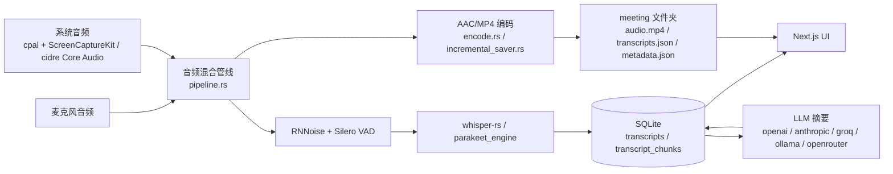

# Meetily 截屏与录屏功能调研文档

> 调研范围：`frontend/`（Next.js 前端 + Tauri/Rust 内核）与 `backend/`（Python FastAPI 遗留后端）
> 调研目标：识别是否存在截屏（screenshot）或屏幕录制（screen recording）相关实现
> 结论先行：**仓库内不存在任何截屏或屏幕录制的实现逻辑**。所有"screen recording"字样仅与 macOS 系统音频捕获的权限申请相关，代码层面只进行音频采集与转写。

---

## 1. 调研范围与方法

### 1.1 目录范围

| 路径 | 类型 | 关键子目录 |
| --- | --- | --- |
| `frontend/src/` | Next.js + React + TypeScript | `app/`、`components/`、`contexts/`、`hooks/`、`services/`、`types/` |
| `frontend/src-tauri/` | Tauri 内核（Rust 2.x） | `src/audio/`、`src/api/`、`src/database/`、`src/notifications/`、`Cargo.toml`、`tauri.conf.json`、`entitlements.plist`、`Info.plist` |
| `backend/app/` | Python FastAPI 遗留后端 | `main.py`、`db.py`、`transcript_processor.py`、`schema_validator.py` |
| `backend/whisper.cpp/`、`backend/whisper-custom/` | 第三方语音转写引擎 | 与截屏/录屏无关 |

### 1.2 调研方法

采用四步走的关键词扫描 + 人工核查方法：

1. **关键词全文搜索**（`Grep` / `rg`），覆盖浏览器、Electron/Tauri、Python 生态下的常见截屏/录屏 API 与依赖：
   - 浏览器/前端：`getDisplayMedia`、`MediaRecorder`、`navigator.mediaDevices`、`DesktopCapturer`、`html2canvas`、`canvas.toDataURL`、`video.srcObject`、`captureStream`
   - Rust 生态：`scrap`、`xcap`、`screenshots`、`wayland-screenshot`、`x11`、`image`（图像抓取）
   - Python 生态：`mss`、`pyautogui`、`PIL.ImageGrab`、`opencv/cv2`、`playwright`、`selenium`、`scrap`
2. **API 端点扫描**：枚举 `backend/app/main.py` 中所有 `@app.get/post/put/delete` 路由，查找是否包含 `/screenshot`、`/screen`、`/record` 等。
3. **Tauri 命令与 IPC 事件扫描**：枚举 `frontend/src-tauri/src/lib.rs` 中所有 `#[tauri::command]` 入口，以及 `emit/listen` 事件。
4. **平台权限/清单文件核查**：`Info.plist`、`entitlements.plist`、`tauri.conf.json` 中的 `permissions` 字段，确认是否声明了媒体设备/屏幕捕获相关能力。

### 1.3 排除范围

- 仓库根目录的 `docs/`、`scripts/`、`.github/`、`llama-helper/` 等运维/文档目录不在本次代码调研范围内。
- `target/`（Cargo 构建产物）不参与源码审计。
- `node_modules/`、`whisper.cpp/`、`whisper-custom/` 第三方代码不展开。

---

## 2. 关键搜索证据汇总

### 2.1 前端 TypeScript/React 侧

| 搜索词 | 命中文件 | 用途澄清 |
| --- | --- | --- |
| `getDisplayMedia`、`MediaRecorder`、`navigator.mediaDevices`、`video.captureStream`、`html2canvas` | 0 个 | — |
| `ScreenCaptureKit` 关键字 | `frontend/src/components/AudioBackendSelector.tsx:133` | 仅为音频后端 ID 字符串 `'screencapturekit'`，用作 macOS 系统音频的采集后端选择 |
| `screencapturekit` | `frontend/src/hooks/usePermissionCheck.ts:31`（注释）、`frontend/src/components/AudioBackendSelector.tsx:133` | 注释说明 macOS 系统音频需走 ScreenCaptureKit 设备 |
| `screen recording` / `Privacy_ScreenCapture` | `frontend/src/components/PermissionWarning.tsx:47,80,84,127`、`frontend/src/hooks/usePermissionCheck.ts`、`frontend/src/components/RecordingControls.tsx:124,129` | 仅用于提示用户授权 macOS Screen Recording 权限（目的是让 ScreenCaptureKit 能够采集系统音频） |
| `screenshot` / `captureStream` / `toBlob` | 0 个 | — |

> 结论：前端代码中**不存在任何浏览器媒体捕获或画布截图 API**。

### 2.2 Tauri Rust 内核侧

| 搜索词 | 命中文件 | 用途澄清 |
| --- | --- | --- |
| `SCStream`、`SCContentFilter`、`SCShareableContent`、`SCSampleBuffer`、`SCStreamConfiguration` | 0 个 | 没有任何 ScreenCaptureKit 视频/屏幕流 API 调用 |
| `ScreenCaptureKit`（作为后端名） | `frontend/src-tauri/src/audio/capture/backend_config.rs`、`frontend/src-tauri/src/audio/devices/platform/macos.rs` | 用于音频后端切换；实际采集走 `cpal` 的 `ScreenCaptureKit` host |
| `screenshot` | 0 个 | — |
| `xcap` / `scrap` / `screenshots` / `x11` / `wayland` | 0 个 | 未引入任何屏幕抓取 crate |
| `xvid` / `h264` / `avc` / `nvenc` / `video_track` | 0 个 | 无视频编码相关依赖 |
| `frame`（关键字） | `audio/stream.rs`、`audio/system_audio_stream.rs`、`audio/audio_processing.rs`、`audio/diagnostics.rs` 等 | 全部为**音频帧**（1024 samples/帧、48 kHz、10 ms 帧）处理逻辑，与视频无关 |
| `video_dir()` | `audio/recording_preferences.rs:60` | 仅用于获取系统视频目录（保存默认录音路径），并未写入视频文件 |
| `"video.mkv"`、`"-vn"` | `audio/decoder.rs:326,807` | ffmpeg 调用，`-vn` 显式**剥离视频轨**；`video.mkv` 是测试用例路径 |

`Cargo.toml` 关键依赖审查（`frontend/src-tauri/Cargo.toml`）：

- 包含：`cpal`、`cidre`（macOS Core Audio Rust 绑定）、`whisper-rs`、`symphonia`（音频解码）、`ffmpeg-sidecar`、`tauri-plugin-fs/store/dialog/notification/updater/process/single-instance`。
- **不包含**：`scrap`、`xcap`、`screenshots`、`image`（抓图）、`nokhwa`（摄像头）、`v4l`（Linux 视频）、`winit` 屏幕抓帧、`wayland-client` 抓屏绑定。
- `cidre` 虽涉及 Apple 框架，但代码中只使用 `core_audio` 模块的 `TapGuard` 与 `AudioHardwareCreateProcessTap` 路径，**用于进程级别音频 tap**，不调用 `SCStream`。

### 2.3 Python FastAPI 后端侧

`backend/app/main.py` 中所有 FastAPI 路由（已逐条列出）：

```
GET  /get-meetings
GET  /get-meeting/{meeting_id}
POST /save-meeting-title
POST /delete-meeting
POST /process-transcript
GET  /get-summary/{meeting_id}
POST /save-transcript
GET  /get-model-config
POST /save-model-config
GET  /get-transcript-config
POST /save-transcript-config
POST /get-api-key
POST /get-transcript-api-key
POST /save-meeting-summary
POST /search-transcripts
```

- 无 `/screenshot`、`/screen`、`/record`、`/capture` 类端点。
- `requirements.txt` 仅含 `fastapi`、`pydantic`、`ollama`、`aiosqlite`、`python-multipart`、`pandas`、`python-dotenv`、`devtools`——无任何截屏/录屏/图像处理依赖。
- `db.py`、`transcript_processor.py`、`schema_validator.py` 仅处理会议元数据、转写文本和摘要，**不存储二进制媒体**。

### 2.4 平台权限与清单文件

`frontend/src-tauri/Info.plist`：

```xml
<key>NSMicrophoneUsageDescription</key>
<string>This application needs access to your microphone to record meeting audio.</string>
<key>NSScreenCaptureUsageDescription</key>
<string>This application needs screen recording permission to capture system audio during meetings.</string>
<key>NSAudioCaptureUsageDescription</key>
<string>This application needs permission to capture system audio output for meeting transcription and recording.</string>
<key>com.apple.security.device.audio-input</key>
<true/>
```

`frontend/src-tauri/entitlements.plist`：

```xml
<key>com.apple.security.device.audio-input</key><true/>
<key>com.apple.security.device.audio-output</key><true/>
<key>com.apple.security.device.microphone</key><true/>
<key>com.apple.security.device.screen-capture</key><true/>
```

- `NSScreenCaptureUsageDescription` 描述文本明确写明"用于采集会议中的系统音频"，并非用于截取屏幕画面。
- 之所以需要 `com.apple.security.device.screen-capture` entitlement：Apple 规定使用 ScreenCaptureKit 框架（哪怕只取音频）必须声明此权限。代码侧并未真正采集视频。

`frontend/src-tauri/tauri.conf.json` capabilities 段：仅声明 `fs:*`、`store:default`、`notification:default`、`updater:default`、`process:default`、`core:path/event/window/app/resources/menu/tray:default` 等，**未声明任何媒体设备或屏幕捕获能力**。

`frontend/src-tauri/src/audio/permissions.rs` 关键函数（行 26–55）：

```rust
pub fn check_screen_recording_permission() -> bool {
    info!("ℹ️  Core Audio tap requires Audio Capture permission (macOS 14.4+)");
    // ...
    true   // Always return true - the actual permission dialog is triggered by Core Audio API
}
```

注意：函数虽名为 `check_screen_recording_permission`，**实际注释与实现均针对 Audio Capture 权限**（macOS 14.4+ 引入的 `NSAudioCaptureUsageDescription`），是命名上的历史遗留，不代表实现截屏。

### 2.5 孤立文件核查：`check_screen_permission.swift`

```swift
import Cocoa
import ScreenCaptureKit

@main
struct CheckPermission {
    static func main() {
        Task {
            do {
                let content = try await SCShareableContent.current
                print("Screen Recording Permission: GRANTED")
                print("Available displays: \(content.displays.count)")
                exit(0)
            } catch {
                print("Screen Recording Permission: DENIED")
                print("Error: \(error)")
                exit(1)
            }
        }
        RunLoop.main.run()
    }
}
```

- 全仓搜索 `check_screen_permission`、`CheckPermission`、`SCShareableContent` 仅命中此文件本身以及 `entitlements.plist` 中字面 `screen-capture` 字符串。
- **`build.rs` 未编译此 Swift 文件**；`Cargo.toml` 未引入 `swift-rs`/`objc` 之外的 Swift 绑定；`scripts/`、`docs/` 中也未发现调用。
- 该文件疑似早期诊断/调试用的独立工具脚本，**未接入构建或运行时调用链**。

---

## 3. 关键模块逐项结论

| 模块 | 文件 | 是否涉及截屏/录屏 | 实际职责 |
| --- | --- | --- | --- |
| 前端 Recording UI | `frontend/src/components/RecordingControls.tsx`、`PermissionWarning.tsx`、`Sidebar/*` | 否 | 调用 `start_recording` / `stop_recording` 等 Tauri 命令，提示 macOS 权限（仅为音频） |
| 前端 AudioBackendSelector | `frontend/src/components/AudioBackendSelector.tsx` | 否 | 在 `screencapturekit` 与 `coreaudio` 两个**音频**后端之间切换 |
| 前端 usePermissionCheck | `frontend/src/hooks/usePermissionCheck.ts` | 否 | 检查麦克风与系统音频设备可用性 |
| Tauri 音频采集 | `frontend/src-tauri/src/audio/capture/{system,core_audio,backend_config}.rs` | 否 | macOS 通过 `cpal`+`ScreenCaptureKit` host 或 `cidre` Core Audio tap 取**系统音频**；其他平台通过 cpal 取输入/输出设备 |
| Tauri 权限处理 | `frontend/src-tauri/src/audio/permissions.rs` | 否 | 触发 macOS 麦克风 / 系统音频权限弹窗（命名与 Screen Recording 无关） |
| Tauri 录制管线 | `frontend/src-tauri/src/audio/{pipeline,stream,recording_manager,recording_saver,incremental_saver,encode,decoder}.rs` | 否 | 音频混合、VAD 分段、MP4/AAC 编码、增量落盘；文件以 `.mp4` 后缀保存但容器内只有 AAC 音频流 |
| Tauri 数据库 | `frontend/src-tauri/src/database/**` | 否 | 存储 meeting / transcript / transcript_chunk / summary / setting 表，无媒体二进制 |
| Tauri API 桥 | `frontend/src-tauri/src/api/*` | 否 | 对接 LLM（Ollama/Claude/Groq/OpenRouter/OpenAI）做摘要与转写配置 |
| Tauri 通知 | `frontend/src-tauri/src/notifications/*` | 否 | 系统通知（录音开始/结束等），不涉及屏幕 |
| Python FastAPI | `backend/app/{main,db,transcript_processor,schema_validator}.py` | 否 | 仅提供会议、转写、摘要、模型配置 HTTP API |
| Swift 调试脚本 | `frontend/src-tauri/check_screen_permission.swift` | 形式相关，**未接入** | 通过 `SCShareableContent.current` 探测 macOS 屏幕录制权限；无任何调用方 |

---

## 4. 数据流与存储机制复核



- 唯一落盘的二进制是 `.mp4` 容器内封装的 **AAC 音频流**（验证见 `incremental_saver.rs:103` 调 `encode_single_audio` 入参为 `&[f32]` 音频样本）。
- 数据库 schema（`database/repositories/*`）仅含 `meeting`、`transcript`、`transcript_chunk`、`summary`、`setting` 五张表，**不存储截图/视频帧**。
- LLM 输入仅为转写文本片段，无图像/视频输入。

---

## 5. 误命中关键词的逐条澄清

仓库存在大量"screen"相关字符串，但经核查全部与截屏/录屏无关，列表如下避免后续维护者困惑：

1. **`screencapturekit` 后端 ID** — 在 `backend_config.rs` 中是 `AudioCaptureBackend::ScreenCaptureKit` 枚举值，对应 `cpal` 的 ScreenCaptureKit host，**只输出系统音频流**。
2. **`check_screen_recording_permission_*` 函数** — 命名误导；实际是 macOS 14.4+ Audio Capture 权限的探测与跳转，参见 `permissions.rs` 注释。
3. **`check_screen_permission.swift`** — 独立 Swift 诊断脚本，未被任何构建脚本/Rust 代码调用，行为上仅打印权限状态。
4. **`NSScreenCaptureUsageDescription`** — Apple 强制要求：使用 ScreenCaptureKit 即使只取音频也必须填写此键；描述文本明确写"capture system audio"。
5. **`com.apple.security.device.screen-capture` entitlement** — 同上，为 ScreenCaptureKit 启用所必需，**不等于实际使用屏幕捕获**。
6. **`audio_chunk_*.mp4` / `audio.mp4`** — 文件扩展名为 `.mp4`，但容器内仅含 AAC 音频，无视频轨。
7. **`-vn` ffmpeg 参数** — 显式剥离视频轨，出现在 `decoder.rs:326`。
8. **`video_dir()` 路径** — 仅用于选定默认保存目录，与实际写视频无关。

---

## 6. 调研结论

| 维度 | 结论 |
| --- | --- |
| **截屏（Screenshot）** | **不存在**。前端无 `html2canvas`/`getDisplayMedia`/Canvas 抓帧调用；Tauri 内核无 `scrap`/`xcap`/`screenshots` 等依赖；Python 后端无图像处理库与端点；未发现任何图像/PNG/JPEG 二进制落盘或传输。 |
| **屏幕录制（Screen Recording）** | **不存在**。Tauri 内核未调用 `SCStream`/`SCContentFilter`/`SCShareableContent` 视频采集 API；未引入任何视频编码（h264/nvenc/vaapi）依赖；未发现 `.mp4`/`.webm`/`.mov` 视频文件生成逻辑；未通过 Tauri IPC 推送视频帧。 |
| **截屏/录屏的 API 端点** | **不存在**。`backend/app/main.py` 15 个端点全部围绕"会议 / 转写 / 摘要 / 模型配置"。 |
| **截屏/录屏的事件与权限** | 仅有 macOS 平台声明 `NSScreenCaptureUsageDescription` 与 `com.apple.security.device.screen-capture`，但目的与实现均为**系统音频捕获**（ScreenCaptureKit 框架的强制要求）。 |
| **截屏/录屏的存储与传输** | **不存在**。数据库与文件落盘均为音频（`.mp4` 容器内 AAC）、转写 JSON 与摘要文本，无图像/视频二进制。 |

**最终结论**：Meetily 当前版本（v0.4.0）的 `frontend/` 与 `backend/` 代码中**不存在任何截屏或屏幕录制的实现**。所有表面上的"screen capture / screen recording"字样均为 macOS 系统音频采集框架的强制声明或命名遗留，运行时并未获取或处理屏幕帧。若后续需要扩展该能力，需新增依赖、声明 Tauri capability、并设计独立的存储/传输通道，与现有音频管线解耦。

---

## 7. 后续建议（仅供参考，未实施）

若产品决定引入截屏/录屏能力，建议在独立 RFC 中评估：

- **依赖选型**：跨平台推荐 `xcap`（Rust）或前端 `getDisplayMedia` + `MediaRecorder`；macOS 可直接走 `SCStream`。
- **权限**：Tauri `capabilities` 中需要 `core:webview:allow-set-webview-position` 等用于 UI 浮窗；macOS 需补齐 `NSScreenCaptureUsageDescription` 文案与 entitlement。
- **存储**：建议增加 `media_blob` 表或独立媒体目录，与 `.mp4` 音频分开，避免污染转写管线。
- **数据流**：截屏/录屏的 IPC 通道与音频解耦，前端按需触发，避免在录音过程中无差别开启造成性能与隐私问题。
